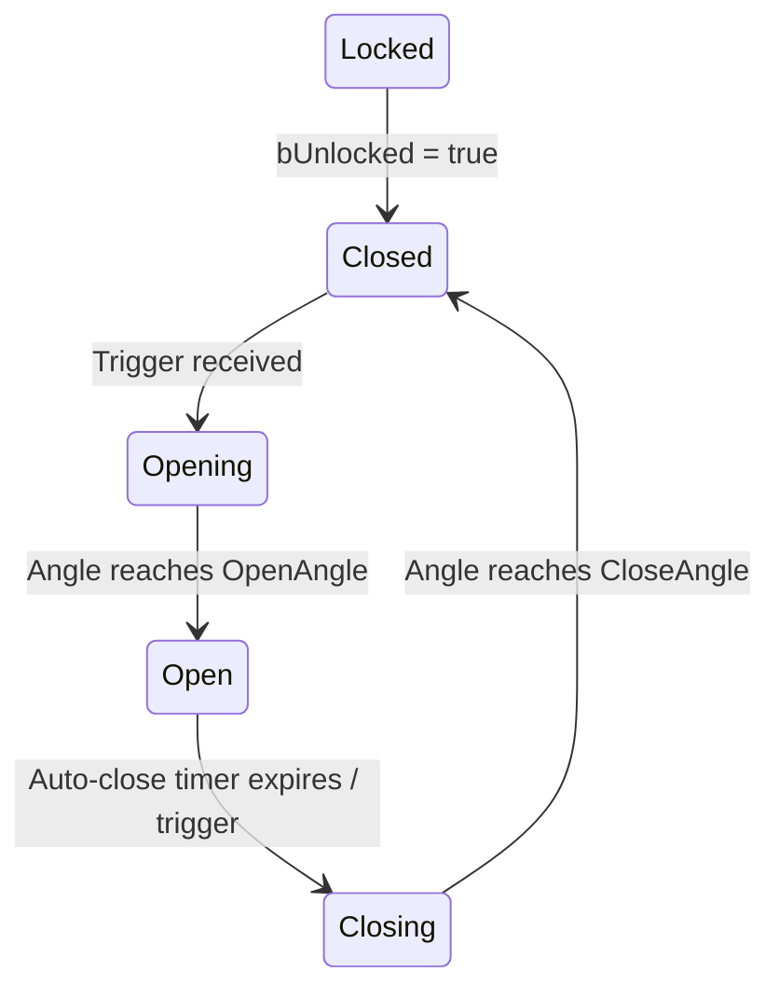

# Door System

> Doors are Jolt hinge constraints with a 5-state machine. They can be triggered by interaction, trigger zones, or constraint break events.

---

## Components

### FDoorStatic (Prefab)

| Field | Type | Description |
|-------|------|-------------|
| `HingeOffset` | `FVector` | Hinge position relative to door center |
| `SwingAxis` | `FVector` | Axis of rotation |
| `OpenAngle` | `float` | Target angle when open (degrees) |
| `CloseAngle` | `float` | Target angle when closed (degrees) |
| `AngularDamping` | `float` | Damping on hinge motor |
| `OpenSpeed` | `float` | Motor speed when opening |
| `CloseSpeed` | `float` | Motor speed when closing |
| `bAutoClose` | `bool` | Automatically close after delay |
| `AutoCloseDelay` | `float` | Seconds before auto-close |
| `TriggerTag` | `FGameplayTag` | Tag for trigger zone linkage |

### FDoorInstance (Per-Entity)

| Field | Type | Description |
|-------|------|-------------|
| `CurrentAngle` | `float` | Current hinge angle |
| `AngularVelocity` | `float` | Current rotational velocity |
| `DoorState` | `EDoorState` | Current state machine state |
| `AutoCloseTimer` | `float` | Time remaining before auto-close |
| `bUnlocked` | `bool` | Set by TriggerUnlockSystem |

---

## State Machine



| State | Motor Behavior |
|-------|---------------|
| **Locked** | Motor off, constraint locked |
| **Closed** | Motor off, at rest angle |
| **Opening** | Motor driving toward `OpenAngle` at `OpenSpeed` |
| **Open** | Motor off, auto-close timer counting (if `bAutoClose`) |
| **Closing** | Motor driving toward `CloseAngle` at `CloseSpeed` |

---

## Trigger System

`TriggerUnlockSystem` resolves trigger → door linkage:

```
Trigger entity (FDoorTriggerLink):
    TargetDoorKey: FSkeletonKey  → resolves to door entity
    → Sets FDoorInstance.bUnlocked = true
```

Triggers can be:
- Interaction-based (player interacts with switch → unlocks door)
- Zone-based (player enters trigger area)
- Destruction-based (destructible holding the lock is destroyed)

---

## Physics Constraint

Each door has a Jolt hinge constraint created at spawn time:

```cpp
// Door body is Dynamic (MOVING layer)
// Hinge attached to world (Body::sFixedToWorld) or a frame body
// Motor controls angular velocity toward target angle
```

The motor target and speed are updated each tick by `DoorTickSystem` based on the current state.
