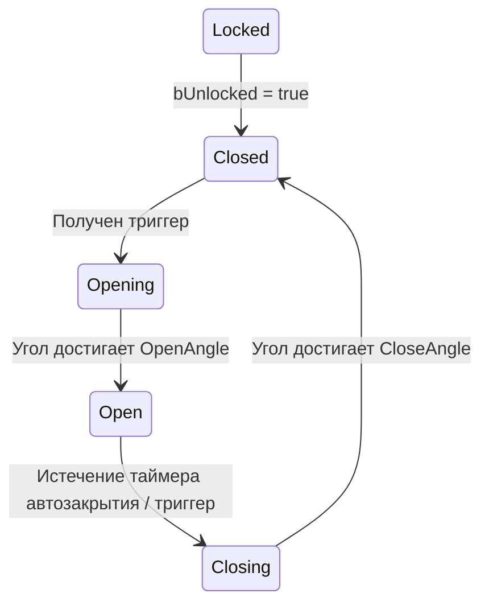

# Система дверей

> Двери реализованы как шарнирные Jolt constraints с 5-состоянным конечным автоматом. Они могут активироваться взаимодействием, триггерными зонами или событиями разрыва constraints.

---

## Компоненты

### FDoorStatic (Prefab)

| Поле | Тип | Описание |
|------|-----|----------|
| `HingeOffset` | `FVector` | Позиция шарнира относительно центра двери |
| `SwingAxis` | `FVector` | Ось вращения |
| `OpenAngle` | `float` | Целевой угол в открытом состоянии (градусы) |
| `CloseAngle` | `float` | Целевой угол в закрытом состоянии (градусы) |
| `AngularDamping` | `float` | Демпфирование мотора шарнира |
| `OpenSpeed` | `float` | Скорость мотора при открытии |
| `CloseSpeed` | `float` | Скорость мотора при закрытии |
| `bAutoClose` | `bool` | Автоматическое закрытие после задержки |
| `AutoCloseDelay` | `float` | Секунды до автозакрытия |
| `TriggerTag` | `FGameplayTag` | Тег для связи с триггерной зоной |

### FDoorInstance (Per-Entity)

| Поле | Тип | Описание |
|------|-----|----------|
| `CurrentAngle` | `float` | Текущий угол шарнира |
| `AngularVelocity` | `float` | Текущая угловая скорость |
| `DoorState` | `EDoorState` | Текущее состояние конечного автомата |
| `AutoCloseTimer` | `float` | Оставшееся время до автозакрытия |
| `bUnlocked` | `bool` | Устанавливается TriggerUnlockSystem |

---

## Конечный автомат



| Состояние | Поведение мотора |
|-----------|-----------------|
| **Locked** | Мотор выключен, constraint заблокирован |
| **Closed** | Мотор выключен, угол покоя |
| **Opening** | Мотор ведёт к `OpenAngle` со скоростью `OpenSpeed` |
| **Open** | Мотор выключен, таймер автозакрытия отсчитывает (если `bAutoClose`) |
| **Closing** | Мотор ведёт к `CloseAngle` со скоростью `CloseSpeed` |

---

## Система триггеров

`TriggerUnlockSystem` разрешает связь триггер → дверь:

```
Trigger entity (FDoorTriggerLink):
    TargetDoorKey: FSkeletonKey  → разрешается в entity двери
    → Устанавливает FDoorInstance.bUnlocked = true
```

Триггеры могут быть:
- На основе взаимодействия (игрок взаимодействует с переключателем → разблокирует дверь)
- На основе зоны (игрок входит в триггерную область)
- На основе разрушения (разрушаемый объект, удерживающий замок, уничтожен)

---

## Физический Constraint

Каждая дверь имеет Jolt hinge constraint, создаваемый при спавне:

```cpp
// Тело двери — Dynamic (слой MOVING)
// Шарнир прикреплён к миру (Body::sFixedToWorld) или к телу рамы
// Мотор контролирует угловую скорость к целевому углу
```

Цель и скорость мотора обновляются каждый тик `DoorTickSystem` на основе текущего состояния.
