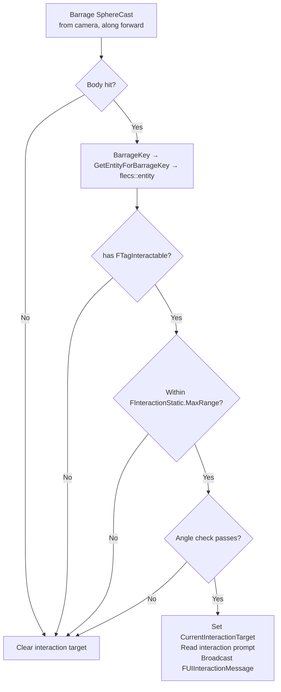
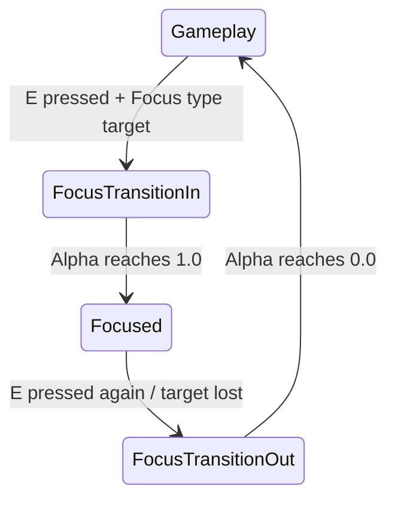
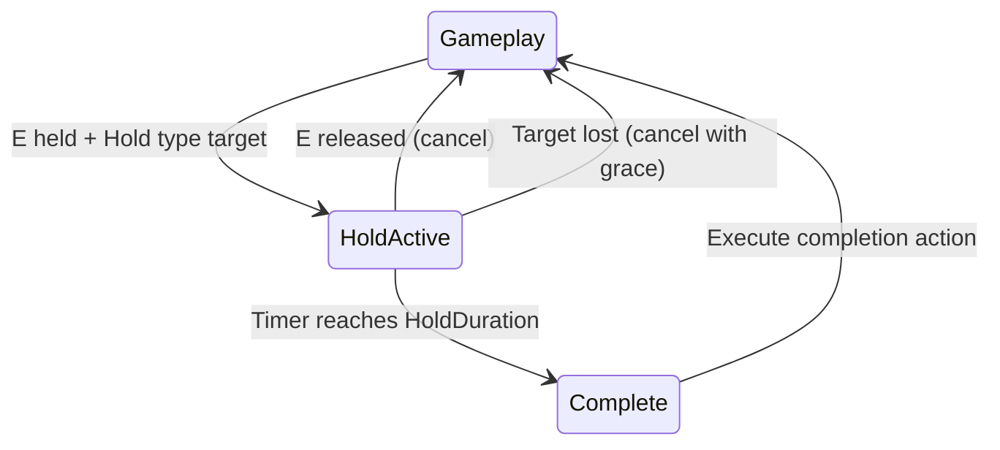
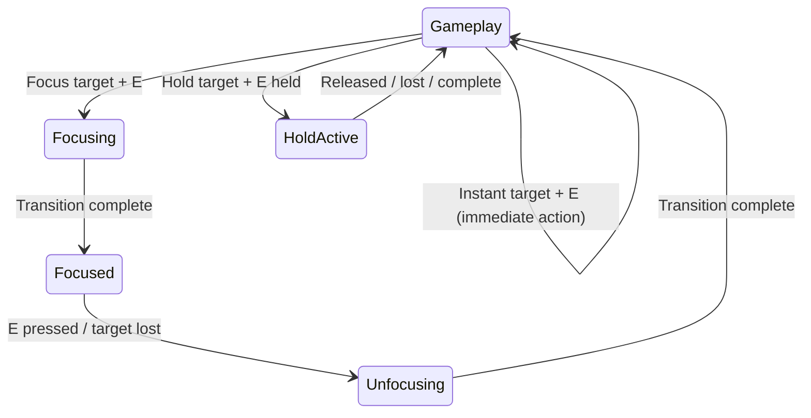

# Interaction System

> Players interact with ECS entities (chests, items, switches) using Barrage raycasts — UE line traces can't see ISM-rendered Flecs entities. The system supports three interaction types: Instant, Focus (camera transition + UI panel), and Hold (progress bar).

---

## Why Barrage Raycasts?

ECS entities are rendered via ISM — they have no UE Actors, no collision components, no scene proxies. UE's `LineTraceSingleByChannel()` is blind to them. Instead, the interaction system uses Jolt physics queries through Barrage's `SphereCast()` API.

---

## Targeting (10 Hz Timer)

`PerformInteractionTrace()` runs on a 0.1s repeating timer (game thread):



### Angle Check

Some entities restrict interaction to a specific facing direction:

```cpp
// If FInteractionAngleOverride exists, use its angle; else use FInteractionStatic default
float MaxAngleCos = InteractionStatic.AngleCosine;
float Dot = FVector::DotProduct(CameraForward, EntityForward);
if (Dot < MaxAngleCos)
    return false;  // Player not facing the right way
```

### Interaction Prompt

Prompt text is **not stored in ECS** — it's read from the data asset chain:

```
entity.get<FEntityDefinitionRef>()
    → EntityDefinition
    → InteractionProfile
    → InteractionPrompt (FText)
```

---

## Interaction Types

Configured in `UFlecsInteractionProfile`:

### Instant

Executes immediately on input. No state transition.

| Instant Action | Behavior |
|---------------|----------|
| `Pickup` | Pick up item into inventory |
| `Toggle` | Toggle a bool state (switch, lever) |
| `Destroy` | Destroy the interacted entity |
| `OpenContainer` | Open loot panel with container contents |
| `CustomEvent` | Fire gameplay tag event |

### Focus

Camera transitions to the entity, opens a UI panel:



| Profile Field | Purpose |
|--------------|---------|
| `bMoveCamera` | Enable camera transition |
| `FocusCameraPosition` | Target camera position (entity-local) |
| `FocusCameraRotation` | Target camera rotation |
| `FocusFOV` | Target FOV |
| `TransitionInTime` | Duration of camera transition in |
| `TransitionOutTime` | Duration of camera transition out |
| `FocusWidgetClass` | Widget to open while focused |

Camera lerp uses `EaseInOutCubic` for smooth acceleration/deceleration.

### Hold

Requires holding the input for a duration:



| Profile Field | Purpose |
|--------------|---------|
| `HoldDuration` | Time to hold (seconds) |
| `bCanCancel` | Allow releasing early |
| `CompletionAction` | Instant action to execute on complete |
| `HoldCompletionEventTag` | Gameplay tag fired on complete |

Hold progress is broadcast to the HUD via `FUIHoldProgressMessage`.

---

## State Machine

`FlecsCharacter_Interaction.cpp` implements the full state machine:



### State: Gameplay (Default)

- Interaction trace runs at 10 Hz
- Prompt UI shows/hides based on `CurrentInteractionTarget`
- E input dispatches based on `EInteractionType`

### State: FocusTransitionIn

- Saves current camera transform
- Computes target transform from entity + `FFocusCameraOverride`
- Disables pawn input (mouse look blocked)
- Swaps input mapping context to "Interaction"
- `alpha += DeltaTime / TransitionInTime`
- Camera: `Lerp(SavedTransform, TargetTransform, EaseInOutCubic(alpha))`

### State: Focused

- Camera held at target position
- Focus widget visible and interactive
- Polls for target validity

### State: FocusTransitionOut

- `alpha -= DeltaTime / TransitionOutTime`
- Camera: `Lerp(SavedTransform, TargetTransform, EaseOutQuad(alpha))`
- On complete: restores pawn control, swaps input context back, closes focus widget

### State: HoldActive

- `holdTimer += DeltaTime`
- Broadcasts `FUIHoldProgressMessage { Progress = holdTimer / HoldDuration }`
- Target-lost grace period: 0.3s before auto-cancel
- On complete: dispatches `CompletionAction`

---

## Sim Thread Execution

When an instant interaction is confirmed, it's dispatched to the sim thread:

```cpp
ArtillerySubsystem->EnqueueCommand([=]()
{
    flecs::entity Target = World.entity(TargetEntityId);
    if (!Target.is_alive()) return;

    switch (Action)
    {
        case EInstantAction::Pickup:
            PickupWorldItem(CharacterEntity, Target);
            break;

        case EInstantAction::Toggle:
            auto* Instance = Target.try_get_mut<FInteractionInstance>();
            if (Instance) Instance->bToggleState = !Instance->bToggleState;
            break;

        case EInstantAction::OpenContainer:
            // Opens loot panel with Target as external container
            OpenContainerCallback(Target);
            break;

        case EInstantAction::Destroy:
            Target.add<FTagDead>();
            break;
    }

    // Single-use interactions
    if (Target.get<FInteractionStatic>()->bSingleUse)
        Target.remove<FTagInteractable>();
});
```

---

## Components

| Component | Location | Fields |
|-----------|----------|--------|
| `FInteractionStatic` | Prefab | MaxRange, bSingleUse, InteractionType, AngleCosine |
| `FInteractionInstance` | Per-entity | bToggleState, UseCount |
| `FInteractionAngleOverride` | Per-entity (optional) | Custom angle restriction |
| `FTagInteractable` | Tag | Marks entity as interactable |
| `FFocusCameraOverride` | Per-entity (optional) | Local-space camera position/rotation for focus |
