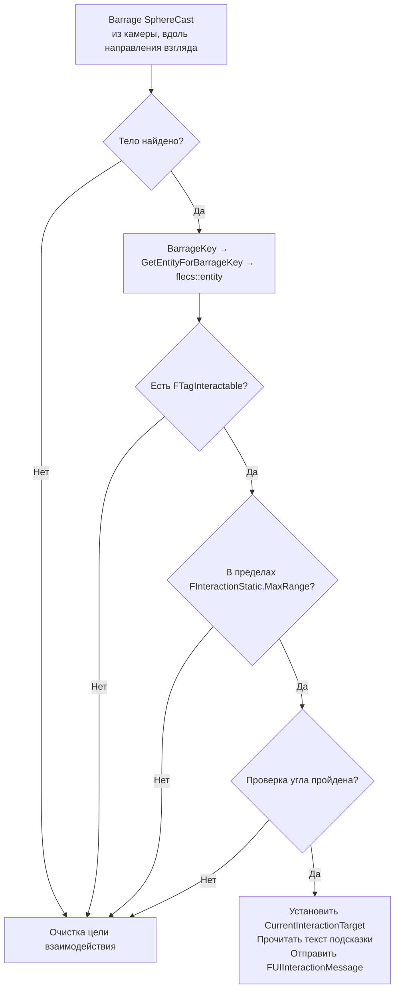
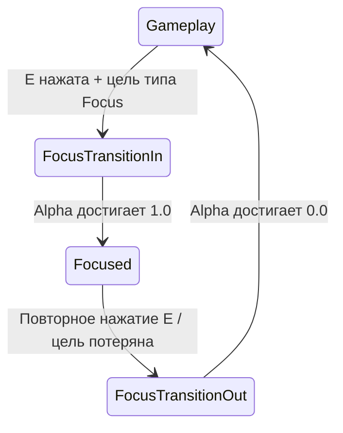
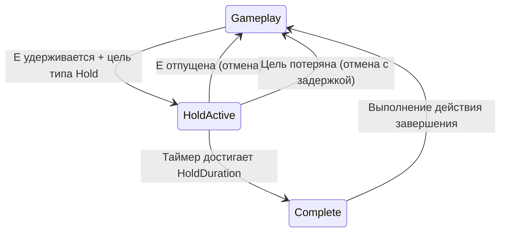
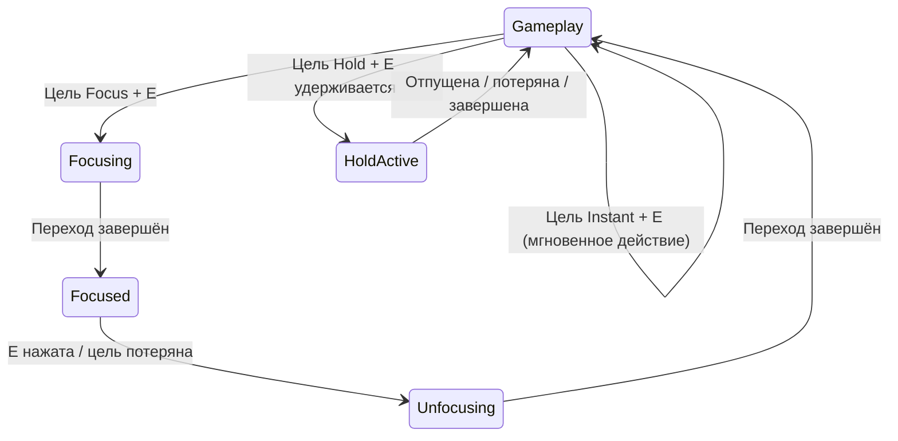

# Система взаимодействия

> Игроки взаимодействуют с ECS-сущностями (сундуки, предметы, переключатели) с помощью рейкастов Barrage — стандартные трейсы UE не видят Flecs-сущности, отрисованные через ISM. Система поддерживает три типа взаимодействия: мгновенное, фокусное (переход камеры + UI-панель) и удержание (полоса прогресса).

---

## Почему рейкасты Barrage?

ECS-сущности рендерятся через ISM — у них нет UE-акторов, компонентов коллизии или scene proxy. `LineTraceSingleByChannel()` движка их не видит. Вместо этого система взаимодействия использует физические запросы Jolt через API `SphereCast()` Barrage.

---

## Определение цели (таймер 10 Гц)

`PerformInteractionTrace()` выполняется по повторяющемуся таймеру 0.1с (game thread):



### Проверка угла

Некоторые сущности ограничивают взаимодействие определённым направлением взгляда:

```cpp
// Если FInteractionAngleOverride существует, используется его угол; иначе — значение по умолчанию из FInteractionStatic
float MaxAngleCos = InteractionStatic.AngleCosine;
float Dot = FVector::DotProduct(CameraForward, EntityForward);
if (Dot < MaxAngleCos)
    return false;  // Игрок смотрит не в ту сторону
```

### Текст подсказки

Текст подсказки **не хранится в ECS** — он читается по цепочке data asset:

```
entity.get<FEntityDefinitionRef>()
    → EntityDefinition
    → InteractionProfile
    → InteractionPrompt (FText)
```

---

## Типы взаимодействия

Настраиваются в `UFlecsInteractionProfile`:

### Мгновенное

Выполняется немедленно при вводе. Без перехода состояний.

| Мгновенное действие | Поведение |
|--------------------|-----------|
| `Pickup` | Подобрать предмет в инвентарь |
| `Toggle` | Переключить булево состояние (выключатель, рычаг) |
| `Destroy` | Уничтожить целевую сущность |
| `OpenContainer` | Открыть панель лута с содержимым контейнера |
| `CustomEvent` | Отправить событие gameplay-тега |

### Фокусное

Камера переходит к сущности, открывается UI-панель:



| Поле профиля | Назначение |
|-------------|-----------|
| `bMoveCamera` | Включить переход камеры |
| `FocusCameraPosition` | Целевая позиция камеры (локальные координаты сущности) |
| `FocusCameraRotation` | Целевая ротация камеры |
| `FocusFOV` | Целевой FOV |
| `TransitionInTime` | Длительность перехода камеры внутрь |
| `TransitionOutTime` | Длительность перехода камеры наружу |
| `FocusWidgetClass` | Виджет, открываемый в режиме фокуса |

Интерполяция камеры использует `EaseInOutCubic` для плавного ускорения/замедления.

### Удержание

Требует удержания ввода в течение определённого времени:



| Поле профиля | Назначение |
|-------------|-----------|
| `HoldDuration` | Время удержания (секунды) |
| `bCanCancel` | Разрешить раннее отпускание |
| `CompletionAction` | Мгновенное действие при завершении |
| `HoldCompletionEventTag` | Gameplay-тег, отправляемый при завершении |

Прогресс удержания транслируется в HUD через `FUIHoldProgressMessage`.

---

## Конечный автомат

`FlecsCharacter_Interaction.cpp` реализует полный конечный автомат:



### Состояние: Gameplay (по умолчанию)

- Трейс взаимодействия выполняется на 10 Гц
- UI подсказки показывается/скрывается по `CurrentInteractionTarget`
- Ввод E диспатчится по `EInteractionType`

### Состояние: FocusTransitionIn

- Сохраняет текущий трансформ камеры
- Вычисляет целевой трансформ из entity + `FFocusCameraOverride`
- Отключает ввод pawn (блокировка мыши)
- Переключает контекст input mapping на "Interaction"
- `alpha += DeltaTime / TransitionInTime`
- Камера: `Lerp(SavedTransform, TargetTransform, EaseInOutCubic(alpha))`

### Состояние: Focused

- Камера удерживается в целевой позиции
- Виджет фокуса видим и интерактивен
- Опрос валидности цели

### Состояние: FocusTransitionOut

- `alpha -= DeltaTime / TransitionOutTime`
- Камера: `Lerp(SavedTransform, TargetTransform, EaseOutQuad(alpha))`
- По завершении: восстановление управления pawn, переключение контекста ввода обратно, закрытие виджета фокуса

### Состояние: HoldActive

- `holdTimer += DeltaTime`
- Отправка `FUIHoldProgressMessage { Progress = holdTimer / HoldDuration }`
- Период ожидания при потере цели: 0.3с перед автоотменой
- По завершении: диспатч `CompletionAction`

---

## Выполнение на Sim Thread

Когда мгновенное взаимодействие подтверждено, оно диспатчится на sim thread:

```cpp
ArtillerySubsystem->EnqueueCommand([=]()
{
    flecs::entity Target = World.entity(TargetEntityId);
    if (!Target.is_alive()) return;

    switch (Action)
    {
        case EInstantAction::Pickup:
            PickupWorldItem(CharacterEntity, Target);
            break;

        case EInstantAction::Toggle:
            auto* Instance = Target.try_get_mut<FInteractionInstance>();
            if (Instance) Instance->bToggleState = !Instance->bToggleState;
            break;

        case EInstantAction::OpenContainer:
            // Открывает панель лута с Target как внешним контейнером
            OpenContainerCallback(Target);
            break;

        case EInstantAction::Destroy:
            Target.add<FTagDead>();
            break;
    }

    // Одноразовые взаимодействия
    if (Target.get<FInteractionStatic>()->bSingleUse)
        Target.remove<FTagInteractable>();
});
```

---

## Компоненты

| Компонент | Расположение | Поля |
|-----------|-------------|------|
| `FInteractionStatic` | Prefab | MaxRange, bSingleUse, InteractionType, AngleCosine |
| `FInteractionInstance` | Per-entity | bToggleState, UseCount |
| `FInteractionAngleOverride` | Per-entity (опционально) | Пользовательское ограничение угла |
| `FTagInteractable` | Tag | Отмечает entity как интерактивную |
| `FFocusCameraOverride` | Per-entity (опционально) | Позиция/ротация камеры в локальных координатах для фокуса |
