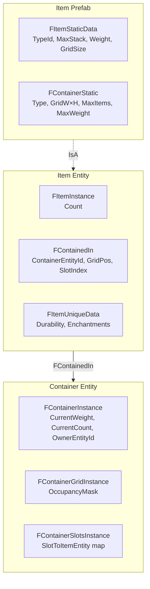
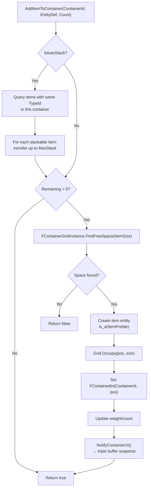
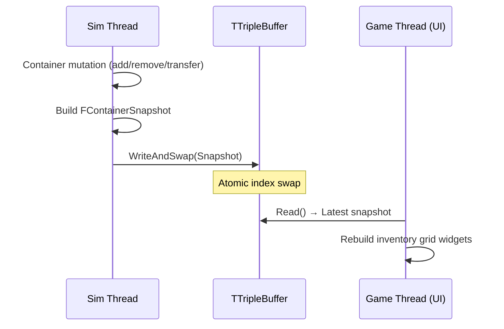

# Item & Container System

> Items and containers are Flecs entities with static/instance components. Containers use a 2D occupancy grid for spatial item placement. All mutations happen on the sim thread; the UI receives snapshots via triple buffer.

---

## Component Hierarchy



---

## Item Static Data

`FItemStaticData` (from `UFlecsItemDefinition`):

| Field | Type | Description |
|-------|------|-------------|
| `TypeId` | `int32` | Hash of `ItemName` (auto-generated) |
| `ItemName` | `FText` | Internal name for hashing |
| `MaxStack` | `int32` | Maximum stack size |
| `Weight` | `float` | Weight per unit |
| `GridSize` | `FIntPoint` | Size in container grid cells (W × H) |
| `EntityDefinition` | `UFlecsEntityDefinition*` | Back-reference for spawning |
| `ItemDefinition` | `UFlecsItemDefinition*` | Full item metadata (display name, icon, etc.) |

---

## Container Types

| Type | Storage | Use Case |
|------|---------|----------|
| **Grid** | 2D occupancy mask (`FContainerGridInstance`) | Player inventory, chest |
| **Slot** | Named slots (`FContainerSlotsInstance`) | Equipment (head, chest, weapon) |
| **List** | Simple count (`FContainerInstance.CurrentCount`) | Ammo pool, simple storage |

---

## Grid Occupancy

`FContainerGridInstance` manages a bit-packed 2D grid:

```
Grid: 8×4 container, item occupying (2,1) with size 2×2

  0 1 2 3 4 5 6 7
0 . . . . . . . .
1 . . X X . . . .
2 . . X X . . . .
3 . . . . . . . .
```

### API

```cpp
struct FContainerGridInstance
{
    TArray<uint8> OccupancyMask;  // Bit-packed grid
    int32 Width, Height;

    void Initialize(int32 W, int32 H);
    bool CanFit(FIntPoint Position, FIntPoint Size) const;
    void Occupy(FIntPoint Position, FIntPoint Size);
    void Free(FIntPoint Position, FIntPoint Size);
    FIntPoint FindFreeSpace(FIntPoint Size) const;  // Returns (-1,-1) if no space
};
```

Grid is cleared with `FMemory::Memzero()` on `RemoveAllItemsFromContainer`.

---

## Container Operations

All operations execute on the sim thread. Blueprint-callable versions use `EnqueueCommand`.

### AddItemToContainer



### RemoveItemFromContainer

1. Grid: `Free(position, size)`
2. Decrement `CurrentCount` and `CurrentWeight`
3. `ItemEntity.destruct()`
4. `NotifyContainerUI()`

### TransferItem

1. Check destination weight limit
2. Try auto-stack at destination
3. Grid: `Free` source → `FindFreeSpace` + `Occupy` destination
4. Update `FContainedIn.ContainerEntityId` and `GridPosition`
5. Notify both containers' UI

### PickupWorldItem

Called by `PickupCollisionSystem` when a character touches a pickupable item:

1. `AddItemToContainerDirect(CharacterInventoryId, ItemDef, Count)`
2. Full transfer → item gets `FTagDead`
3. Partial transfer → reduce `FItemInstance.Count` on world item
4. Failed → item stays in world

---

## Item Prefab Registry

`GetOrCreateItemPrefab(ItemDefinition)` in `ItemRegistry`:

- Generates `TypeId = GetTypeHash(ItemName)` if TypeId == 0
- Creates `World.prefab()` with `FItemStaticData` set
- If item has a `ContainerProfile`: also sets `FContainerStatic`
- Cached in `TMap<int32, flecs::entity> ItemPrefabs`

---

## World Items

Items dropped in the world have additional components:

| Component | Purpose |
|-----------|---------|
| `FWorldItemInstance` | `DespawnTimer` (auto-despawn), `PickupGraceTimer` (prevent instant re-pickup) |
| `FTagPickupable` | Marks item as collectable |
| `FTagDroppedItem` | Distinguishes from naturally-spawned items |
| `FBarrageBody` | Physics body for world collision |
| `FISMRender` | Visual mesh in world |

### Drop Flow

```cpp
UFlecsContainerLibrary::DropItem(World, ContainerId, ItemEntityId, DropLocation, Count)
```

1. Remove item from container (or reduce count)
2. Create new world entity with physics body at `DropLocation`
3. Set `FWorldItemInstance { PickupGraceTimer = 0.5f, DespawnTimer = 300.f }`
4. Add `FTagPickupable` + `FTagDroppedItem`

---

## UI Integration

### Sim → Game Sync

Container state is pushed to the game thread via `TTripleBuffer<FContainerSnapshot>`:



`FContainerSnapshot` contains:

```cpp
struct FContainerSnapshot
{
    TArray<FContainerItemData> Items;  // TypeId, Count, GridPos, GridSize, EntityId
    int32 GridWidth, GridHeight;
    float CurrentWeight, MaxWeight;
    int32 CurrentCount, MaxItems;
};
```

### Optimistic Drag-Drop

The inventory UI moves items visually immediately without waiting for sim-thread confirmation:

1. User drags item from slot A to slot B
2. UI immediately shows item at slot B (optimistic)
3. `EnqueueCommand` → sim thread: `TransferItem(containerA, containerB, ...)`
4. Sim thread confirms → next snapshot matches optimistic state
5. Sim thread rejects → next snapshot shows item back at slot A (revert)

---

## Blueprint API

```cpp
// Add items
bool UFlecsContainerLibrary::AddItemToContainer(World, ContainerId, EntityDef, Count,
                                                 OutActuallyAdded, bAutoStack);

// Remove items
bool UFlecsContainerLibrary::RemoveItemFromContainer(World, ContainerId, ItemEntityId, Count);
int32 UFlecsContainerLibrary::RemoveAllItemsFromContainer(World, ContainerId);

// Transfer between containers
bool UFlecsContainerLibrary::TransferItem(World, SourceId, DestId, ItemEntityId, DestGridPos);

// World item operations
bool UFlecsContainerLibrary::PickupItem(World, WorldItemKey, ContainerId, OutPickedUp);
FSkeletonKey UFlecsContainerLibrary::DropItem(World, ContainerId, ItemEntityId, DropLoc, Count);

// Queries
int32 UFlecsContainerLibrary::GetContainerItemCount(World, ContainerId);

// World item timer
void UFlecsContainerLibrary::SetItemDespawnTimer(World, BarrageKey, Timer);
```
