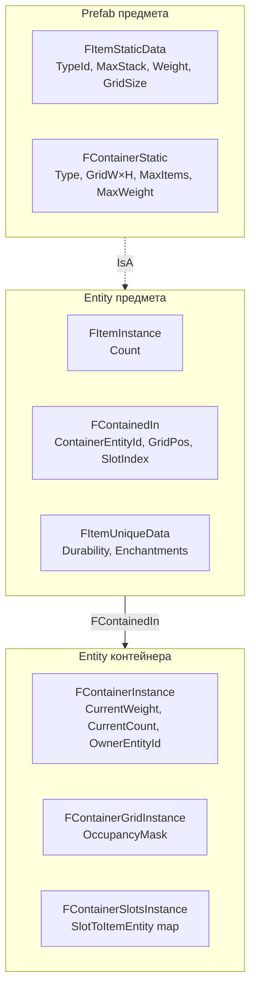
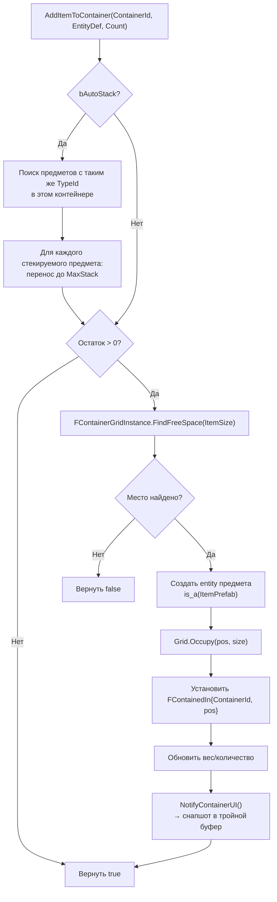
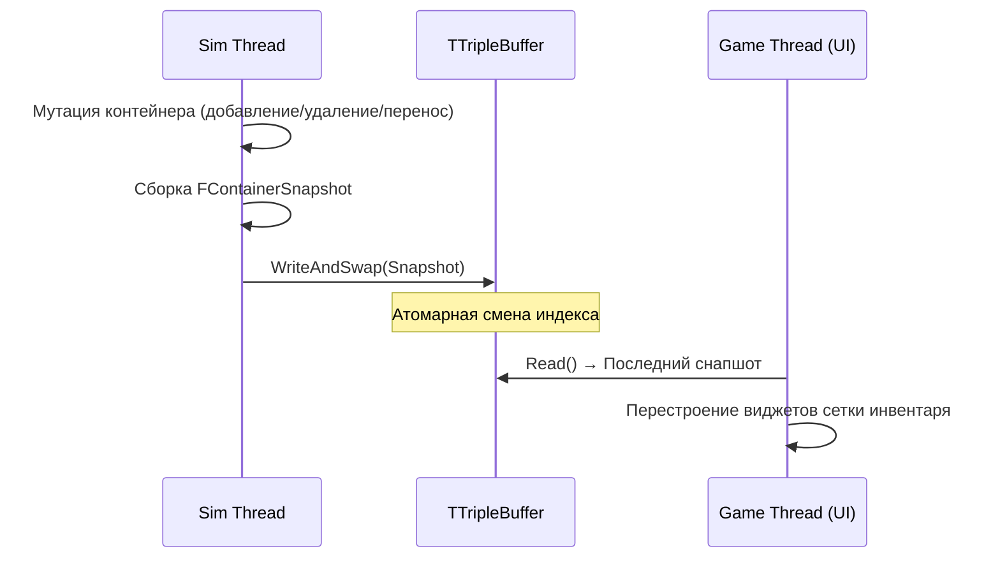

# Система предметов и контейнеров

> Предметы и контейнеры — это Flecs entity со статическими/инстанс-компонентами. Контейнеры используют 2D-сетку занятости для пространственного размещения предметов. Все мутации происходят на sim thread; UI получает снапшоты через тройной буфер.

---

## Иерархия компонентов



---

## Статические данные предмета

`FItemStaticData` (из `UFlecsItemDefinition`):

| Поле | Тип | Описание |
|------|-----|----------|
| `TypeId` | `int32` | Хеш `ItemName` (генерируется автоматически) |
| `ItemName` | `FText` | Внутреннее имя для хеширования |
| `MaxStack` | `int32` | Максимальный размер стека |
| `Weight` | `float` | Вес за единицу |
| `GridSize` | `FIntPoint` | Размер в ячейках сетки контейнера (Ш x В) |
| `EntityDefinition` | `UFlecsEntityDefinition*` | Обратная ссылка для спавна |
| `ItemDefinition` | `UFlecsItemDefinition*` | Полные метаданные предмета (отображаемое имя, иконка и т.д.) |

---

## Типы контейнеров

| Тип | Хранение | Применение |
|-----|----------|------------|
| **Grid** | 2D-маска занятости (`FContainerGridInstance`) | Инвентарь игрока, сундук |
| **Slot** | Именованные слоты (`FContainerSlotsInstance`) | Экипировка (голова, грудь, оружие) |
| **List** | Простой счётчик (`FContainerInstance.CurrentCount`) | Пул патронов, простое хранилище |

---

## Сетка занятости

`FContainerGridInstance` управляет битово-упакованной 2D-сеткой:

```
Сетка: контейнер 8×4, предмет занимает (2,1) размером 2×2

  0 1 2 3 4 5 6 7
0 . . . . . . . .
1 . . X X . . . .
2 . . X X . . . .
3 . . . . . . . .
```

### API

```cpp
struct FContainerGridInstance
{
    TArray<uint8> OccupancyMask;  // Битово-упакованная сетка
    int32 Width, Height;

    void Initialize(int32 W, int32 H);
    bool CanFit(FIntPoint Position, FIntPoint Size) const;
    void Occupy(FIntPoint Position, FIntPoint Size);
    void Free(FIntPoint Position, FIntPoint Size);
    FIntPoint FindFreeSpace(FIntPoint Size) const;  // Возвращает (-1,-1) если места нет
};
```

Сетка очищается через `FMemory::Memzero()` при `RemoveAllItemsFromContainer`.

---

## Операции с контейнером

Все операции выполняются на sim thread. Blueprint-вызываемые версии используют `EnqueueCommand`.

### AddItemToContainer



### RemoveItemFromContainer

1. Сетка: `Free(position, size)`
2. Уменьшение `CurrentCount` и `CurrentWeight`
3. `ItemEntity.destruct()`
4. `NotifyContainerUI()`

### TransferItem

1. Проверка лимита веса назначения
2. Попытка автостека в назначении
3. Сетка: `Free` источник → `FindFreeSpace` + `Occupy` назначение
4. Обновление `FContainedIn.ContainerEntityId` и `GridPosition`
5. Уведомление UI обоих контейнеров

### PickupWorldItem

Вызывается `PickupCollisionSystem`, когда персонаж касается подбираемого предмета:

1. `AddItemToContainerDirect(CharacterInventoryId, ItemDef, Count)`
2. Полный перенос → предмет получает `FTagDead`
3. Частичный перенос → уменьшение `FItemInstance.Count` у мирового предмета
4. Неуспех → предмет остаётся в мире

---

## Реестр Prefab предметов

`GetOrCreateItemPrefab(ItemDefinition)` в `ItemRegistry`:

- Генерирует `TypeId = GetTypeHash(ItemName)` если TypeId == 0
- Создаёт `World.prefab()` с установленным `FItemStaticData`
- Если у предмета есть `ContainerProfile`: также устанавливает `FContainerStatic`
- Кэшируется в `TMap<int32, flecs::entity> ItemPrefabs`

---

## Мировые предметы

У предметов, сброшенных в мир, есть дополнительные компоненты:

| Компонент | Назначение |
|-----------|-----------|
| `FWorldItemInstance` | `DespawnTimer` (автоудаление), `PickupGraceTimer` (защита от мгновенного повторного подбора) |
| `FTagPickupable` | Отмечает предмет как подбираемый |
| `FTagDroppedItem` | Отличает от естественно заспавненных предметов |
| `FBarrageBody` | Физическое тело для коллизий в мире |
| `FISMRender` | Визуальный меш в мире |

### Поток выбрасывания

```cpp
UFlecsContainerLibrary::DropItem(World, ContainerId, ItemEntityId, DropLocation, Count)
```

1. Удаление предмета из контейнера (или уменьшение количества)
2. Создание нового мирового entity с физическим телом в `DropLocation`
3. Установка `FWorldItemInstance { PickupGraceTimer = 0.5f, DespawnTimer = 300.f }`
4. Добавление `FTagPickupable` + `FTagDroppedItem`

---

## Интеграция с UI

### Синхронизация Sim → Game

Состояние контейнера передаётся на game thread через `TTripleBuffer<FContainerSnapshot>`:



`FContainerSnapshot` содержит:

```cpp
struct FContainerSnapshot
{
    TArray<FContainerItemData> Items;  // TypeId, Count, GridPos, GridSize, EntityId
    int32 GridWidth, GridHeight;
    float CurrentWeight, MaxWeight;
    int32 CurrentCount, MaxItems;
};
```

### Оптимистичное перетаскивание

UI инвентаря перемещает предметы визуально немедленно, не дожидаясь подтверждения от sim thread:

1. Пользователь перетаскивает предмет из слота A в слот B
2. UI сразу показывает предмет в слоте B (оптимистично)
3. `EnqueueCommand` → sim thread: `TransferItem(containerA, containerB, ...)`
4. Sim thread подтверждает → следующий снапшот совпадает с оптимистичным состоянием
5. Sim thread отклоняет → следующий снапшот показывает предмет обратно в слоте A (откат)

---

## Blueprint API

```cpp
// Добавление предметов
bool UFlecsContainerLibrary::AddItemToContainer(World, ContainerId, EntityDef, Count,
                                                 OutActuallyAdded, bAutoStack);

// Удаление предметов
bool UFlecsContainerLibrary::RemoveItemFromContainer(World, ContainerId, ItemEntityId, Count);
int32 UFlecsContainerLibrary::RemoveAllItemsFromContainer(World, ContainerId);

// Перенос между контейнерами
bool UFlecsContainerLibrary::TransferItem(World, SourceId, DestId, ItemEntityId, DestGridPos);

// Операции с мировыми предметами
bool UFlecsContainerLibrary::PickupItem(World, WorldItemKey, ContainerId, OutPickedUp);
FSkeletonKey UFlecsContainerLibrary::DropItem(World, ContainerId, ItemEntityId, DropLoc, Count);

// Запросы
int32 UFlecsContainerLibrary::GetContainerItemCount(World, ContainerId);

// Таймер мирового предмета
void UFlecsContainerLibrary::SetItemDespawnTimer(World, BarrageKey, Timer);
```
