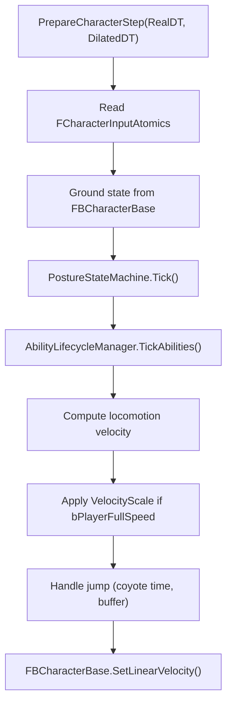
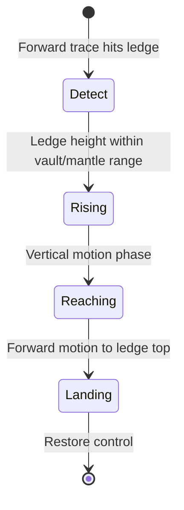

# Movement System

> Character locomotion runs on the simulation thread inside `PrepareCharacterStep()`. It reads input from atomics, computes desired velocity, and feeds Jolt's character controller. Movement abilities (slide, mantle, ledge grab, climb) are integrated here.

---

## PrepareCharacterStep

Called once per sim tick per registered character, before `StepWorld()`:



---

## Input → Velocity

```cpp
// Read input direction (normalized by game thread)
float InputX = InputAtomics.DirX.load();
float InputZ = InputAtomics.DirZ.load();

// Camera-relative direction
FVector CamForward = GetCameraForwardXY();
FVector CamRight = GetCameraRightXY();
FVector DesiredDir = CamForward * InputZ + CamRight * InputX;
DesiredDir.Normalize();

// Speed based on posture and sprint state
float TargetSpeed = GetTargetSpeed(Posture, bSprinting, bSliding);

// Acceleration / deceleration smoothing
float Accel = bOnGround ? MovementStatic.GroundAcceleration : MovementStatic.AirAcceleration;
SmoothedVelocity = FMath::VInterpTo(SmoothedVelocity, DesiredDir * TargetSpeed, DT, Accel);
```

### Speed Table

| State | Speed Source |
|-------|-------------|
| Standing walk | `MovementStatic.WalkSpeed` |
| Sprint | `MovementStatic.SprintSpeed` |
| Crouch | `MovementStatic.CrouchSpeed` |
| Prone | `MovementStatic.ProneSpeed` |
| Slide | Decelerating from entry speed |
| Air | Previous horizontal velocity × `AirControlMultiplier` |

---

## VelocityScale (Time Dilation Compensation)

When `bPlayerFullSpeed = true`, the player must move at real-time speed despite dilated physics:

```cpp
float VelocityScale = bPlayerFullSpeed ? (1.f / ActiveTimeScale) : 1.f;

// CRITICAL: Undo previous frame's scaling before smoothing
FVector CurH = GetHorizontalVelocity();
if (VelocityScale > 1.001f)
    CurH *= (1.f / VelocityScale);  // Remove previous scale

FVector SmoothedH = SmoothVelocity(CurH, DesiredH, DT);
FVector FinalVelocity = SmoothedH * VelocityScale;
```

!!! danger "Compounding Bug"
    `GetLinearVelocity()` returns the **scaled** velocity from the previous frame. Without undoing the previous scale, `VelocityScale` compounds each frame → exponential acceleration. Always divide out the old scale before applying the new one.

---

## Jump System

### Coyote Time

After leaving the ground, the player has `CoyoteTimeFrames` sim ticks to still jump:

```cpp
if (bWasOnGround && !bOnGround)
    CoyoteFramesRemaining = MovementStatic.CoyoteTimeFrames;

if (bJumpPressed && (bOnGround || CoyoteFramesRemaining > 0))
    DoJump();
```

### Jump Buffer

If jump is pressed while airborne (near ground), it's buffered for `JumpBufferFrames` ticks:

```cpp
if (bJumpPressed && !bOnGround)
    JumpBufferRemaining = MovementStatic.JumpBufferFrames;

if (bOnGround && JumpBufferRemaining > 0)
    DoJump();
```

### Jump Velocity

```cpp
void DoJump()
{
    float JumpVel = (Posture == Crouching)
        ? MovementStatic.CrouchJumpVelocity
        : MovementStatic.JumpVelocity;

    JumpVel *= VelocityScale;  // Time dilation compensation
    SetVerticalVelocity(JumpVel);
}
```

---

## Gravity

```cpp
// BaseGravityJoltY captured once from Jolt world settings
float GravityThisTick = BaseGravityJoltY * MovementStatic.GravityScale * VelocityScale;
FBCharacterBase->SetGravity(GravityThisTick);
```

VelocityScale is applied to gravity so the player falls at real-time speed during slow-motion.

---

## Movement Abilities

### Slide

Activation: Crouch + Sprint + OnGround + speed > `SlideEntrySpeed`

```
Phase: Active
  Direction: locked to velocity at activation
  Speed: decelerates at SlideDeceleration
  Capsule: crouch height
  Camera: tilt by SlideTiltAngle

Exit: speed < SlideExitSpeed OR jump input OR duration exceeded
```

`SlideActiveAtomic` (shared atomic bool) communicates slide state to the game thread for camera tilt.

### Mantle / Vault

Activation: `FLedgeDetector::Detect()` via Barrage forward SphereCast



- **Vault:** Short obstacles (< `VaultMaxHeight`) — quick hop-over
- **Mantle:** Taller obstacles — multi-phase climb animation
- Communicated via `StateAtomics.MantleActive` + `MantleType`

### Ledge Grab

Activation: Airborne + forward trace finds grabbable ledge at `LedgeGrabMaxHeight`

```
Phase: Hanging
  Velocity: zeroed, held at ledge position
  Input: Jump → PullUp, Crouch → Drop, Move → Wall-jump

Phase: PullUp
  Duration: PullUpDuration
  Velocity: upward + forward onto ledge
```

### Climb

Activation: Forward SphereCast hits entity with `FTagClimbable` + `FClimbableStatic`

```
Phase: Climbing
  Velocity: FClimbableStatic.ClimbDirection * ClimbSpeed
  Exit: Reach top (AABB check) → TopExitVelocity
  Exit: Look away (angle > DetachAngle) → detach
```

### Rope Swing

Activation: Camera SphereCast hits entity with `FTagSwingable` + `FSwingableStatic`

```
Phase: Attached
  Creates Jolt distance constraint to swing point
  Input: forward = swing force, jump = detach
  Visual: FRopeVisualRenderer (spline from hand to anchor)
```

---

## Movement Profile

`UFlecsMovementProfile` → `FMovementStatic` (ECS component):

| Group | Fields |
|-------|--------|
| **Speeds** | WalkSpeed, SprintSpeed, CrouchSpeed, ProneSpeed |
| **Acceleration** | GroundAccel, AirAccel, SprintAccel, Deceleration |
| **Jump** | JumpVelocity, CrouchJumpVelocity, CoyoteTimeFrames, JumpBufferFrames |
| **Air** | AirControlMultiplier, GravityScale |
| **Capsule** | StandingHeight, CrouchHeight, ProneHeight, StandingRadius |
| **Camera** | SprintFOVBoost, FOVInterpSpeed, HeadBob params, SlideTilt |
| **Posture** | bCrouchIsToggle, bProneIsToggle, EyeHeights, TransitionSpeeds |
| **Slide** | EntrySpeed, ExitSpeed, Deceleration, Duration, JumpVelocity |
| **Mantle** | ForwardReach, height limits, phase durations |
| **LedgeGrab** | MaxHeight, DetectionRadius, HangTimeout, WallJumpForces |
| **Blink** | MaxRange, MaxCharges, RechargeTime, TimeDilation settings |
