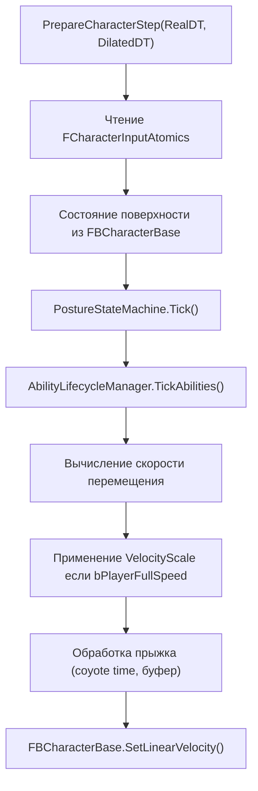
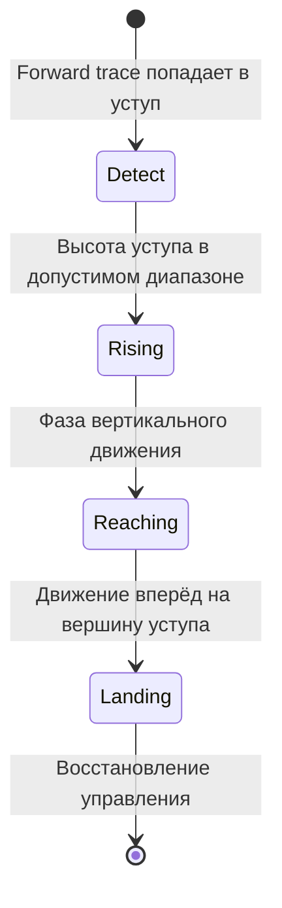

# Система движения

> Локомоция персонажа выполняется на sim thread внутри `PrepareCharacterStep()`. Она считывает ввод из атомиков, вычисляет желаемую скорость и передаёт её контроллеру персонажа Jolt. Способности движения (скольжение, карабканье, захват уступа, лазание) интегрированы здесь же.

---

## PrepareCharacterStep

Вызывается один раз за тик симуляции для каждого зарегистрированного персонажа, перед `StepWorld()`:



---

## Ввод → Скорость

```cpp
// Чтение направления ввода (нормализовано game thread)
float InputX = InputAtomics.DirX.load();
float InputZ = InputAtomics.DirZ.load();

// Направление относительно камеры
FVector CamForward = GetCameraForwardXY();
FVector CamRight = GetCameraRightXY();
FVector DesiredDir = CamForward * InputZ + CamRight * InputX;
DesiredDir.Normalize();

// Скорость на основе позы и состояния спринта
float TargetSpeed = GetTargetSpeed(Posture, bSprinting, bSliding);

// Сглаживание ускорения / торможения
float Accel = bOnGround ? MovementStatic.GroundAcceleration : MovementStatic.AirAcceleration;
SmoothedVelocity = FMath::VInterpTo(SmoothedVelocity, DesiredDir * TargetSpeed, DT, Accel);
```

### Таблица скоростей

| Состояние | Источник скорости |
|-----------|------------------|
| Ходьба стоя | `MovementStatic.WalkSpeed` |
| Спринт | `MovementStatic.SprintSpeed` |
| Присед | `MovementStatic.CrouchSpeed` |
| Лёжа | `MovementStatic.ProneSpeed` |
| Скольжение | Замедление от начальной скорости |
| В воздухе | Предыдущая горизонтальная скорость x `AirControlMultiplier` |

---

## VelocityScale (компенсация замедления времени)

Когда `bPlayerFullSpeed = true`, игрок должен двигаться с реальной скоростью несмотря на замедленную физику:

```cpp
float VelocityScale = bPlayerFullSpeed ? (1.f / ActiveTimeScale) : 1.f;

// КРИТИЧНО: Отмена масштабирования предыдущего кадра перед сглаживанием
FVector CurH = GetHorizontalVelocity();
if (VelocityScale > 1.001f)
    CurH *= (1.f / VelocityScale);  // Снятие предыдущего масштаба

FVector SmoothedH = SmoothVelocity(CurH, DesiredH, DT);
FVector FinalVelocity = SmoothedH * VelocityScale;
```

!!! danger "Баг накопления"
    `GetLinearVelocity()` возвращает **масштабированную** скорость предыдущего кадра. Без отмены предыдущего масштаба `VelocityScale` накапливается каждый кадр → экспоненциальное ускорение. Всегда делите на старый масштаб перед применением нового.

---

## Система прыжков

### Coyote Time

После отрыва от земли у игрока есть `CoyoteTimeFrames` тиков симуляции для прыжка:

```cpp
if (bWasOnGround && !bOnGround)
    CoyoteFramesRemaining = MovementStatic.CoyoteTimeFrames;

if (bJumpPressed && (bOnGround || CoyoteFramesRemaining > 0))
    DoJump();
```

### Буфер прыжка

Если прыжок нажат в воздухе (рядом с землёй), он буферизуется на `JumpBufferFrames` тиков:

```cpp
if (bJumpPressed && !bOnGround)
    JumpBufferRemaining = MovementStatic.JumpBufferFrames;

if (bOnGround && JumpBufferRemaining > 0)
    DoJump();
```

### Скорость прыжка

```cpp
void DoJump()
{
    float JumpVel = (Posture == Crouching)
        ? MovementStatic.CrouchJumpVelocity
        : MovementStatic.JumpVelocity;

    JumpVel *= VelocityScale;  // Компенсация замедления времени
    SetVerticalVelocity(JumpVel);
}
```

---

## Гравитация

```cpp
// BaseGravityJoltY захватывается однократно из настроек мира Jolt
float GravityThisTick = BaseGravityJoltY * MovementStatic.GravityScale * VelocityScale;
FBCharacterBase->SetGravity(GravityThisTick);
```

VelocityScale применяется к гравитации, чтобы игрок падал с реальной скоростью во время slow-motion.

---

## Способности движения

### Скольжение

Активация: Присед + Спринт + На земле + скорость > `SlideEntrySpeed`

```
Фаза: Активное
  Направление: зафиксировано по скорости в момент активации
  Скорость: замедление с SlideDeceleration
  Капсула: высота приседа
  Камера: наклон на SlideTiltAngle

Выход: скорость < SlideExitSpeed ИЛИ ввод прыжка ИЛИ превышена длительность
```

`SlideActiveAtomic` (разделяемый атомарный bool) передаёт состояние скольжения на game thread для наклона камеры.

### Карабканье / Перепрыгивание

Активация: `FLedgeDetector::Detect()` через Barrage SphereCast вперёд



- **Vault:** Низкие препятствия (< `VaultMaxHeight`) — быстрый перепрыг
- **Mantle:** Высокие препятствия — многофазная анимация карабканья
- Передаётся через `StateAtomics.MantleActive` + `MantleType`

### Захват уступа

Активация: В воздухе + forward trace находит захватываемый уступ на `LedgeGrabMaxHeight`

```
Фаза: Висение
  Скорость: обнулена, удержание на позиции уступа
  Ввод: Прыжок → Подъём, Присед → Отпустить, Движение → Прыжок от стены

Фаза: Подъём
  Длительность: PullUpDuration
  Скорость: вверх + вперёд на уступ
```

### Лазание

Активация: Forward SphereCast попадает в entity с `FTagClimbable` + `FClimbableStatic`

```
Фаза: Лазание
  Скорость: FClimbableStatic.ClimbDirection * ClimbSpeed
  Выход: Достигнута вершина (проверка AABB) → TopExitVelocity
  Выход: Взгляд в сторону (угол > DetachAngle) → отсоединение
```

### Качание на верёвке

Активация: Camera SphereCast попадает в entity с `FTagSwingable` + `FSwingableStatic`

```
Фаза: Прикреплён
  Создаётся Jolt distance constraint к точке качания
  Ввод: вперёд = сила раскачивания, прыжок = отсоединение
  Визуал: FRopeVisualRenderer (сплайн от руки до якоря)
```

---

## Профиль движения

`UFlecsMovementProfile` → `FMovementStatic` (компонент ECS):

| Группа | Поля |
|--------|------|
| **Скорости** | WalkSpeed, SprintSpeed, CrouchSpeed, ProneSpeed |
| **Ускорение** | GroundAccel, AirAccel, SprintAccel, Deceleration |
| **Прыжок** | JumpVelocity, CrouchJumpVelocity, CoyoteTimeFrames, JumpBufferFrames |
| **Воздух** | AirControlMultiplier, GravityScale |
| **Капсула** | StandingHeight, CrouchHeight, ProneHeight, StandingRadius |
| **Камера** | SprintFOVBoost, FOVInterpSpeed, параметры HeadBob, SlideTilt |
| **Поза** | bCrouchIsToggle, bProneIsToggle, EyeHeights, TransitionSpeeds |
| **Скольжение** | EntrySpeed, ExitSpeed, Deceleration, Duration, JumpVelocity |
| **Карабканье** | ForwardReach, ограничения высоты, длительности фаз |
| **Захват уступа** | MaxHeight, DetectionRadius, HangTimeout, WallJumpForces |
| **Blink** | MaxRange, MaxCharges, RechargeTime, настройки замедления времени |
