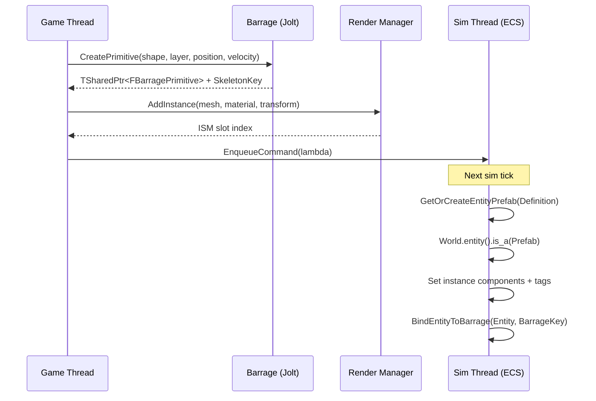
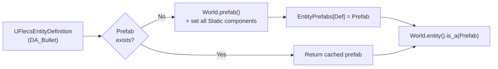
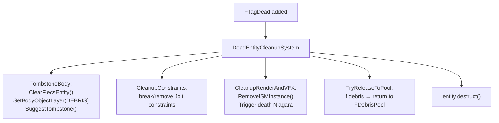

# Spawn Pipeline

> Every gameplay entity — projectile, item, destructible, door — is created through a unified spawn pipeline. A single `FEntitySpawnRequest` struct drives the entire flow: physics body creation, ISM registration, ECS entity setup, and tag assignment.

---

## Entry Points

### C++ Fluent API

```cpp
FEntitySpawnRequest::FromDefinition(BulletDef, SpawnLocation)
    .WithVelocity(Direction * Speed)
    .WithOwnerEntity(ShooterId)
    .Spawn(WorldContext);
```

### Blueprint

```cpp
UFlecsSpawnLibrary::SpawnProjectileFromEntityDef(
    World, Definition, Location, Direction, Speed, OwnerEntityId);
```

### Level Actor

Place `AFlecsEntitySpawnerActor` in the level. Set `EntityDefinition` in the Details panel. Entity spawns on `BeginPlay` (or manually via `SpawnEntity()`).

| Property | Default | Description |
|----------|---------|-------------|
| `EntityDefinition` | — | Data Asset (required) |
| `InitialVelocity` | (0,0,0) | World-space velocity |
| `bOverrideScale` | false | Override scale from RenderProfile |
| `ScaleOverride` | (1,1,1) | Custom scale |
| `bSpawnOnBeginPlay` | true | Auto-spawn on play |
| `bDestroyAfterSpawn` | true | Destroy the spawner actor after spawning |
| `bShowPreview` | true | Show mesh preview in editor viewport |

---

## Two-Phase Spawn



### Phase 1 — Game Thread

1. **Profile resolution** — `UFlecsEntityDefinition` provides all profiles. Per-request overrides in `FEntitySpawnRequest` take priority.

2. **Physics body creation** — Barrage creates a Jolt body:
    - Projectiles → `CreateBouncingSphere()` (sphere shape, sensor mode for non-bouncing)
    - Items/Destructibles → `FBarrageSpawnUtils::SpawnEntity()` (auto-sized box from mesh bounds)
    - Characters → `FBCharacterBase` (capsule with character controller)

3. **ISM registration** — `UFlecsRenderManager::AddInstance()` allocates an ISM slot. The initial transform is set from the spawn position.

4. **Niagara attachment** — If `NiagaraProfile` has an attached effect, it's registered with `UFlecsNiagaraManager`.

5. **EnqueueCommand** — A lambda capturing all spawn data is pushed to the MPSC command queue.

### Phase 2 — Simulation Thread

Executes at the start of the next sim tick (inside `DrainCommandQueue`):

1. **Prefab lookup** — `GetOrCreateEntityPrefab(EntityDefinition)`:
    - First call per definition: creates a `World.prefab()` and sets all static components from profiles
    - Subsequent calls: returns cached prefab from `TMap<UFlecsEntityDefinition*, flecs::entity>`

2. **Entity creation** — `World.entity().is_a(Prefab)`:
    - Inherits all static components automatically (zero memory for shared data)
    - Instance components added on top

3. **Instance components**:
    ```
    FBarrageBody { BarrageKey }         — forward binding
    FISMRender { Mesh, Material, Slot } — render link
    FHealthInstance { CurrentHP = MaxHP } — mutable health
    FProjectileInstance { Lifetime }     — if projectile
    FItemInstance { Count }              — if item
    FContainerInstance + FContainerGridInstance — if container
    ```

4. **Bidirectional binding** — `BindEntityToBarrage(Entity, BarrageKey)`:
    - Sets `FBarrageBody` component on entity (forward)
    - Stores entity ID in `FBarragePrimitive` atomic (reverse)
    - Adds to `TranslationMapping` (SkeletonKey → entity)

5. **Tag assignment** — Based on entity type and profile presence:
    ```
    FTagProjectile        — has ProjectileProfile
    FTagItem              — has ItemDefinition
    FTagContainer         — has ContainerProfile
    FTagPickupable        — bPickupable flag in EntityDefinition
    FTagInteractable      — has InteractionProfile
    FTagDestructible      — has DestructibleProfile
    FTagHasLoot           — bHasLoot flag
    FTagDoor              — has DoorProfile
    FTagCharacter         — bIsCharacter flag
    ```

---

## Prefab Registry



Static components set on the prefab:

| Profile Present | Component Set |
|----------------|---------------|
| HealthProfile | `FHealthStatic` |
| DamageProfile | `FDamageStatic` |
| ProjectileProfile | `FProjectileStatic` |
| WeaponProfile | `FWeaponStatic` |
| ContainerProfile | `FContainerStatic` |
| InteractionProfile | `FInteractionStatic` |
| DestructibleProfile | `FDestructibleStatic` |
| DoorProfile | `FDoorStatic` |
| MovementProfile | `FMovementStatic` |
| ItemDefinition | `FItemStaticData` |
| ExplosionProfile | `FExplosionStatic` |

---

## Projectile Fast Path

`WeaponFireSystem` bypasses the generic spawn pipeline for performance. It creates the Barrage body and Flecs entity **inline on the sim thread** in a single tick:

```
WeaponFireSystem (sim thread):
  1. Aim raycast → corrected direction
  2. Bloom spread → final direction
  3. CreateBouncingSphere() — Barrage body (sim thread has Barrage access)
  4. World.entity() — NO prefab (avoids deferred timing race)
     .set<FProjectileStatic>({...})
     .set<FProjectileInstance>({...})
     .set<FDamageStatic>({...})
     .set<FBarrageBody>({BarrageKey})
     .set<FEquippedBy>({OwnerEntityId})
     .add<FTagProjectile>()
  5. BindEntityToBarrage(Entity, BarrageKey)
  6. Enqueue FPendingProjectileSpawn → game thread (for ISM)
```

**Why no prefab?** Creating a prefab and instantiating from it within the same `progress()` tick involves deferred operations. The prefab `set<T>()` calls are staged; the `is_a(Prefab)` in the same tick may not see them. The inline approach sets all components directly, avoiding deferred timing issues.

---

## FEntitySpawnRequest

```cpp
USTRUCT(BlueprintType)
struct FEntitySpawnRequest
{
    UPROPERTY(EditAnywhere)
    UFlecsEntityDefinition* EntityDefinition = nullptr;

    UPROPERTY(EditAnywhere)
    FVector Location = FVector::ZeroVector;

    UPROPERTY(EditAnywhere)
    FRotator Rotation = FRotator::ZeroRotator;

    UPROPERTY(EditAnywhere)
    FVector InitialVelocity = FVector::ZeroVector;

    UPROPERTY(EditAnywhere)
    int32 ItemCount = 1;

    UPROPERTY()
    uint64 OwnerEntityId = 0;

    UPROPERTY()
    bool bPickupable = false;

    // Fluent API
    static FEntitySpawnRequest FromDefinition(UFlecsEntityDefinition* Def, FVector Loc);
    FEntitySpawnRequest& WithVelocity(FVector Vel);
    FEntitySpawnRequest& WithOwnerEntity(uint64 OwnerId);
    FEntitySpawnRequest& Pickupable();
    FSkeletonKey Spawn(UObject* WorldContext);
};
```

---

## Entity Destruction

Destruction follows the reverse of spawning:



!!! danger "Never use FinalizeReleasePrimitive"
    `FinalizeReleasePrimitive()` corrupts Jolt internal state and causes crashes on PIE exit. Always use the DEBRIS layer + `SuggestTombstone()` pattern for safe deferred destruction.
