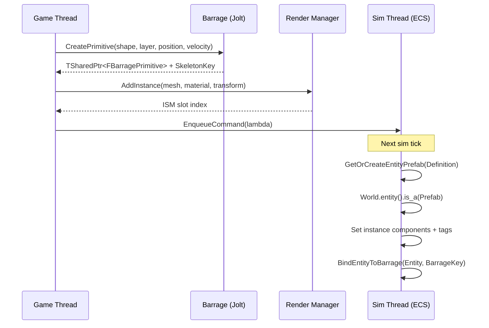
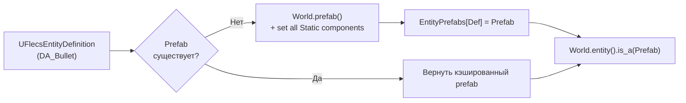
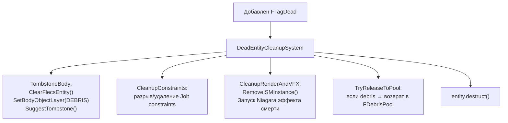

# Пайплайн спавна

> Каждая игровая сущность — снаряд, предмет, разрушаемый объект, дверь — создаётся через единый пайплайн спавна. Одна структура `FEntitySpawnRequest` управляет всем процессом: созданием физического тела, регистрацией ISM, настройкой ECS-entity и назначением тегов.

---

## Точки входа

### C++ Fluent API

```cpp
FEntitySpawnRequest::FromDefinition(BulletDef, SpawnLocation)
    .WithVelocity(Direction * Speed)
    .WithOwnerEntity(ShooterId)
    .Spawn(WorldContext);
```

### Blueprint

```cpp
UFlecsSpawnLibrary::SpawnProjectileFromEntityDef(
    World, Definition, Location, Direction, Speed, OwnerEntityId);
```

### Актор на уровне

Разместите `AFlecsEntitySpawnerActor` на уровне. Укажите `EntityDefinition` в панели Details. Сущность появится при `BeginPlay` (или вручную через `SpawnEntity()`).

| Свойство | По умолчанию | Описание |
|----------|-------------|----------|
| `EntityDefinition` | — | Data Asset (обязательно) |
| `InitialVelocity` | (0,0,0) | Скорость в мировых координатах |
| `bOverrideScale` | false | Переопределить масштаб из RenderProfile |
| `ScaleOverride` | (1,1,1) | Пользовательский масштаб |
| `bSpawnOnBeginPlay` | true | Автоматический спавн при запуске |
| `bDestroyAfterSpawn` | true | Уничтожить актор-спавнер после спавна |
| `bShowPreview` | true | Показывать превью меша в редакторе |

---

## Двухфазный спавн



### Фаза 1 — Game Thread

1. **Разрешение профилей** — `UFlecsEntityDefinition` предоставляет все профили. Переопределения в `FEntitySpawnRequest` имеют приоритет.

2. **Создание физического тела** — Barrage создаёт Jolt body:
    - Снаряды → `CreateBouncingSphere()` (сферическая форма, режим сенсора для неотскакивающих)
    - Предметы/Разрушаемые → `FBarrageSpawnUtils::SpawnEntity()` (бокс, автоматически подбираемый по размерам меша)
    - Персонажи → `FBCharacterBase` (капсула с контроллером персонажа)

3. **Регистрация ISM** — `UFlecsRenderManager::AddInstance()` выделяет ISM-слот. Начальный трансформ устанавливается из позиции спавна.

4. **Привязка Niagara** — Если в `NiagaraProfile` есть привязанный эффект, он регистрируется в `UFlecsNiagaraManager`.

5. **EnqueueCommand** — Лямбда, захватывающая все данные спавна, помещается в MPSC-очередь команд.

### Фаза 2 — Simulation Thread

Выполняется в начале следующего тика симуляции (внутри `DrainCommandQueue`):

1. **Поиск prefab** — `GetOrCreateEntityPrefab(EntityDefinition)`:
    - Первый вызов для данного определения: создаёт `World.prefab()` и устанавливает все статические компоненты из профилей
    - Последующие вызовы: возвращает кэшированный prefab из `TMap<UFlecsEntityDefinition*, flecs::entity>`

2. **Создание entity** — `World.entity().is_a(Prefab)`:
    - Наследует все статические компоненты автоматически (нулевое потребление памяти для общих данных)
    - Инстанс-компоненты добавляются сверху

3. **Инстанс-компоненты**:
    ```
    FBarrageBody { BarrageKey }         — прямая привязка
    FISMRender { Mesh, Material, Slot } — связь с рендером
    FHealthInstance { CurrentHP = MaxHP } — изменяемое здоровье
    FProjectileInstance { Lifetime }     — если снаряд
    FItemInstance { Count }              — если предмет
    FContainerInstance + FContainerGridInstance — если контейнер
    ```

4. **Двунаправленная привязка** — `BindEntityToBarrage(Entity, BarrageKey)`:
    - Устанавливает компонент `FBarrageBody` на entity (прямая)
    - Сохраняет ID entity в атомике `FBarragePrimitive` (обратная)
    - Добавляет в `TranslationMapping` (SkeletonKey → entity)

5. **Назначение тегов** — На основе типа сущности и наличия профилей:
    ```
    FTagProjectile        — есть ProjectileProfile
    FTagItem              — есть ItemDefinition
    FTagContainer         — есть ContainerProfile
    FTagPickupable        — флаг bPickupable в EntityDefinition
    FTagInteractable      — есть InteractionProfile
    FTagDestructible      — есть DestructibleProfile
    FTagHasLoot           — флаг bHasLoot
    FTagDoor              — есть DoorProfile
    FTagCharacter         — флаг bIsCharacter
    ```

---

## Реестр Prefab



Статические компоненты, устанавливаемые на prefab:

| Наличие профиля | Устанавливаемый компонент |
|----------------|--------------------------|
| HealthProfile | `FHealthStatic` |
| DamageProfile | `FDamageStatic` |
| ProjectileProfile | `FProjectileStatic` |
| WeaponProfile | `FWeaponStatic` |
| ContainerProfile | `FContainerStatic` |
| InteractionProfile | `FInteractionStatic` |
| DestructibleProfile | `FDestructibleStatic` |
| DoorProfile | `FDoorStatic` |
| MovementProfile | `FMovementStatic` |
| ItemDefinition | `FItemStaticData` |
| ExplosionProfile | `FExplosionStatic` |

---

## Быстрый путь для снарядов

`WeaponFireSystem` обходит общий пайплайн спавна ради производительности. Он создаёт Barrage body и Flecs entity **инлайн на sim thread** за один тик:

```
WeaponFireSystem (sim thread):
  1. Aim raycast → скорректированное направление
  2. Bloom spread → финальное направление
  3. CreateBouncingSphere() — Barrage body (sim thread имеет доступ к Barrage)
  4. World.entity() — БЕЗ prefab (избегает гонки с отложенными операциями)
     .set<FProjectileStatic>({...})
     .set<FProjectileInstance>({...})
     .set<FDamageStatic>({...})
     .set<FBarrageBody>({BarrageKey})
     .set<FEquippedBy>({OwnerEntityId})
     .add<FTagProjectile>()
  5. BindEntityToBarrage(Entity, BarrageKey)
  6. Enqueue FPendingProjectileSpawn → game thread (для ISM)
```

**Почему без prefab?** Создание prefab и инстанцирование из него в пределах одного вызова `progress()` включает отложенные операции. Вызовы `set<T>()` для prefab попадают в staging; `is_a(Prefab)` в том же тике может их не увидеть. Инлайн-подход устанавливает все компоненты напрямую, избегая проблем с таймингом отложенных операций.

---

## FEntitySpawnRequest

```cpp
USTRUCT(BlueprintType)
struct FEntitySpawnRequest
{
    UPROPERTY(EditAnywhere)
    UFlecsEntityDefinition* EntityDefinition = nullptr;

    UPROPERTY(EditAnywhere)
    FVector Location = FVector::ZeroVector;

    UPROPERTY(EditAnywhere)
    FRotator Rotation = FRotator::ZeroRotator;

    UPROPERTY(EditAnywhere)
    FVector InitialVelocity = FVector::ZeroVector;

    UPROPERTY(EditAnywhere)
    int32 ItemCount = 1;

    UPROPERTY()
    uint64 OwnerEntityId = 0;

    UPROPERTY()
    bool bPickupable = false;

    // Fluent API
    static FEntitySpawnRequest FromDefinition(UFlecsEntityDefinition* Def, FVector Loc);
    FEntitySpawnRequest& WithVelocity(FVector Vel);
    FEntitySpawnRequest& WithOwnerEntity(uint64 OwnerId);
    FEntitySpawnRequest& Pickupable();
    FSkeletonKey Spawn(UObject* WorldContext);
};
```

---

## Уничтожение сущностей

Уничтожение следует обратному порядку относительно спавна:



!!! danger "Никогда не используйте FinalizeReleasePrimitive"
    `FinalizeReleasePrimitive()` повреждает внутреннее состояние Jolt и вызывает краши при выходе из PIE. Всегда используйте паттерн DEBRIS layer + `SuggestTombstone()` для безопасного отложенного уничтожения.
