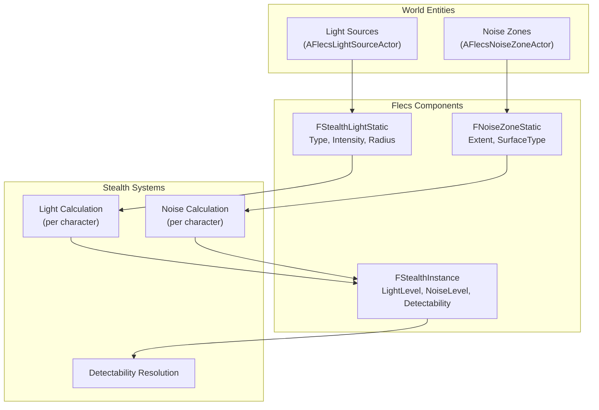

# Stealth System

> The stealth system tracks character visibility (light level) and noise (surface type + movement) using ECS entities for light sources and noise zones. These are gameplay-only — they don't affect rendering.

---

## Architecture



---

## Light Sources

`AFlecsLightSourceActor` is a level-placeable actor that registers a Flecs entity on `BeginPlay`:

| Profile Field | Type | Description |
|--------------|------|-------------|
| `LightType` | `EStealthLightType` | Point or Spot |
| `Intensity` | `float` | Light intensity at center |
| `Radius` | `float` | Falloff radius (cm) |
| `InnerConeAngle` | `float` | Spot light inner cone (degrees) |
| `OuterConeAngle` | `float` | Spot light outer cone (degrees) |
| `Direction` | `FVector` | Spot light direction |

These are **gameplay-only** light sources — they don't emit visible light. Place them alongside visual lights to define stealth-relevant illumination zones.

---

## Noise Zones

`AFlecsNoiseZoneActor` defines regions with specific surface noise characteristics:

| Profile Field | Type | Description |
|--------------|------|-------------|
| `Extent` | `FVector` | Half-extents of the zone box (cm) |
| `SurfaceType` | `ESurfaceNoise` | Quiet, Normal, Loud, VeryLoud |

Characters moving through a noise zone generate noise based on the zone's `SurfaceType` and their movement speed.

---

## Noise Events

```cpp
struct FNoiseEvent
{
    FVector Location;
    float Volume;          // Noise amplitude
    float Timestamp;       // Sim time when generated
};
```

Noise events are generated by character movement and ability usage, stored in `FStealthInstance.PendingNoise`.

---

## Surface Noise Levels

| ESurfaceNoise | Base Volume | Example |
|--------------|-------------|---------|
| `Quiet` | 0.2 | Carpet, grass |
| `Normal` | 0.5 | Concrete, wood |
| `Loud` | 0.8 | Metal grating |
| `VeryLoud` | 1.0 | Gravel, broken glass |

---

## Components

| Component | Location | Purpose |
|-----------|----------|---------|
| `FStealthLightStatic` | Prefab (light entity) | Light type, intensity, radius, cone |
| `FNoiseZoneStatic` | Prefab (zone entity) | Extent, surface type |
| `FWorldPosition` | Per-entity | World position for spatial queries |
| `FStealthInstance` | Per-character | Accumulated LightLevel, NoiseLevel, Detectability |
| `FNoiseEvent` | Transient | Individual noise event |
| `FTagStealthLight` | Tag | Marks light source entities |
| `FTagNoiseZone` | Tag | Marks noise zone entities |

---

## Actors

| Actor | Purpose |
|-------|---------|
| `AFlecsLightSourceActor` | Places a stealth light in the level. Registers ECS entity on BeginPlay. |
| `AFlecsNoiseZoneActor` | Places a noise zone in the level. Registers ECS entity on BeginPlay. |
