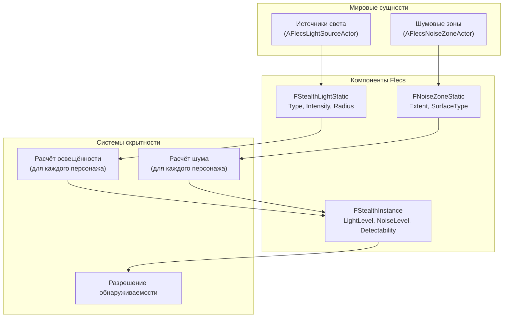

# Система скрытности

> Система скрытности отслеживает видимость персонажа (уровень освещённости) и шум (тип поверхности + движение) с помощью ECS-сущностей для источников света и шумовых зон. Они влияют только на геймплей — не на рендеринг.

---

## Архитектура



---

## Источники света

`AFlecsLightSourceActor` — актор, размещаемый на уровне, регистрирующий Flecs entity при `BeginPlay`:

| Поле профиля | Тип | Описание |
|-------------|-----|----------|
| `LightType` | `EStealthLightType` | Точечный или прожекторный |
| `Intensity` | `float` | Интенсивность света в центре |
| `Radius` | `float` | Радиус затухания (см) |
| `InnerConeAngle` | `float` | Внутренний конус прожектора (градусы) |
| `OuterConeAngle` | `float` | Внешний конус прожектора (градусы) |
| `Direction` | `FVector` | Направление прожектора |

Это **геймплейные** источники света — они не излучают видимый свет. Размещайте их рядом с визуальными источниками света для определения зон освещённости, важных для скрытности.

---

## Шумовые зоны

`AFlecsNoiseZoneActor` определяет регионы с конкретными шумовыми характеристиками поверхности:

| Поле профиля | Тип | Описание |
|-------------|-----|----------|
| `Extent` | `FVector` | Полуразмеры бокса зоны (см) |
| `SurfaceType` | `ESurfaceNoise` | Quiet, Normal, Loud, VeryLoud |

Персонажи, двигающиеся через шумовую зону, генерируют шум на основе `SurfaceType` зоны и их скорости движения.

---

## Шумовые события

```cpp
struct FNoiseEvent
{
    FVector Location;
    float Volume;          // Амплитуда шума
    float Timestamp;       // Время симуляции генерации
};
```

Шумовые события генерируются движением персонажа и использованием способностей, сохраняются в `FStealthInstance.PendingNoise`.

---

## Уровни шума поверхностей

| ESurfaceNoise | Базовая громкость | Пример |
|--------------|-------------------|--------|
| `Quiet` | 0.2 | Ковёр, трава |
| `Normal` | 0.5 | Бетон, дерево |
| `Loud` | 0.8 | Металлическая решётка |
| `VeryLoud` | 1.0 | Гравий, битое стекло |

---

## Компоненты

| Компонент | Расположение | Назначение |
|-----------|-------------|-----------|
| `FStealthLightStatic` | Prefab (entity света) | Тип света, интенсивность, радиус, конус |
| `FNoiseZoneStatic` | Prefab (entity зоны) | Размеры, тип поверхности |
| `FWorldPosition` | Per-entity | Мировая позиция для пространственных запросов |
| `FStealthInstance` | Per-character | Накопленные LightLevel, NoiseLevel, Detectability |
| `FNoiseEvent` | Транзиентный | Отдельное шумовое событие |
| `FTagStealthLight` | Tag | Отмечает entity источника света |
| `FTagNoiseZone` | Tag | Отмечает entity шумовой зоны |

---

## Акторы

| Актор | Назначение |
|-------|-----------|
| `AFlecsLightSourceActor` | Размещает геймплейный источник света на уровне. Регистрирует ECS entity при BeginPlay. |
| `AFlecsNoiseZoneActor` | Размещает шумовую зону на уровне. Регистрирует ECS entity при BeginPlay. |
