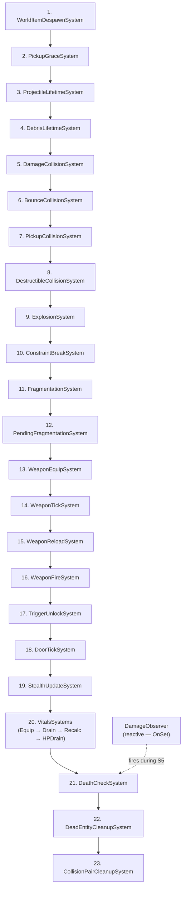

# System Execution Order

> All Flecs systems run during `world.progress()` on the simulation thread. They execute in the order they are registered in `SetupFlecsSystems()`. This page lists every system with its purpose, inputs, outputs, and dependencies.

---

## Registration Order

Systems are registered in `FlecsArtillerySubsystem_Systems.cpp::SetupFlecsSystems()`. The registration order **is** the execution order.



---

## System Details

### 1. WorldItemDespawnSystem

| Property | Value |
|----------|-------|
| **Queries** | `FWorldItemInstance`, `FTagItem`, without `FTagDead` |
| **Does** | Counts down `DespawnTimer`. Adds `FTagDead` when expired. |
| **Why first** | Items should despawn before collision systems process them. |

### 2. PickupGraceSystem

| Property | Value |
|----------|-------|
| **Queries** | `FWorldItemInstance` |
| **Does** | Counts down `PickupGraceTimer`. Freshly-dropped items can't be picked up until timer reaches 0. |
| **Why here** | Must run before `PickupCollisionSystem` checks `CanBePickedUp()`. |

### 3. ProjectileLifetimeSystem

| Property | Value |
|----------|-------|
| **Queries** | `FProjectileInstance`, `FTagProjectile`, without `FTagDead` |
| **Does** | Decrements `LifetimeRemaining`. Checks minimum velocity. Adds `FTagDead` if expired or too slow. |
| **Grace period** | `GraceFramesRemaining` prevents premature velocity kill right after spawn. |

### 4. DebrisLifetimeSystem

| Property | Value |
|----------|-------|
| **Queries** | `FDebrisInstance`, `FTagDebrisFragment` |
| **Does** | Counts down debris fragment lifetime. On expiry: recycles body to `FDebrisPool`, removes ISM instance. |

### 5. DamageCollisionSystem

| Property | Value |
|----------|-------|
| **Queries** | `FCollisionPair`, `FTagCollisionDamage` |
| **Does** | Reads `FDamageStatic` from projectile. Owner check. `obtain<FPendingDamage>().AddHit()`. Kills non-bouncing projectile. |
| **Triggers** | `DamageObserver` (via `modified<FPendingDamage>()`). |
| **Setup** | `SetupDamageCollisionSystems()` |

### 6. BounceCollisionSystem

| Property | Value |
|----------|-------|
| **Queries** | `FCollisionPair`, `FTagCollisionBounce` |
| **Does** | Increments `FProjectileInstance.BounceCount`. Kills if over `MaxBounces`. |
| **Setup** | `SetupDamageCollisionSystems()` |

### 7. PickupCollisionSystem

| Property | Value |
|----------|-------|
| **Queries** | `FCollisionPair`, `FTagCollisionPickup` |
| **Does** | Identifies character and item entities. Checks `CanBePickedUp()`. Calls `PickupWorldItem()`. |
| **Setup** | `SetupPickupCollisionSystems()` |

### 8. DestructibleCollisionSystem

| Property | Value |
|----------|-------|
| **Queries** | `FCollisionPair`, `FTagCollisionDestructible` |
| **Does** | Adds `FTagDead` to the destructible entity. |
| **Setup** | `SetupDestructibleCollisionSystems()` |

### 9. ExplosionSystem

| Property | Value |
|----------|-------|
| **Queries** | `FTagDetonate`, `FBarrageBody`, `FExplosionStatic`, without `FTagDead` |
| **Does** | Reads epicenter from Barrage body + EpicenterLift along contact normal. Calls `ApplyExplosion()`: SphereSearch for targets in radius, CastRay LOS check per target, radial damage with exponent falloff, radial impulse with vertical bias. Sets `FPendingFragmentation` on destructible entities. Enqueues explosion VFX. Adds `FTagDead`. |
| **Why here** | Must run after all detonation triggers (collision systems, lifetime systems) have added `FTagDetonate`, and before fragmentation systems process explosion-triggered destruction. |
| **Setup** | `SetupExplosionSystems()` |

### 10. ConstraintBreakSystem

| Property | Value |
|----------|-------|
| **Queries** | `FFlecsConstraintData` |
| **Does** | Pass 1: Polls Jolt for broken constraints. Pass 2: BFS to find disconnected fragment groups. Pass 3: Door constraint break. |
| **Why before Fragmentation** | Must process existing constraint breaks before new fragments are created. |
| **Setup** | `SetupDestructibleCollisionSystems()` |

### 11. FragmentationSystem

| Property | Value |
|----------|-------|
| **Queries** | `FCollisionPair`, `FTagCollisionFragmentation` |
| **Does** | Calls `FragmentEntity()` — reusable core logic that spawns debris fragments from `FDebrisPool`, creates Jolt constraints per adjacency, world anchors for bottom fragments, enqueues `FPendingFragmentSpawn`. |
| **Immediately** | Invalidates `FDestructibleStatic.Profile`, moves body to DEBRIS layer (no deferred wait). |
| **Setup** | `SetupFragmentationSystems()` |

### 12. PendingFragmentationSystem

| Property | Value |
|----------|-------|
| **Queries** | `FPendingFragmentation`, `FDestructibleStatic`, `FBarrageBody`, without `FTagDead` |
| **Does** | Processes explosion-triggered fragmentation. Calls `FragmentEntity()` with impact data from `FPendingFragmentation`. Removes `FPendingFragmentation` after processing. |
| **Why after FragmentationSystem** | Both systems call the same `FragmentEntity()` core logic, but this one handles deferred fragmentation from explosions rather than direct collision impacts. |
| **Setup** | `SetupFragmentationSystems()` |

### 13. WeaponEquipSystem

| Property | Value |
|----------|-------|
| **Queries** | `FWeaponSlotState`, `FTagWeaponSlot` |
| **Does** | Processes weapon equip/unequip requests. Manages slot transitions and weapon entity binding. |
| **Why before WeaponTick** | Equip state must be resolved before weapon systems tick. |
| **Setup** | `SetupWeaponSystems()` |

### 14. WeaponTickSystem

| Property | Value |
|----------|-------|
| **Queries** | `FWeaponStatic`, `FWeaponInstance` |
| **Does** | Fire cooldown decay. Burst cooldown. Semi-auto trigger reset. Bloom decay. |
| **Setup** | `SetupWeaponSystems()` |

### 15. WeaponReloadSystem

| Property | Value |
|----------|-------|
| **Queries** | `FWeaponInstance`, with `bReloading == true` |
| **Does** | Reload timer countdown. Ammo transfer (reserve → magazine). UI notification. |
| **Setup** | `SetupWeaponSystems()` |

### 16. WeaponFireSystem

| Property | Value |
|----------|-------|
| **Queries** | `FWeaponStatic`, `FWeaponInstance`, `FAimDirection` |
| **Does** | Aim raycast. Bloom spread. Barrage body creation. Flecs entity creation (inline). Enqueue spawn + shot events. |
| **Why after reload** | Reload must complete before fire system checks ammo. |
| **Setup** | `SetupWeaponSystems()` |

### 17. TriggerUnlockSystem

| Property | Value |
|----------|-------|
| **Queries** | `FDoorTriggerLink`, `FTagDoorTrigger` |
| **Does** | Resolves trigger → door linkage. Sets `FDoorInstance.bUnlocked = true`. |
| **Why before DoorTick** | Door must know it's unlocked before the state machine ticks. |
| **Setup** | `SetupDoorSystems()` |

### 18. DoorTickSystem

| Property | Value |
|----------|-------|
| **Queries** | `FDoorStatic`, `FDoorInstance` |
| **Does** | 5-state machine: Locked → Closed → Opening → Open → Closing. Controls constraint motor. Auto-close timer. |
| **Setup** | `SetupDoorSystems()` |

### 19. StealthUpdateSystem

| Property | Value |
|----------|-------|
| **Queries** | `FStealthInstance`, `FWorldPosition` |
| **Does** | Updates stealth state based on light zones and noise zones. Calculates visibility/audibility for AI. |
| **Setup** | `SetupStealthSystems()` |

### 20. VitalsSystems

Four sub-systems that run in sequence:

#### 20a. EquipmentModifierSystem

| Property | Value |
|----------|-------|
| **Queries** | `FEquipmentVitalsCache`, `FCharacterInventoryRef` |
| **Does** | Scans equipped items for `FVitalsItemStatic` modifiers. Caches aggregated stat modifiers. |
| **Why first** | Equipment modifiers must be calculated before drain/regen systems use them. |
| **Setup** | `SetupVitalsSystems()` |

#### 20b. VitalDrainSystem

| Property | Value |
|----------|-------|
| **Queries** | `FVitalsStatic`, `FVitalsInstance`, `FStatModifiers` |
| **Does** | Applies per-tick drain to vitals (hunger, thirst, stamina). Modulated by equipment and temperature. |
| **Setup** | `SetupVitalsSystems()` |

#### 20c. VitalModifierRecalcSystem

| Property | Value |
|----------|-------|
| **Queries** | `FVitalsInstance`, `FStatModifiers` |
| **Does** | Recalculates derived stat modifiers based on current vital levels (e.g., low hunger reduces max stamina). |
| **Setup** | `SetupVitalsSystems()` |

#### 20d. VitalHPDrainSystem

| Property | Value |
|----------|-------|
| **Queries** | `FVitalsInstance`, `FHealthInstance` |
| **Does** | Applies HP damage when vitals reach critical levels (starvation, dehydration). |
| **Why last** | Must run after drain and recalc so HP penalty reflects current-tick vital state. |
| **Setup** | `SetupVitalsSystems()` |

### 21. DeathCheckSystem

| Property | Value |
|----------|-------|
| **Queries** | `FHealthInstance`, without `FTagDead` |
| **Does** | Adds `FTagDead` if `CurrentHP ≤ 0`. |
| **Why here** | All damage sources (collision systems, observers) have processed by this point. |

### 22. DeadEntityCleanupSystem

| Property | Value |
|----------|-------|
| **Queries** | `FTagDead` |
| **Does** | Tombstone body. Cleanup constraints. Remove ISM. Trigger death VFX. Release to pool. `entity.destruct()`. |
| **Why second-to-last** | Must process after all systems that may add `FTagDead`. |

### 23. CollisionPairCleanupSystem

| Property | Value |
|----------|-------|
| **Queries** | `FCollisionPair` |
| **Does** | `entity.destruct()` on every collision pair. |
| **Why LAST** | Must run after ALL collision processing systems. No collision pair may survive to the next tick. |

---

## DamageObserver (Reactive)

| Property | Value |
|----------|-------|
| **Event** | `flecs::OnSet` on `FPendingDamage` |
| **Does** | Applies all `FDamageHit` entries to `FHealthInstance.CurrentHP`. Removes `FPendingDamage`. |
| **When fires** | Immediately when `modified<FPendingDamage>()` is called (typically during `DamageCollisionSystem`). |
| **Not in order** | Observer fires during the calling system, not at a scheduled slot. |

---

## Setup Methods

Systems are grouped by domain. Each domain has a setup method called from `SetupFlecsSystems()`:

```cpp
void SetupFlecsSystems()
{
    RegisterFlecsComponents();          // All components
    InitAbilityTickFunctions();

    // DamageObserver (reactive, inline)
    // WorldItemDespawnSystem (inline)
    // PickupGraceSystem (inline)
    // ProjectileLifetimeSystem (inline)
    // DebrisLifetimeSystem (inline)

    SetupCollisionSystems();            // DamageCollision, BounceCollision, PickupCollision, Destructible
    SetupExplosionSystems();            // ExplosionSystem
    SetupFragmentationSystems();        // ConstraintBreak, Fragmentation, PendingFragmentation
    SetupWeaponSystems();               // WeaponEquip, WeaponTick, WeaponReload, WeaponFire
    SetupDoorSystems();                 // TriggerUnlock, DoorTick
    SetupStealthSystems();              // StealthUpdateSystem
    SetupVitalsSystems();               // EquipmentModifier, VitalDrain, VitalModifierRecalc, VitalHPDrain

    // DeathCheckSystem (inline)
    // DeadEntityCleanupSystem (inline)
    // CollisionPairCleanupSystem (ALWAYS LAST, inline)
}
```

---

## Ordering Constraints

| Rule | Reason |
|------|--------|
| Lifetime systems before collision systems | Expired entities should be dead before collision processing |
| PickupGrace before PickupCollision | Grace timer must be checked before allowing pickup |
| ConstraintBreak before Fragmentation | Existing breaks must be processed before new fragments are created |
| WeaponEquip before WeaponTick | Equip/unequip must resolve before weapon systems tick |
| WeaponReload before WeaponFire | Reload must complete before fire checks ammo |
| TriggerUnlock before DoorTick | Door must know it's unlocked before state machine ticks |
| Vitals after Stealth | Temperature zones affect vital drain rates |
| EquipmentModifier before VitalDrain | Equipment stat bonuses must be cached before drain calculates |
| VitalHPDrain before DeathCheck | HP damage from critical vitals must be applied before death check |
| ExplosionSystem after collision, before fragmentation | Detonation triggers (collision, fuse, lifetime) must be resolved; FPendingFragmentation must be set before fragmentation systems process it |
| PendingFragmentationSystem after FragmentationSystem | Both call FragmentEntity(); explosion-triggered fragmentation processed after collision-triggered |
| All damage sources before DeathCheck | All hits in a tick must be applied before checking for death |
| DeadEntityCleanup before CollisionPairCleanup | Dead entities must be cleaned up while collision data still exists |
| CollisionPairCleanup LAST always | All systems must finish processing pairs first |
