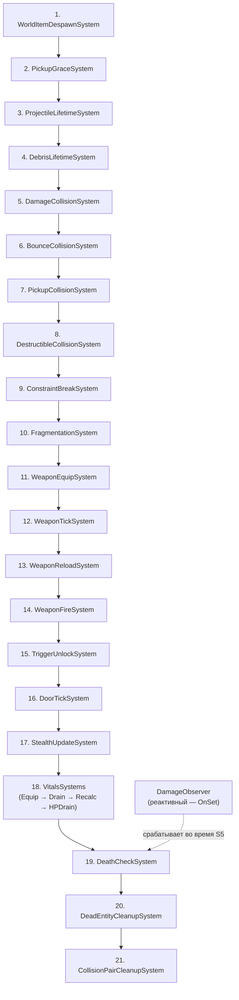

# Порядок выполнения систем

> Все системы Flecs выполняются во время `world.progress()` на sim thread. Они выполняются в порядке регистрации в `SetupFlecsSystems()`. Эта страница перечисляет каждую систему с её назначением, входами, выходами и зависимостями.

---

## Порядок регистрации

Системы регистрируются в `FlecsArtillerySubsystem_Systems.cpp::SetupFlecsSystems()`. Порядок регистрации **является** порядком выполнения.



---

## Детали систем

### 1. WorldItemDespawnSystem

| Свойство | Значение |
|----------|----------|
| **Запросы** | `FWorldItemInstance`, `FTagItem`, без `FTagDead` |
| **Действие** | Обратный отсчёт `DespawnTimer`. Добавляет `FTagDead` по истечении. |
| **Почему первая** | Предметы должны исчезнуть до обработки системами столкновений. |

### 2. PickupGraceSystem

| Свойство | Значение |
|----------|----------|
| **Запросы** | `FWorldItemInstance` |
| **Действие** | Обратный отсчёт `PickupGraceTimer`. Свежевыброшенные предметы нельзя подобрать, пока таймер не обнулится. |
| **Почему здесь** | Должна выполниться до проверки `CanBePickedUp()` в `PickupCollisionSystem`. |

### 3. ProjectileLifetimeSystem

| Свойство | Значение |
|----------|----------|
| **Запросы** | `FProjectileInstance`, `FTagProjectile`, без `FTagDead` |
| **Действие** | Уменьшение `LifetimeRemaining`. Проверка минимальной скорости. Добавление `FTagDead` при истечении или слишком низкой скорости. |
| **Период защиты** | `GraceFramesRemaining` предотвращает преждевременное уничтожение по скорости сразу после спавна. |

### 4. DebrisLifetimeSystem

| Свойство | Значение |
|----------|----------|
| **Запросы** | `FDebrisInstance`, `FTagDebrisFragment` |
| **Действие** | Обратный отсчёт времени жизни фрагмента обломков. По истечении: возврат тела в `FDebrisPool`, удаление ISM-инстанса. |

### 5. DamageCollisionSystem

| Свойство | Значение |
|----------|----------|
| **Запросы** | `FCollisionPair`, `FTagCollisionDamage` |
| **Действие** | Читает `FDamageStatic` из снаряда. Проверка владельца. `obtain<FPendingDamage>().AddHit()`. Уничтожает неотскакивающий снаряд. |
| **Триггеры** | `DamageObserver` (через `modified<FPendingDamage>()`). |
| **Setup** | `SetupDamageCollisionSystems()` |

### 6. BounceCollisionSystem

| Свойство | Значение |
|----------|----------|
| **Запросы** | `FCollisionPair`, `FTagCollisionBounce` |
| **Действие** | Инкрементирует `FProjectileInstance.BounceCount`. Уничтожает при превышении `MaxBounces`. |
| **Setup** | `SetupDamageCollisionSystems()` |

### 7. PickupCollisionSystem

| Свойство | Значение |
|----------|----------|
| **Запросы** | `FCollisionPair`, `FTagCollisionPickup` |
| **Действие** | Определяет entity персонажа и предмета. Проверяет `CanBePickedUp()`. Вызывает `PickupWorldItem()`. |
| **Setup** | `SetupPickupCollisionSystems()` |

### 8. DestructibleCollisionSystem

| Свойство | Значение |
|----------|----------|
| **Запросы** | `FCollisionPair`, `FTagCollisionDestructible` |
| **Действие** | Добавляет `FTagDead` разрушаемой entity. |
| **Setup** | `SetupDestructibleCollisionSystems()` |

### 9. ConstraintBreakSystem

| Свойство | Значение |
|----------|----------|
| **Запросы** | `FFlecsConstraintData` |
| **Действие** | Проход 1: Опрос Jolt на разорванные constraints. Проход 2: BFS для поиска отсоединённых групп фрагментов. Проход 3: Разрыв constraints дверей. |
| **Почему до Fragmentation** | Существующие разрывы constraints должны быть обработаны до создания новых фрагментов. |
| **Setup** | `SetupDestructibleCollisionSystems()` |

### 10. FragmentationSystem

| Свойство | Значение |
|----------|----------|
| **Запросы** | `FCollisionPair`, `FTagCollisionFragmentation` |
| **Действие** | Спавнит фрагменты обломков из `FDebrisPool`. Создаёт Jolt constraints по графу смежности. Мировые якоря для нижних фрагментов. Enqueue `FPendingFragmentSpawn`. |
| **Немедленно** | Инвалидирует `FDestructibleStatic.Profile`, переводит тело на слой DEBRIS (без отложенного ожидания). |
| **Setup** | `SetupDestructibleCollisionSystems()` |

### 11. WeaponEquipSystem

| Свойство | Значение |
|----------|----------|
| **Запросы** | `FWeaponSlotState`, `FTagWeaponSlot` |
| **Действие** | Обрабатывает запросы на экипировку/снятие оружия. Управляет переходами слотов и привязкой entity оружия. |
| **Почему до WeaponTick** | Состояние экипировки должно быть определено до тика систем оружия. |
| **Setup** | `SetupWeaponSystems()` |

### 12. WeaponTickSystem

| Свойство | Значение |
|----------|----------|
| **Запросы** | `FWeaponStatic`, `FWeaponInstance` |
| **Действие** | Убывание кулдауна стрельбы. Кулдаун очереди. Сброс полуавтомата. Убывание разброса. |
| **Setup** | `SetupWeaponSystems()` |

### 13. WeaponReloadSystem

| Свойство | Значение |
|----------|----------|
| **Запросы** | `FWeaponInstance` с `bReloading == true` |
| **Действие** | Обратный отсчёт перезарядки. Перенос патронов (запас → магазин). Уведомление UI. |
| **Setup** | `SetupWeaponSystems()` |

### 14. WeaponFireSystem

| Свойство | Значение |
|----------|----------|
| **Запросы** | `FWeaponStatic`, `FWeaponInstance`, `FAimDirection` |
| **Действие** | Aim raycast. Разброс (bloom). Создание Barrage body. Создание Flecs entity (инлайн). Enqueue событий спавна + выстрела. |
| **Почему после перезарядки** | Перезарядка должна завершиться до проверки боезапаса системой стрельбы. |
| **Setup** | `SetupWeaponSystems()` |

### 15. TriggerUnlockSystem

| Свойство | Значение |
|----------|----------|
| **Запросы** | `FDoorTriggerLink`, `FTagDoorTrigger` |
| **Действие** | Разрешает связь триггер → дверь. Устанавливает `FDoorInstance.bUnlocked = true`. |
| **Почему до DoorTick** | Дверь должна знать о разблокировке до тика конечного автомата. |
| **Setup** | `SetupDoorSystems()` |

### 16. DoorTickSystem

| Свойство | Значение |
|----------|----------|
| **Запросы** | `FDoorStatic`, `FDoorInstance` |
| **Действие** | 5-состоянный автомат: Locked → Closed → Opening → Open → Closing. Управление мотором constraint. Таймер автозакрытия. |
| **Setup** | `SetupDoorSystems()` |

### 17. StealthUpdateSystem

| Свойство | Значение |
|----------|----------|
| **Запросы** | `FStealthInstance`, `FWorldPosition` |
| **Действие** | Обновляет состояние скрытности на основе зон освещения и шума. Рассчитывает видимость/слышимость для ИИ. |
| **Setup** | `SetupStealthSystems()` |

### 18. VitalsSystems

Четыре подсистемы, выполняемые последовательно:

#### 18a. EquipmentModifierSystem

| Свойство | Значение |
|----------|----------|
| **Запросы** | `FEquipmentVitalsCache`, `FCharacterInventoryRef` |
| **Действие** | Сканирует экипированные предметы на наличие модификаторов `FVitalsItemStatic`. Кэширует агрегированные модификаторы характеристик. |
| **Почему первая** | Модификаторы экипировки должны быть рассчитаны до использования системами расхода/регенерации. |
| **Setup** | `SetupVitalsSystems()` |

#### 18b. VitalDrainSystem

| Свойство | Значение |
|----------|----------|
| **Запросы** | `FVitalsStatic`, `FVitalsInstance`, `FStatModifiers` |
| **Действие** | Применяет потиковый расход витальных показателей (голод, жажда, выносливость). Модулируется экипировкой и температурой. |
| **Setup** | `SetupVitalsSystems()` |

#### 18c. VitalModifierRecalcSystem

| Свойство | Значение |
|----------|----------|
| **Запросы** | `FVitalsInstance`, `FStatModifiers` |
| **Действие** | Пересчитывает производные модификаторы характеристик на основе текущих уровней витальных показателей (напр., низкий голод снижает макс. выносливость). |
| **Setup** | `SetupVitalsSystems()` |

#### 18d. VitalHPDrainSystem

| Свойство | Значение |
|----------|----------|
| **Запросы** | `FVitalsInstance`, `FHealthInstance` |
| **Действие** | Наносит урон HP при критических уровнях витальных показателей (голодание, обезвоживание). |
| **Почему последняя** | Должна выполниться после расхода и пересчёта, чтобы штраф HP отражал состояние витальных показателей текущего тика. |
| **Setup** | `SetupVitalsSystems()` |

### 19. DeathCheckSystem

| Свойство | Значение |
|----------|----------|
| **Запросы** | `FHealthInstance`, без `FTagDead` |
| **Действие** | Добавляет `FTagDead` если `CurrentHP <= 0`. |
| **Почему здесь** | Все источники урона (системы столкновений, observer) уже обработаны к этому моменту. |

### 20. DeadEntityCleanupSystem

| Свойство | Значение |
|----------|----------|
| **Запросы** | `FTagDead` |
| **Действие** | Tombstone тела. Очистка constraints. Удаление ISM. Запуск VFX смерти. Возврат в пул. `entity.destruct()`. |
| **Почему предпоследняя** | Должна обработать после всех систем, которые могут добавить `FTagDead`. |

### 21. CollisionPairCleanupSystem

| Свойство | Значение |
|----------|----------|
| **Запросы** | `FCollisionPair` |
| **Действие** | `entity.destruct()` для каждой коллизионной пары. |
| **Почему ПОСЛЕДНЯЯ** | Должна выполниться после ВСЕХ систем обработки столкновений. Ни одна коллизионная пара не должна дожить до следующего тика. |

---

## DamageObserver (Реактивный)

| Свойство | Значение |
|----------|----------|
| **Событие** | `flecs::OnSet` на `FPendingDamage` |
| **Действие** | Применяет все записи `FDamageHit` к `FHealthInstance.CurrentHP`. Удаляет `FPendingDamage`. |
| **Когда срабатывает** | Немедленно при вызове `modified<FPendingDamage>()` (обычно во время `DamageCollisionSystem`). |
| **Не в порядке** | Observer срабатывает во время вызывающей системы, а не в запланированном слоте. |

---

## Методы настройки

Системы группируются по доменам. Каждый домен имеет метод настройки, вызываемый из `SetupFlecsSystems()`:

```cpp
void SetupFlecsSystems()
{
    RegisterFlecsComponents();          // Все компоненты
    InitAbilityTickFunctions();

    // DamageObserver (реактивный, инлайн)
    // WorldItemDespawnSystem (инлайн)
    // PickupGraceSystem (инлайн)
    // ProjectileLifetimeSystem (инлайн)
    // DebrisLifetimeSystem (инлайн)

    SetupCollisionSystems();            // DamageCollision, BounceCollision, PickupCollision, Destructible
    SetupFragmentationSystems();        // ConstraintBreak, Fragmentation
    SetupWeaponSystems();               // WeaponEquip, WeaponTick, WeaponReload, WeaponFire
    SetupDoorSystems();                 // TriggerUnlock, DoorTick
    SetupStealthSystems();              // StealthUpdateSystem
    SetupVitalsSystems();               // EquipmentModifier, VitalDrain, VitalModifierRecalc, VitalHPDrain

    // DeathCheckSystem (инлайн)
    // DeadEntityCleanupSystem (инлайн)
    // CollisionPairCleanupSystem (ВСЕГДА ПОСЛЕДНЯЯ, инлайн)
}
```

---

## Ограничения порядка

| Правило | Причина |
|---------|--------|
| Системы времени жизни до систем столкновений | Истёкшие сущности должны быть мертвы до обработки столкновений |
| PickupGrace до PickupCollision | Таймер защиты должен быть проверен перед разрешением подбора |
| ConstraintBreak до Fragmentation | Существующие разрывы должны быть обработаны до создания новых фрагментов |
| WeaponEquip до WeaponTick | Экипировка/снятие должны быть определены до тика систем оружия |
| WeaponReload до WeaponFire | Перезарядка должна завершиться до проверки боезапаса |
| TriggerUnlock до DoorTick | Дверь должна знать о разблокировке до тика конечного автомата |
| Vitals после Stealth | Температурные зоны влияют на скорость расхода витальных показателей |
| EquipmentModifier до VitalDrain | Бонусы экипировки должны быть кэшированы до расчёта расхода |
| VitalHPDrain до DeathCheck | Урон HP от критических витальных показателей должен быть применён до проверки смерти |
| Все источники урона до DeathCheck | Все попадания за тик должны быть применены до проверки смерти |
| DeadEntityCleanup до CollisionPairCleanup | Мёртвые entity должны быть очищены, пока данные столкновений ещё существуют |
| CollisionPairCleanup ВСЕГДА ПОСЛЕДНЯЯ | Все системы должны закончить обработку пар первыми |
