# Time Dilation

> FatumGame supports multi-source time dilation with smooth transitions and optional player-full-speed compensation. Multiple systems can push time dilation simultaneously — the slowest wins.

---

## Overview

```mermaid
graph LR
    subgraph Sources["Dilation Sources"]
        Kill["Kill cam<br/>Scale=0.1, 2s"]
        Ability["Blink ability<br/>Scale=0.3, 0.5s"]
        Menu["Pause menu<br/>Scale=0.01, indefinite"]
    end

    subgraph Stack["FTimeDilationStack<br/>(min-wins)"]
        Resolution["Resolved: Scale=0.01<br/>(Menu wins)"]
    end

    subgraph Transport["Atomics"]
        Desired["DesiredTimeScale"]
        Player["bPlayerFullSpeed"]
        Speed["TransitionSpeed"]
    end

    subgraph Sim["Sim Thread"]
        Smooth["FInterpTo smoothing"]
        Apply["DilatedDT = RealDT × Scale"]
    end

    Sources --> Stack --> Transport --> Sim
    Sim -->|"ActiveTimeScalePublished"| GT["Game Thread<br/>SetGlobalTimeDilation()"]
```



---

## FTimeDilationStack

Game-thread-only priority stack. Located at `AFlecsCharacter::DilationStack`.

### FDilationEntry

| Field | Type | Description |
|-------|------|-------------|
| `Tag` | `FName` | Unique identifier for push/remove |
| `DesiredScale` | `float` | Target time scale (0.01 = near-frozen, 1.0 = real-time) |
| `Duration` | `float` | Auto-expire after this many seconds (0 = indefinite) |
| `Elapsed` | `float` | Time elapsed (wall-clock) |
| `bPlayerFullSpeed` | `bool` | Player moves at real-time speed in slow-mo |
| `EntrySpeed` | `float` | Transition speed when this entry wins |
| `ExitSpeed` | `float` | Transition speed captured at removal |

### Resolution Rule: Min-Wins

The entry with the **lowest** `DesiredScale` among all active entries wins:

```cpp
float GetTargetScale() const
{
    float MinScale = 1.f;
    for (const auto& Entry : Entries)
        MinScale = FMath::Min(MinScale, Entry.DesiredScale);
    return MinScale;
}
```

### API

```cpp
// Push a new dilation source
Character->DilationStack.Push({
    .Tag = "FreezeFrame",
    .DesiredScale = 0.03f,
    .Duration = 0.1f,
    .bPlayerFullSpeed = false,
    .EntrySpeed = 20.f
});

// Remove by tag (auto-captures ExitSpeed)
Character->DilationStack.Remove("FreezeFrame");

// Tick (uses wall-clock time, NOT FApp::GetDeltaTime)
Character->DilationStack.Tick();  // Expires timed entries
```

### Wall-Clock Tick

`Tick()` uses `FPlatformTime::Seconds()` delta, not `FApp::GetDeltaTime()`. This is critical because `FApp::GetDeltaTime()` is already dilated by `SetGlobalTimeDilation` — using it would cause the stack to tick at dilated speed, making timed entries expire too slowly.

---

## Game → Sim Transport

Three atomics on `FSimulationWorker`:

| Atomic | Written By | Value |
|--------|-----------|-------|
| `DesiredTimeScale` | `AFlecsCharacter::Tick()` | Stack's resolved target scale |
| `bPlayerFullSpeed` | `AFlecsCharacter::Tick()` | Winning entry's `bPlayerFullSpeed` |
| `TransitionSpeed` | `AFlecsCharacter::Tick()` | Winning entry's `EntrySpeed` (or `LastExitSpeed` if empty) |

---

## Sim Thread Smoothing

```cpp
// In FSimulationWorker::Run()
float Desired = DesiredTimeScale.load();
float Speed = TransitionSpeed.load();

ActiveTimeScale = FMath::FInterpTo(ActiveTimeScale, Desired, RealDT, Speed);
float DilatedDT = RealDT * ActiveTimeScale;

// Publish for game thread
ActiveTimeScalePublished.store(ActiveTimeScale);
```

`FInterpTo` provides smooth exponential interpolation — no jarring snaps when entering or exiting slow-motion.

---

## Player Compensation

When `bPlayerFullSpeed = true`, the player must move at real-time speed while the world runs slowly.

### The Math

```
Jolt integrates: displacement = velocity × dt

Normal:     V × DilatedDT = V × (RealDT × Scale)  →  slow displacement
Compensated: (V / Scale) × (RealDT × Scale) = V × RealDT  →  real-time displacement
```

`VelocityScale = 1.0 / ActiveTimeScale` is applied to:

| System | How |
|--------|-----|
| Locomotion | `FinalVelocity = SmoothedVelocity * VelocityScale` |
| Jump | `JumpVelocity *= VelocityScale` |
| Gravity | `Gravity *= VelocityScale` |

### Compounding Prevention

`GetLinearVelocity()` returns the **scaled** velocity from the previous frame. Before locomotion smoothing:

```cpp
FVector CurH = GetHorizontalVelocity();
if (VelocityScale > 1.001f)
    CurH *= (1.f / VelocityScale);  // Remove previous frame's scale
```

Without this, VelocityScale compounds exponentially each frame → runaway acceleration.

---

## Sim → Game Feedback

`AFlecsCharacter::Tick()` reads `ActiveTimeScalePublished`:

```cpp
float PublishedScale = SimWorker->ActiveTimeScalePublished.load();
UGameplayStatics::SetGlobalTimeDilation(GetWorld(), PublishedScale);
```

This keeps UE animations, Niagara VFX, and audio in sync with the smoothed physics time scale.

### VInterpTo Under Dilation

Character position smoothing uses `VInterpTo(SmoothedPos, TargetPos, DT, Speed)`. When `bPlayerFullSpeed = true`, UE's `DeltaTime` is dilated but the character moves at real speed. Undilation:

```cpp
float EffectiveDT = DeltaTime;
if (bPlayerFullSpeed && PublishedScale > SMALL_NUMBER)
    EffectiveDT = DeltaTime / PublishedScale;
```

---

## Usage Examples

```cpp
// Freeze frame on kill (0.1 second, world slows, player slows too)
Character->DilationStack.Push({
    .Tag = "FreezeFrame",
    .DesiredScale = 0.03f,
    .Duration = 0.1f,
    .bPlayerFullSpeed = false,
    .EntrySpeed = 50.f
});

// Bullet time (2 seconds, player at full speed)
Character->DilationStack.Push({
    .Tag = "BulletTime",
    .DesiredScale = 0.2f,
    .Duration = 2.f,
    .bPlayerFullSpeed = true,
    .EntrySpeed = 10.f,
    .ExitSpeed = 5.f
});

// Blink ability targeting (indefinite, until ability ends)
Character->DilationStack.Push({
    .Tag = "BlinkTargeting",
    .DesiredScale = 0.3f,
    .Duration = 0.f,  // Indefinite
    .bPlayerFullSpeed = true,
    .EntrySpeed = 15.f
});

// Remove when ability ends
Character->DilationStack.Remove("BlinkTargeting");
```
