# Замедление времени

> FatumGame поддерживает многоисточниковое замедление времени с плавными переходами и опциональной компенсацией полной скорости игрока. Несколько систем могут одновременно запрашивать замедление — побеждает самое медленное.

---

## Обзор

```mermaid
graph LR
    subgraph Sources["Источники замедления"]
        Kill["Kill cam<br/>Scale=0.1, 2с"]
        Ability["Способность Blink<br/>Scale=0.3, 0.5с"]
        Menu["Меню паузы<br/>Scale=0.01, бессрочно"]
    end

    subgraph Stack["FTimeDilationStack<br/>(побеждает минимум)"]
        Resolution["Результат: Scale=0.01<br/>(Menu побеждает)"]
    end

    subgraph Transport["Атомики"]
        Desired["DesiredTimeScale"]
        Player["bPlayerFullSpeed"]
        Speed["TransitionSpeed"]
    end

    subgraph Sim["Sim Thread"]
        Smooth["Сглаживание FInterpTo"]
        Apply["DilatedDT = RealDT × Scale"]
    end

    Sources --> Stack --> Transport --> Sim
    Sim -->|"ActiveTimeScalePublished"| GT["Game Thread<br/>SetGlobalTimeDilation()"]
```



---

## FTimeDilationStack

Стек приоритетов только для game thread. Расположен в `AFlecsCharacter::DilationStack`.

### FDilationEntry

| Поле | Тип | Описание |
|------|-----|----------|
| `Tag` | `FName` | Уникальный идентификатор для push/remove |
| `DesiredScale` | `float` | Целевой масштаб времени (0.01 = почти заморожено, 1.0 = реальное время) |
| `Duration` | `float` | Автоистечение через столько секунд (0 = бессрочно) |
| `Elapsed` | `float` | Прошедшее время (настенные часы) |
| `bPlayerFullSpeed` | `bool` | Игрок двигается с реальной скоростью в slow-mo |
| `EntrySpeed` | `float` | Скорость перехода, когда эта запись побеждает |
| `ExitSpeed` | `float` | Скорость перехода, захватываемая при удалении |

### Правило разрешения: побеждает минимум

Запись с **наименьшим** `DesiredScale` среди всех активных записей побеждает:

```cpp
float GetTargetScale() const
{
    float MinScale = 1.f;
    for (const auto& Entry : Entries)
        MinScale = FMath::Min(MinScale, Entry.DesiredScale);
    return MinScale;
}
```

### API

```cpp
// Добавить новый источник замедления
Character->DilationStack.Push({
    .Tag = "FreezeFrame",
    .DesiredScale = 0.03f,
    .Duration = 0.1f,
    .bPlayerFullSpeed = false,
    .EntrySpeed = 20.f
});

// Удалить по тегу (автоматически захватывает ExitSpeed)
Character->DilationStack.Remove("FreezeFrame");

// Тик (использует настенное время, НЕ FApp::GetDeltaTime)
Character->DilationStack.Tick();  // Истекает записи с таймером
```

### Тик по настенным часам

`Tick()` использует дельту `FPlatformTime::Seconds()`, а не `FApp::GetDeltaTime()`. Это критично, потому что `FApp::GetDeltaTime()` уже замедлен `SetGlobalTimeDilation` — его использование привело бы к тому, что стек тикал бы с замедленной скоростью, и записи с таймером истекали бы слишком медленно.

---

## Транспорт Game → Sim

Три атомика на `FSimulationWorker`:

| Атомик | Записывается | Значение |
|--------|-------------|----------|
| `DesiredTimeScale` | `AFlecsCharacter::Tick()` | Результирующий целевой масштаб стека |
| `bPlayerFullSpeed` | `AFlecsCharacter::Tick()` | `bPlayerFullSpeed` побеждающей записи |
| `TransitionSpeed` | `AFlecsCharacter::Tick()` | `EntrySpeed` побеждающей записи (или `LastExitSpeed` если стек пуст) |

---

## Сглаживание на Sim Thread

```cpp
// В FSimulationWorker::Run()
float Desired = DesiredTimeScale.load();
float Speed = TransitionSpeed.load();

ActiveTimeScale = FMath::FInterpTo(ActiveTimeScale, Desired, RealDT, Speed);
float DilatedDT = RealDT * ActiveTimeScale;

// Публикация для game thread
ActiveTimeScalePublished.store(ActiveTimeScale);
```

`FInterpTo` обеспечивает плавную экспоненциальную интерполяцию — без резких скачков при входе или выходе из slow-motion.

---

## Компенсация игрока

Когда `bPlayerFullSpeed = true`, игрок должен двигаться с реальной скоростью, пока мир замедлен.

### Математика

```
Jolt интегрирует: перемещение = скорость × dt

Обычное:       V × DilatedDT = V × (RealDT × Scale)  →  замедленное перемещение
Компенсированное: (V / Scale) × (RealDT × Scale) = V × RealDT  →  перемещение в реальном времени
```

`VelocityScale = 1.0 / ActiveTimeScale` применяется к:

| Система | Как |
|---------|-----|
| Локомоция | `FinalVelocity = SmoothedVelocity * VelocityScale` |
| Прыжок | `JumpVelocity *= VelocityScale` |
| Гравитация | `Gravity *= VelocityScale` |

### Предотвращение накопления

`GetLinearVelocity()` возвращает **масштабированную** скорость предыдущего кадра. Перед сглаживанием локомоции:

```cpp
FVector CurH = GetHorizontalVelocity();
if (VelocityScale > 1.001f)
    CurH *= (1.f / VelocityScale);  // Снятие масштаба предыдущего кадра
```

Без этого VelocityScale экспоненциально накапливается каждый кадр → неконтролируемое ускорение.

---

## Обратная связь Sim → Game

`AFlecsCharacter::Tick()` читает `ActiveTimeScalePublished`:

```cpp
float PublishedScale = SimWorker->ActiveTimeScalePublished.load();
UGameplayStatics::SetGlobalTimeDilation(GetWorld(), PublishedScale);
```

Это синхронизирует анимации UE, Niagara VFX и аудио со сглаженным масштабом физического времени.

### VInterpTo при замедлении

Сглаживание позиции персонажа использует `VInterpTo(SmoothedPos, TargetPos, DT, Speed)`. Когда `bPlayerFullSpeed = true`, `DeltaTime` UE замедлен, но персонаж двигается на полной скорости. Отмена замедления:

```cpp
float EffectiveDT = DeltaTime;
if (bPlayerFullSpeed && PublishedScale > SMALL_NUMBER)
    EffectiveDT = DeltaTime / PublishedScale;
```

---

## Примеры использования

```cpp
// Стоп-кадр при убийстве (0.1 секунды, мир замедлен, игрок тоже)
Character->DilationStack.Push({
    .Tag = "FreezeFrame",
    .DesiredScale = 0.03f,
    .Duration = 0.1f,
    .bPlayerFullSpeed = false,
    .EntrySpeed = 50.f
});

// Bullet time (2 секунды, игрок на полной скорости)
Character->DilationStack.Push({
    .Tag = "BulletTime",
    .DesiredScale = 0.2f,
    .Duration = 2.f,
    .bPlayerFullSpeed = true,
    .EntrySpeed = 10.f,
    .ExitSpeed = 5.f
});

// Прицеливание способности Blink (бессрочно, пока способность активна)
Character->DilationStack.Push({
    .Tag = "BlinkTargeting",
    .DesiredScale = 0.3f,
    .Duration = 0.f,  // Бессрочно
    .bPlayerFullSpeed = true,
    .EntrySpeed = 15.f
});

// Удаление по завершении способности
Character->DilationStack.Remove("BlinkTargeting");
```
