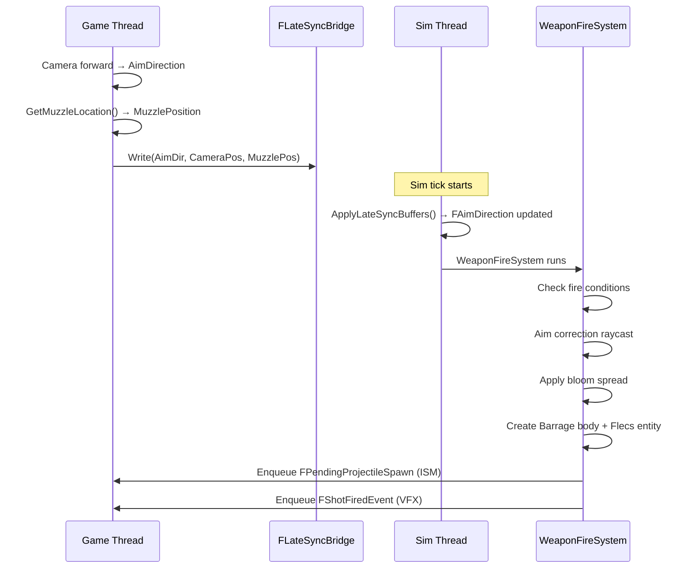
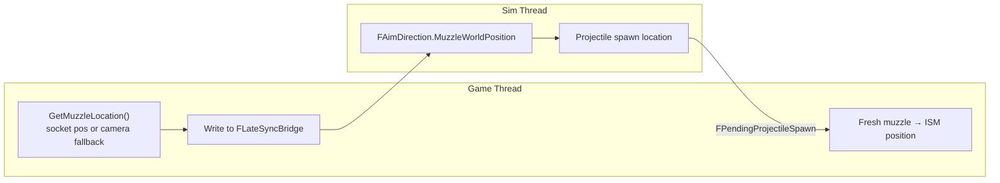

# Weapon System

> The weapon system handles firing, reloading, bloom (spread), and ammo management. All weapon logic runs on the simulation thread. Aim correction, muzzle flash VFX, and recoil are cosmetic game-thread systems.

---

## Component Layout

### FWeaponStatic (Prefab)

Inherited from `UFlecsWeaponProfile`:

| Field | Type | Description |
|-------|------|-------------|
| `FireRate` | `float` | Rounds per second |
| `FireMode` | `EFireMode` | Auto, Semi, Burst |
| `BurstCount` | `int32` | Shots per burst |
| `MagCapacity` | `int32` | Magazine size |
| `ReserveCapacity` | `int32` | Max reserve ammo |
| `ReloadTime` | `float` | Reload duration (seconds) |
| `AmmoPerShot` | `int32` | Ammo consumed per shot |
| `ProjectileDefinition` | `UFlecsEntityDefinition*` | Projectile to spawn |
| `ProjectileSpeedMultiplier` | `float` | Speed multiplier on base projectile speed |
| `DamageMultiplier` | `float` | Damage multiplier on base projectile damage |
| `ProjectilesPerShot` | `int32` | Pellets per shot (shotgun) |
| `MuzzleOffset` | `FVector` | Muzzle position relative to weapon |
| `MuzzleSocketName` | `FName` | Skeletal mesh socket for muzzle |
| `BaseSpread` | `float` | Minimum bloom (radians) |
| `SpreadPerShot` | `float` | Bloom added per shot |
| `MaxSpread` | `float` | Maximum bloom cap |
| `SpreadDecayRate` | `float` | Bloom decay per second |
| `SpreadRecoveryDelay` | `float` | Delay before bloom starts decaying |

### FWeaponInstance (Per-Entity)

| Field | Type | Description |
|-------|------|-------------|
| `CurrentMag` | `int32` | Rounds in magazine |
| `CurrentReserve` | `int32` | Reserve ammo |
| `FireCooldown` | `float` | Time until next shot allowed |
| `BurstRemaining` | `int32` | Remaining burst shots |
| `BurstCooldown` | `float` | Time between burst shots |
| `bReloading` | `bool` | Currently reloading |
| `ReloadTimer` | `float` | Remaining reload time |
| `CurrentBloom` | `float` | Current spread angle |
| `BloomDecayDelay` | `float` | Time until bloom starts decaying |
| `bFireInputActive` | `bool` | Fire button held |
| `bSemiAutoReset` | `bool` | Semi-auto trigger released since last shot |

### FAimDirection (Per-Entity)

Written by `FLateSyncBridge` each sim tick:

| Field | Type | Description |
|-------|------|-------------|
| `AimWorldDirection` | `FVector` | Camera forward vector |
| `AimWorldOrigin` | `FVector` | Camera world position |
| `MuzzleWorldPosition` | `FVector` | Weapon muzzle world position |

---

## Fire Pipeline



### WeaponFireSystem Detail

1. **Fire conditions check:**
   ```
   bFireInputActive == true
   FireCooldown <= 0
   CurrentMag > 0
   bReloading == false
   Semi-auto: bSemiAutoReset == true
   ```

2. **Aim correction raycast:**
   ```cpp
   // Cast from camera position along aim direction
   Barrage->CastRay(
       AimOrigin, AimDirection * MaxRange,
       FastExcludeObjectLayerFilter({PROJECTILE, ENEMYPROJECTILE, DEBRIS})
   );
   ```
   - If hit found: compute direction from muzzle to hit point
   - MinEngagementDist = 300u: if hit distance < 300 cm, use raw aim direction (barrel parallax protection)
   - Dot product safety: if `dot(muzzleToHit, aimDir) < 0.85`, discard hit (geometry behind camera)

3. **Bloom spread:**
   ```cpp
   FVector FinalDir = FMath::VRandCone(CorrectedDirection, CurrentBloom);
   ```

4. **Projectile creation (inline):**
   ```
   CreateBouncingSphere(MuzzlePos, FinalDir * Speed, CollisionRadius)
   → Flecs entity (no prefab — inline component set)
   → BindEntityToBarrage
   → Enqueue FPendingProjectileSpawn (sim→game)
   ```

5. **State update:**
   ```
   CurrentMag -= AmmoPerShot
   FireCooldown = 1.0 / FireRate
   CurrentBloom += SpreadPerShot (clamped to MaxSpread)
   BloomDecayDelay = SpreadRecoveryDelay
   ```

---

## WeaponTickSystem

Runs every sim tick, handles cooldowns and bloom decay:

```
FireCooldown -= DeltaTime
BurstCooldown -= DeltaTime
BloomDecayDelay -= DeltaTime

if (BloomDecayDelay <= 0)
    CurrentBloom = FMath::FInterpTo(CurrentBloom, BaseSpread, DeltaTime, SpreadDecayRate)

// Semi-auto reset
if (FireMode == Semi && !bFireInputActive)
    bSemiAutoReset = true
```

---

## WeaponReloadSystem

```
if (bReloading && ReloadTimer > 0):
    ReloadTimer -= DeltaTime

if (ReloadTimer <= 0 && bReloading):
    AmmoToLoad = Min(MagCapacity - CurrentMag, CurrentReserve)
    CurrentMag += AmmoToLoad
    CurrentReserve -= AmmoToLoad
    bReloading = false

    // Notify UI
    MessageSubsystem->Publish(FUIReloadMessage{ .bComplete = true })
```

---

## Muzzle Position Flow



!!! warning "Muzzle Fallback"
    If no weapon mesh socket is available, `GetMuzzleLocation()` falls back to `FollowCamera->GetComponentLocation()` + `WeaponStatic->MuzzleOffset`. It must **NOT** use `GetActorLocation()` — the capsule center is ~60 units below the camera, causing severe parallax at all ranges.

!!! info "MuzzleOffset Ownership"
    `MuzzleOffset` belongs to `FWeaponStatic` (weapon profile), NOT to `FAimDirection` or the character. Different weapons have different muzzle positions.

---

## ADS (Aim Down Sights)

Purely cosmetic game-thread system in `FlecsCharacter_ADS.cpp`:

- Spring interpolation for FOV change (normal FOV → `WeaponProfile.ADSFOV`)
- Camera offset transition (hip → sight anchor socket)
- Sensitivity multiplier (`ADSSensitivityMultiplier`)
- All ADS attenuation multipliers (bloom, recoil, sway reduced while ADS)

ADS state does **not** affect sim-thread ballistics — only visual feedback.

---

## Recoil

Game-thread cosmetic system in `FlecsCharacter_Recoil.cpp`:

### Kick Recoil
Each shot applies random pitch/yaw kick to the camera:
```
KickPitch = Random(KickPitchMin, KickPitchMax)
KickYaw = Random(KickYawMin, KickYawMax)
```
Decayed each frame by `KickRecoverySpeed` and `KickDamping`.

### Pattern Recoil
Optional `UCurveVector` providing a deterministic recoil pattern (spray pattern):
```
PatternOffset = RecoilPatternCurve->Evaluate(ShotIndex)
    * PatternScale
    + Random(PatternRandomPitch, PatternRandomYaw)
```

### Screen Shake
Per-shot shake with `ShakeAmplitude`, `ShakeFrequency`, `ShakeDecaySpeed`.

### Weapon Motion Springs
Positional inertia (weapon sways in response to camera movement):
- `InertiaStiffness`, `InertiaDamping`, `MaxInertiaOffset`
- `IdleSwayAmplitude`, `IdleSwayFrequency`
- Walk bob, strafe tilt, landing impact, sprint pose

---

## Blueprint API

```cpp
UFlecsWeaponLibrary::StartFiring(World, WeaponEntityId);
UFlecsWeaponLibrary::StopFiring(World, WeaponEntityId);
UFlecsWeaponLibrary::ReloadWeapon(World, WeaponEntityId);
UFlecsWeaponLibrary::SetAimDirection(World, CharacterEntityId, Direction, Position);

// Queries
int32 Ammo = UFlecsWeaponLibrary::GetWeaponAmmo(World, WeaponEntityId);
bool Reloading = UFlecsWeaponLibrary::IsWeaponReloading(World, WeaponEntityId);
UFlecsWeaponLibrary::GetWeaponAmmoInfo(World, WeaponEntityId, OutCurrent, OutMag, OutReserve);
```
