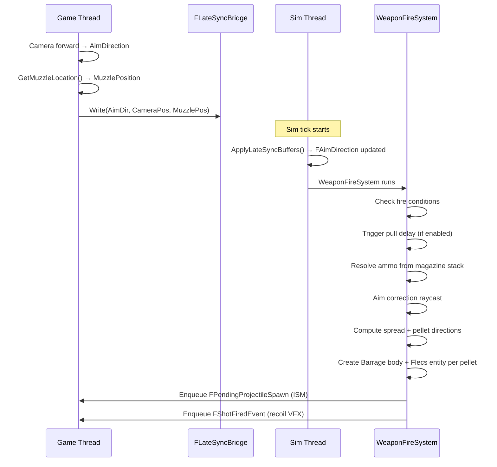
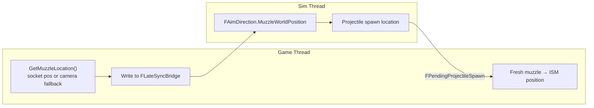

# Weapon System

> The weapon system handles firing, reloading, bloom (spread), ammo management, and post-fire cycling. All weapon logic runs on the simulation thread (60 Hz). Aim correction, muzzle flash VFX, and recoil are cosmetic game-thread systems.

---

## Component Layout

### FWeaponStatic (Prefab)

Inherited from `UFlecsWeaponProfile`. Lives in the Flecs prefab, shared by all weapons of this type.

| Field | Type | Description |
|-------|------|-------------|
| `ProjectileDefinition` | `UFlecsEntityDefinition*` | Projectile to spawn when firing |
| `FireInterval` | `float` | Time between shots in seconds (e.g. 0.1 = 10 shots/sec) |
| `BurstCount` | `int32` | Shots per burst (burst fire mode) |
| `BurstDelay` | `float` | Delay between bursts in seconds |
| `ProjectileSpeedMultiplier` | `float` | Speed multiplier on base projectile speed |
| `DamageMultiplier` | `float` | Damage multiplier on base projectile damage |
| `ProjectilesPerShot` | `int32` | Pellets per shot (>1 for shotguns) |
| `bIsAutomatic` | `bool` | Automatic fire mode |
| `bIsBurst` | `bool` | Burst fire mode |
| `AmmoPerShot` | `int32` | Ammo consumed per shot |
| `bHasChamber` | `bool` | Weapon has a chamber (+1 round). Tactical reload skips chambering |
| `bUnlimitedAmmo` | `bool` | Debug: ignores magazine system |
| `AcceptedCaliberIds` | `uint8[4]` | Accepted caliber IDs from CaliberRegistry (0xFF = invalid) |
| `AcceptedCaliberCount` | `int32` | Number of valid caliber entries |
| `RemoveMagTime` | `float` | Time to remove old magazine (seconds) |
| `InsertMagTime` | `float` | Time to insert new magazine (seconds) |
| `ChamberTime` | `float` | Time to chamber a round (seconds) |
| `ReloadMoveSpeedMultiplier` | `float` | Movement speed multiplier during reload |
| `MuzzleOffset` | `FVector` | Muzzle position relative to weapon origin |
| `MuzzleSocketName` | `FName` | Skeletal mesh socket for muzzle |
| `ReloadType` | `uint8` | 0 = Magazine, 1 = SingleRound |
| `OpenTime` | `float` | Time to open weapon for single-round reload (0 = skip) |
| `InsertRoundTime` | `float` | Time to insert one loose round |
| `CloseTime` | `float` | Time to close weapon after single-round reload (0 = skip) |
| `AcceptedDeviceTypes` | `uint8` | Bitmask of accepted quick-load devices |
| `bDisableQuickLoadDevices` | `bool` | Force-disable all quick-load devices |
| `OpenTimeDevice` | `float` | Open phase duration when using a device (0 = use standard) |
| `CloseTimeDevice` | `float` | Close phase duration when using a device (0 = use standard) |
| `bRequiresCycling` | `bool` | Weapon requires cycling after each shot (bolt/pump) |
| `CycleTime` | `float` | Time to complete one cycle action (seconds) |
| `bEnableTriggerPull` | `bool` | Enable trigger pull delay (revolver double-action) |
| `TriggerPullTime` | `float` | Time to complete trigger pull (seconds) |
| `bTriggerPullEveryShot` | `bool` | Every shot requires pull (double-action) vs only first (single-action) |
| `BaseSpread` | `float` | Standing inaccuracy in decidegrees (always present) |
| `SpreadPerShot` | `float` | Bloom growth per shot (decidegrees) |
| `MaxBloom` | `float` | Maximum bloom cap (decidegrees) |
| `BloomDecayRate` | `float` | Bloom decay speed (decidegrees/sec) |
| `BloomRecoveryDelay` | `float` | Delay before bloom starts decaying (seconds) |
| `BaseSpreadMultipliers[6]` | `float` | Per-movement-state base spread multipliers (indexed by EWeaponMoveState) |
| `BloomMultipliers[6]` | `float` | Per-movement-state bloom multipliers |
| `PelletRingCount` | `int32` | Number of pellet rings (0 = legacy VRandCone) |
| `PelletRings[4]` | `FPelletRingData` | Ring-based pellet spread data (sim thread, radians) |

### FWeaponInstance (Per-Entity)

| Field | Type | Description |
|-------|------|-------------|
| `InsertedMagazineId` | `int64` | Flecs entity ID of inserted magazine (0 = none) |
| `FireCooldownRemaining` | `float` | Countdown until weapon can fire again |
| `BurstShotsRemaining` | `int32` | Remaining shots in current burst |
| `BurstCooldownRemaining` | `float` | Burst cooldown timer |
| `bHasFiredSincePress` | `bool` | Semi-auto: already fired while trigger held |
| `ReloadPhase` | `EWeaponReloadPhase` | Current reload state machine phase |
| `ReloadPhaseTimer` | `float` | Timer for current reload phase |
| `SelectedMagazineId` | `int64` | Magazine selected for insertion during reload |
| `bPrevMagWasEmpty` | `bool` | Was previous magazine empty (for chambering decision) |
| `bChambered` | `bool` | A round is chambered (separate from magazine) |
| `ChamberedAmmoTypeIdx` | `uint8` | Ammo type index of chambered round |
| `CurrentBloom` | `float` | Current bloom in decidegrees |
| `TimeSinceLastShot` | `float` | Seconds since last successful fire |
| `TriggerPullTimer` | `float` | Trigger pull countdown (when bEnableTriggerPull) |
| `bTriggerPulling` | `bool` | Currently pulling trigger |
| `ShotsFiredTotal` | `int32` | Total shots fired since equip |
| `bNeedsCycle` | `bool` | Must complete cycle before next fire (bolt/pump) |
| `bCycling` | `bool` | Currently cycling (timer active) |
| `CycleTimeRemaining` | `float` | Cycle countdown timer |
| `RoundsInsertedThisReload` | `int32` | Rounds inserted so far in current single-round reload |
| `ActiveLoadMethod` | `EActiveLoadMethod` | Active loading method (None/LooseRound/StripperClip/Speedloader) |
| `ActiveDeviceEntityId` | `uint64` | Entity ID of device being consumed |
| `BatchSize` | `int32` | Rounds to insert in current batch |
| `BatchInsertTime` | `float` | Time for one batch insert action |
| `DeviceAmmoTypeIdx` | `uint8` | Ammo type index for device's ammo |
| `bUsedDeviceThisReload` | `bool` | Device was used at any point during this reload |
| `bFireRequested` | `bool` | Fire button held (game thread input) |
| `bFireTriggerPending` | `bool` | Latched fire trigger (survives Start+Stop batching) |
| `bReloadRequested` | `bool` | Reload was requested |
| `bReloadCancelRequested` | `bool` | Reload cancel was requested |

### FAimDirection (Per-Character)

Written by `FLateSyncBridge` each sim tick:

| Field | Type | Description |
|-------|------|-------------|
| `Direction` | `FVector` | Normalized aim direction in world space |
| `CharacterPosition` | `FVector` | Camera position (aim raycast origin) |
| `MuzzleWorldPosition` | `FVector` | Weapon muzzle world position from mesh socket |

---

## Fire Pipeline



### WeaponFireSystem Detail

1. **Fire conditions check:**
   ```
   bFireRequested == true OR bFireTriggerPending == true
   ReloadPhase == Idle
   InsertedMagazineId != 0
   FireCooldownRemaining <= 0
   BurstCooldownRemaining <= 0
   bNeedsCycle == false
   Semi-auto: bHasFiredSincePress == false
   ```

2. **Trigger pull delay** (when `bEnableTriggerPull == true`):
   - Requires continuous hold (`bFireRequested`) -- latched trigger not sufficient
   - First shot always requires pull; subsequent shots depend on `bTriggerPullEveryShot`
   - Timer counts down `TriggerPullTime`; fire releases cancel the pull
   - Double-action (every shot) vs single-action (only first while held)

3. **Ammo resolution from magazine:**
   - Chambered round fires first (`bChambered` + `ChamberedAmmoTypeIdx`)
   - Next round from magazine is chambered immediately after firing
   - Ammo type resolved from `FMagazineStatic::AcceptedAmmoTypes` array
   - Each ammo type has its own `DamageMultiplier` and `SpeedMultiplier`
   - Empty magazine + empty chamber triggers auto-reload

4. **Aim correction raycast:**
   ```cpp
   Barrage->CastRay(
       CharacterPosition, Direction * 100000,
       FastExcludeObjectLayerFilter({PROJECTILE, ENEMYPROJECTILE, DEBRIS})
   );
   ```
   - If hit found: compute direction from muzzle to hit point
   - MinEngagementDist = 300 cm: if target too close, push along aim ray (barrel parallax protection)
   - Dot product safety: if `dot(muzzleToHit, aimDir) < 0.85`, discard hit (>32 deg deviation)

5. **Spread calculation:**
   ```
   EffectiveSpread = BaseSpread * BaseMult(MoveState) + Min(CurrentBloom, MaxBloom) * BloomMult(MoveState)
   SpreadRadians = DegreesToRadians(EffectiveSpread * 0.1)   // decidegrees -> radians
   ```

6. **Projectile creation (inline, no prefab):**
   ```
   CreateBouncingSphere(MuzzlePos, PelletDirection * Speed, CollisionRadius)
   → Flecs entity with inline components (FBarrageBody, FProjectileInstance, FDamageStatic, etc.)
   → Reverse binding: Body->SetFlecsEntity(EntityId)
   → Enqueue FPendingProjectileSpawn (sim -> game thread for ISM)
   → Enqueue FShotFiredEvent (game thread recoil)
   ```

7. **State update:**
   ```
   FireCooldownRemaining += FireInterval   // carry-over overshoot for consistent rate
   CurrentBloom += SpreadPerShot (clamped to MaxBloom)
   TimeSinceLastShot = 0
   ShotsFiredTotal++
   bFireTriggerPending = false
   bHasFiredSincePress = true
   ```

---

## Pellet Ring Spread (Shotgun)

Shotgun pellet patterns use a ring-based system for visually consistent and designer-tunable spread.

### Designer Configuration (UFlecsWeaponProfile)

The `PelletRings` array on the weapon profile defines concentric rings of pellets:

```cpp
USTRUCT(BlueprintType)
struct FPelletRing
{
    int32 PelletCount;            // pellets on this ring (1-20)
    float RadiusDecidegrees;      // angular radius from center (0 = center, 20 = 2.0 deg)
    float AngularJitterDecidegrees; // jitter along ring (breaks geometric regularity)
    float RadialJitterDecidegrees;  // jitter toward/away from center
};
```

### Sim-Thread Data (FPelletRingData)

`FWeaponStatic::FromProfile()` converts decidegrees to radians into `FPelletRingData`:

```cpp
struct FPelletRingData
{
    int32 PelletCount;
    float RadiusRadians;          // pre-converted from decidegrees
    float AngularJitterRadians;   // azimuthal jitter (along ring)
    float RadialJitterRadians;    // radial jitter (toward/away from center)
};
```

### Algorithm

1. **Bloom drift**: All pellets share a single `VRandCone(SpawnDirection, SpreadRadians)` cone center -- bloom shifts the entire pattern.
2. **Random rotation**: A single random angle `[0, 2pi)` rotates all rings uniformly per shot. Prevents predictable fixed-position patterns.
3. **Per-pellet placement**: Each pellet in a ring is placed at `RandomRotation + PelletIdx * (2pi / PelletCount)` azimuth, at `RadiusRadians` from center.
4. **Per-pellet jitter**: Angular jitter (along ring) and radial jitter (toward/away from center) are applied independently to each pellet, breaking geometric regularity.

```
Shot pattern (conceptual):
    Ring 0: 1 pellet at center (Radius=0)
    Ring 1: 4 pellets at 2.0 deg radius, evenly spaced + jitter
    Ring 2: 8 pellets at 4.0 deg radius, evenly spaced + jitter
```

### Legacy Fallback

When `PelletRingCount == 0` (PelletRings array empty), the system falls back to independent `FMath::VRandCone()` per pellet -- each pellet independently samples within the spread cone. This is the default for single-projectile weapons.

---

## Trigger Pull System

Simulates revolver-style delayed fire. Enabled per-weapon via `bEnableTriggerPull`.

| Field | Description |
|-------|-------------|
| `TriggerPullTime` | Duration of pull before shot fires (seconds) |
| `bTriggerPullEveryShot` | `true` = double-action (every shot), `false` = single-action (first shot only while held) |

**Behavior:**
- Player must hold fire button continuously during pull. Releasing cancels the pull.
- Latched trigger (`bFireTriggerPending`) is NOT sufficient -- continuous hold required.
- After pull completes, the shot fires immediately.
- Single-action: first shot has delay, subsequent shots while held fire at normal `FireInterval`.

---

## Post-Fire Cycling (Bolt/Pump)

Weapons with `bRequiresCycling = true` must complete a cycle action after each shot before the next shot can fire.

| Field | Description |
|-------|-------------|
| `bRequiresCycling` | Enable cycling requirement (FWeaponStatic) |
| `CycleTime` | Duration of cycle action in seconds (FWeaponStatic) |
| `bNeedsCycle` | Must cycle before next fire (FWeaponInstance) |
| `bCycling` | Currently in cycle animation (FWeaponInstance) |
| `CycleTimeRemaining` | Countdown timer (FWeaponInstance) |

**Sequence:** Fire -> `bNeedsCycle=true, bCycling=true` -> `CycleTimeRemaining` counts down -> cycle complete (`bNeedsCycle=false, bCycling=false`) -> can fire again.

If the player attempts to fire while `bNeedsCycle && !bCycling`, the cycle starts automatically.

---

## Caliber Filtering

Weapons accept specific calibers via `AcceptedCaliberIds[4]` (up to 4 calibers per weapon). Caliber IDs come from the `UFlecsCaliberRegistry` (Project Settings). During magazine reload, the system filters magazines by matching `FMagazineStatic::CaliberId` against the weapon's accepted calibers. During single-round reload, loose ammo items and quick-load devices are also filtered by caliber.

---

## Reload State Machine

### EWeaponReloadPhase

```
Idle = 0
RemovingMag = 1
InsertingMag = 2
Chambering = 3
Opening = 4
InsertingRound = 5
Closing = 6
```

### Magazine Reload Path

```
Idle -> RemovingMag -> InsertingMag -> [Chambering] -> Idle
```

1. **RemovingMag** (`RemoveMagTime * MagSpeedMod`): Old magazine removed from weapon, returned to inventory.
2. **InsertingMag** (`InsertMagTime * MagSpeedMod`): New magazine (best ammo count from inventory) inserted. Old magazine's `FContainedIn` is restored; new magazine's is removed.
3. **Chambering** (`ChamberTime`): Only if `bHasChamber && bPrevMagWasEmpty`. Pops first round from new magazine into chamber.
4. **Tactical reload**: If chamber already had a round (or old mag had ammo), chambering is skipped -- straight to Idle.

**Cancel behavior (magazine):**
- `RemovingMag`: Cancel allowed. Magazine stays in weapon. Weapon stays loaded.
- `InsertingMag`: Cancel allowed. Old mag already in inventory -- weapon is EMPTY (dangerous).
- `Chambering`: Non-cancellable.

### Single-Round Reload Path

```
Idle -> [Opening] -> InsertingRound (loop) -> [Closing] -> Idle
```

1. **Opening** (`OpenTime` or `OpenTimeDevice`): Open cylinder/action. Skipped if time is 0.
2. **InsertingRound** (loop): Each round takes `InsertRoundTime` (loose) or `BatchInsertTime` (device). Loops until full, cancelled, or out of ammo.
3. **Closing** (`CloseTime` or `CloseTimeDevice`): Close cylinder/action. Skipped if time is 0.

**Cancel behavior (single-round):**
- `Opening`: Cancel allowed. Instant abort, no Close needed.
- `InsertingRound`: Cancel is **deferred** -- current round/batch timer must finish, then transitions to Closing.
- `Closing`: Non-cancellable.

**Cancel also triggers on:** `bFireRequested` or `bFireTriggerPending` during InsertingRound (interrupt reload to fire).

---

## Quick-Load Devices (Stripper Clips, Speedloaders)

Quick-load devices allow batch-inserting multiple rounds during single-round reload.

### Data Assets

**UFlecsQuickLoadProfile** (on item EntityDefinition):

| Field | Type | Description |
|-------|------|-------------|
| `DeviceType` | `EQuickLoadDeviceTypeUI` | StripperClip or Speedloader |
| `RoundsHeld` | `int32` | Rounds loaded per use (1-30) |
| `Caliber` | `FName` | Must match CaliberRegistry |
| `AmmoTypeDefinition` | `UFlecsAmmoTypeDefinition*` | Ammo type this device is pre-loaded with |
| `InsertTime` | `float` | Time for batch insert action (seconds) |
| `bRequiresEmptyMagazine` | `bool` | Magazine must be completely empty (speedloaders) |

### ECS Components

**FQuickLoadStatic** (prefab, sim-thread copy of profile):

| Field | Type | Description |
|-------|------|-------------|
| `DeviceType` | `EQuickLoadDeviceType` | StripperClip (0) or Speedloader (1) |
| `RoundsHeld` | `int32` | Rounds per use |
| `CaliberId` | `uint8` | Resolved caliber ID |
| `AmmoTypeDefinition` | `const UFlecsAmmoTypeDefinition*` | Ammo type pointer |
| `InsertTime` | `float` | Batch insert time (seconds) |
| `bRequiresEmptyMagazine` | `bool` | Require empty magazine |

**FTagQuickLoadDevice**: Tag for query filtering.

**EActiveLoadMethod** (on FWeaponInstance):
```
None = 0, LooseRound = 1, StripperClip = 2, Speedloader = 3
```

### Weapon Acceptance (FWeaponStatic)

```cpp
uint8 AcceptedDeviceTypes;      // bitmask: QUICKLOAD_BIT_STRIPPERCLIP (1) | QUICKLOAD_BIT_SPEEDLOADER (2)
bool bDisableQuickLoadDevices;  // force-disable override
float OpenTimeDevice;           // device-specific open time (0 = use standard)
float CloseTimeDevice;          // device-specific close time (0 = use standard)
```

Configured in `UFlecsWeaponProfile` via `bAcceptStripperClips` and `bAcceptSpeedloaders`.

### Device Scan Algorithm (ScanForQuickLoadDevice)

At reload start and after each completed batch, the system scans the character's inventory:

1. Filter by: `FContainedIn` in inventory, `FQuickLoadStatic` present, caliber match, device type accepted by weapon, ammo type accepted by magazine.
2. Speedloaders additionally require `bRequiresEmptyMagazine` check.
3. **Priority**: Speedloader > StripperClip (speedloaders are preferred when both are available).
4. Within same type: largest `RoundsHeld` wins.
5. `BatchSize = Min(RoundsHeld, AvailableSlots)`.

### Reload Flow with Devices

```
Reload requested
  -> ScanForQuickLoadDevice()
  -> Device found? Set ActiveLoadMethod, BatchSize, BatchInsertTime
  -> No device? Fallback to LooseRound

Opening phase (uses OpenTimeDevice if device active)
  -> InsertingRound phase

InsertingRound timer expires:
  Device path: push BatchSize rounds into magazine, consume 1 device from inventory
  Loose path: find 1 compatible ammo item, push into magazine, consume 1

After each insert:
  Full? -> Closing
  Cancel? -> Closing (deferred -- timer must finish first)
  No ammo? -> Closing
  Device just used? -> Re-scan for next device
    Next device found? -> continue with new device
    No more devices? -> fallback to LooseRound, continue

Closing phase (uses CloseTimeDevice if any device was used this reload)
  -> Idle
```

**Key behaviors:**
- Device batch insert is non-cancellable. Cancel request is deferred until the current batch timer expires, then the system transitions to Closing.
- After a device batch, the system re-scans for another device. If none found, it falls back to loose rounds seamlessly.
- Closing phase time depends on whether ANY device was used during the reload (`bUsedDeviceThisReload`), not just the last insert method.

---

## Bloom & Spread System

All spread values are in **decidegrees** (1 unit = 0.1 deg). Converted to radians at fire time.

### Formula

```
EffectiveSpread = BaseSpread * BaseMult(MoveState) + Min(CurrentBloom, MaxBloom) * BloomMult(MoveState)
```

### Movement State Multipliers

`EWeaponMoveState` (priority: Slide > Airborne > Sprint > Crouch > Walk > Idle):

| State | Index | Typical Base | Typical Bloom |
|-------|-------|-------------|---------------|
| Idle | 0 | 1.0 | 1.0 |
| Walk | 1 | 1.2 | 1.0 |
| Sprint | 2 | 3.0 | 2.0 |
| Airborne | 3 | 5.0 | 3.0 |
| Crouch | 4 | 0.7 | 0.8 |
| Slide | 5 | 4.0 | 2.5 |

### Bloom Lifecycle

1. **Growth**: On fire, `CurrentBloom += SpreadPerShot` (capped at `MaxBloom`).
2. **Delay**: `TimeSinceLastShot` must exceed `BloomRecoveryDelay` before decay starts.
3. **Decay**: `CurrentBloom` decays toward 0 at `BloomDecayRate` decidegrees/sec.

---

## WeaponTickSystem

Runs every sim tick, handles cooldowns, cycling, and bloom decay:

```
FireCooldownRemaining -= DeltaTime
BurstCooldownRemaining -= DeltaTime
TimeSinceLastShot += DeltaTime

if (bCycling):
    CycleTimeRemaining -= DeltaTime
    if (CycleTimeRemaining <= 0):
        bCycling = false
        bNeedsCycle = false

if (TimeSinceLastShot >= BloomRecoveryDelay):
    CurrentBloom decays toward 0 at BloomDecayRate

if (!bIsAutomatic && !bIsBurst && !bFireRequested):
    bHasFiredSincePress = false   // semi-auto reset
```

---

## Muzzle Position Flow



!!! warning "Muzzle Fallback"
    If no weapon mesh socket is available, `GetMuzzleLocation()` falls back to `FollowCamera->GetComponentLocation()` + `WeaponStatic->MuzzleOffset`. It must **NOT** use `GetActorLocation()` -- the capsule center is ~60 units below the camera, causing severe parallax at all ranges.

!!! info "MuzzleOffset Ownership"
    `MuzzleOffset` belongs to `FWeaponStatic` (weapon profile), NOT to `FAimDirection` or the character. Different weapons have different muzzle positions.

---

## ADS (Aim Down Sights)

Purely cosmetic game-thread system in `FlecsCharacter_ADS.cpp`:

- Spring interpolation for FOV change (normal FOV -> `WeaponProfile.ADSFOV`)
- Camera offset transition (hip -> sight anchor socket)
- Sensitivity multiplier (`ADSSensitivityMultiplier`)
- All ADS attenuation multipliers (bloom, recoil, sway reduced while ADS)

ADS state does **not** affect sim-thread ballistics -- only visual feedback.

---

## Recoil

Game-thread cosmetic system in `FlecsCharacter_Recoil.cpp`:

### Kick Recoil
Each shot applies random pitch/yaw kick to the camera:
```
KickPitch = Random(KickPitchMin, KickPitchMax)
KickYaw = Random(KickYawMin, KickYawMax)
```
Decayed each frame by `KickRecoverySpeed` and `KickDamping`.

### Pattern Recoil
Optional `UCurveVector` providing a deterministic recoil pattern (spray pattern):
```
PatternOffset = RecoilPatternCurve->Evaluate(ShotIndex)
    * PatternScale
    + Random(PatternRandomPitch, PatternRandomYaw)
```

### Screen Shake
Per-shot shake with `ShakeAmplitude`, `ShakeFrequency`, `ShakeDecaySpeed`.

### Weapon Motion Springs
Positional inertia (weapon sways in response to camera movement):
- `InertiaStiffness`, `InertiaDamping`, `MaxInertiaOffset`
- `IdleSwayAmplitude`, `IdleSwayFrequency`
- Walk bob, strafe tilt, landing impact, sprint pose

---

## Blueprint API

```cpp
UFlecsWeaponLibrary::StartFiring(World, WeaponEntityId);
UFlecsWeaponLibrary::StopFiring(World, WeaponEntityId);
UFlecsWeaponLibrary::ReloadWeapon(World, WeaponEntityId);
UFlecsWeaponLibrary::SetAimDirection(World, CharacterEntityId, Direction, Position);

// Queries
int32 Ammo = UFlecsWeaponLibrary::GetWeaponAmmo(World, WeaponEntityId);
bool Reloading = UFlecsWeaponLibrary::IsWeaponReloading(World, WeaponEntityId);
UFlecsWeaponLibrary::GetWeaponAmmoInfo(World, WeaponEntityId, OutCurrent, OutMag, OutReserve);
```
