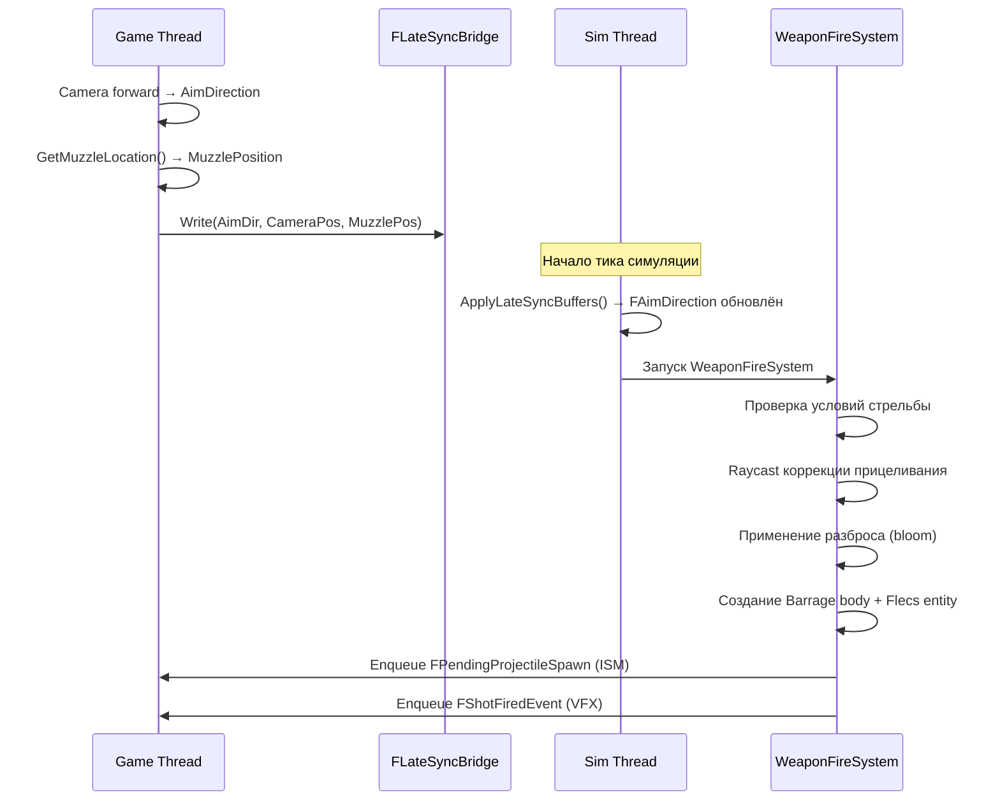
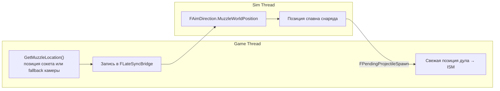

# Система оружия

> Система оружия управляет стрельбой, перезарядкой, разбросом (bloom) и боезапасом. Вся логика оружия выполняется на sim thread. Коррекция прицеливания, VFX вспышки дула и отдача — косметические системы game thread.

---

## Структура компонентов

### FWeaponStatic (Prefab)

Наследуется из `UFlecsWeaponProfile`:

| Поле | Тип | Описание |
|------|-----|----------|
| `FireRate` | `float` | Выстрелов в секунду |
| `FireMode` | `EFireMode` | Авто, полуавтомат, очередь |
| `BurstCount` | `int32` | Выстрелов в очереди |
| `MagCapacity` | `int32` | Размер магазина |
| `ReserveCapacity` | `int32` | Максимальный запас патронов |
| `ReloadTime` | `float` | Длительность перезарядки (секунды) |
| `AmmoPerShot` | `int32` | Расход патронов за выстрел |
| `ProjectileDefinition` | `UFlecsEntityDefinition*` | Спавнимый снаряд |
| `ProjectileSpeedMultiplier` | `float` | Множитель скорости базового снаряда |
| `DamageMultiplier` | `float` | Множитель урона базового снаряда |
| `ProjectilesPerShot` | `int32` | Дробин за выстрел (дробовик) |
| `MuzzleOffset` | `FVector` | Позиция дула относительно оружия |
| `MuzzleSocketName` | `FName` | Сокет скелетного меша для дула |
| `BaseSpread` | `float` | Минимальный разброс (радианы) |
| `SpreadPerShot` | `float` | Разброс, добавляемый за выстрел |
| `MaxSpread` | `float` | Максимальный предел разброса |
| `SpreadDecayRate` | `float` | Скорость убывания разброса в секунду |
| `SpreadRecoveryDelay` | `float` | Задержка перед началом убывания разброса |

### FWeaponInstance (Per-Entity)

| Поле | Тип | Описание |
|------|-----|----------|
| `CurrentMag` | `int32` | Патронов в магазине |
| `CurrentReserve` | `int32` | Запас патронов |
| `FireCooldown` | `float` | Время до следующего разрешённого выстрела |
| `BurstRemaining` | `int32` | Оставшиеся выстрелы в очереди |
| `BurstCooldown` | `float` | Время между выстрелами очереди |
| `bReloading` | `bool` | Идёт перезарядка |
| `ReloadTimer` | `float` | Оставшееся время перезарядки |
| `CurrentBloom` | `float` | Текущий угол разброса |
| `BloomDecayDelay` | `float` | Время до начала убывания разброса |
| `bFireInputActive` | `bool` | Кнопка стрельбы удерживается |
| `bSemiAutoReset` | `bool` | Курок отпущен с прошлого выстрела (полуавтомат) |

### FAimDirection (Per-Entity)

Записывается `FLateSyncBridge` каждый тик симуляции:

| Поле | Тип | Описание |
|------|-----|----------|
| `AimWorldDirection` | `FVector` | Направление камеры |
| `AimWorldOrigin` | `FVector` | Мировая позиция камеры |
| `MuzzleWorldPosition` | `FVector` | Мировая позиция дула оружия |

---

## Пайплайн стрельбы



### Детали WeaponFireSystem

1. **Проверка условий стрельбы:**
   ```
   bFireInputActive == true
   FireCooldown <= 0
   CurrentMag > 0
   bReloading == false
   Полуавтомат: bSemiAutoReset == true
   ```

2. **Raycast коррекции прицеливания:**
   ```cpp
   // Каст из позиции камеры вдоль направления прицеливания
   Barrage->CastRay(
       AimOrigin, AimDirection * MaxRange,
       FastExcludeObjectLayerFilter({PROJECTILE, ENEMYPROJECTILE, DEBRIS})
   );
   ```
   - Если попадание найдено: вычисляется направление от дула к точке попадания
   - MinEngagementDist = 300u: если дистанция попадания < 300 см, используется сырое направление прицеливания (защита от параллакса ствола)
   - Проверка скалярного произведения: если `dot(muzzleToHit, aimDir) < 0.85`, попадание отбрасывается (геометрия за камерой)

3. **Разброс (Bloom):**
   ```cpp
   FVector FinalDir = FMath::VRandCone(CorrectedDirection, CurrentBloom);
   ```

4. **Создание снаряда (инлайн):**
   ```
   CreateBouncingSphere(MuzzlePos, FinalDir * Speed, CollisionRadius)
   → Flecs entity (без prefab — инлайн установка компонентов)
   → BindEntityToBarrage
   → Enqueue FPendingProjectileSpawn (sim→game)
   ```

5. **Обновление состояния:**
   ```
   CurrentMag -= AmmoPerShot
   FireCooldown = 1.0 / FireRate
   CurrentBloom += SpreadPerShot (ограничен MaxSpread)
   BloomDecayDelay = SpreadRecoveryDelay
   ```

---

## WeaponTickSystem

Выполняется каждый тик симуляции, управляет кулдаунами и убыванием разброса:

```
FireCooldown -= DeltaTime
BurstCooldown -= DeltaTime
BloomDecayDelay -= DeltaTime

if (BloomDecayDelay <= 0)
    CurrentBloom = FMath::FInterpTo(CurrentBloom, BaseSpread, DeltaTime, SpreadDecayRate)

// Сброс полуавтомата
if (FireMode == Semi && !bFireInputActive)
    bSemiAutoReset = true
```

---

## WeaponReloadSystem

```
if (bReloading && ReloadTimer > 0):
    ReloadTimer -= DeltaTime

if (ReloadTimer <= 0 && bReloading):
    AmmoToLoad = Min(MagCapacity - CurrentMag, CurrentReserve)
    CurrentMag += AmmoToLoad
    CurrentReserve -= AmmoToLoad
    bReloading = false

    // Уведомление UI
    MessageSubsystem->Publish(FUIReloadMessage{ .bComplete = true })
```

---

## Поток позиции дула



!!! warning "Fallback позиции дула"
    Если сокет меша оружия недоступен, `GetMuzzleLocation()` использует fallback: `FollowCamera->GetComponentLocation()` + `WeaponStatic->MuzzleOffset`. Он **НЕ** должен использовать `GetActorLocation()` — центр капсулы на ~60 юнитов ниже камеры, что вызывает сильный параллакс на всех дистанциях.

!!! info "Принадлежность MuzzleOffset"
    `MuzzleOffset` принадлежит `FWeaponStatic` (профиль оружия), а НЕ `FAimDirection` или персонажу. Разное оружие имеет разные позиции дула.

---

## ADS (прицеливание)

Чисто косметическая система game thread в `FlecsCharacter_ADS.cpp`:

- Пружинная интерполяция изменения FOV (обычный FOV → `WeaponProfile.ADSFOV`)
- Переход смещения камеры (от бедра → к сокету прицела)
- Множитель чувствительности (`ADSSensitivityMultiplier`)
- Все множители ослабления ADS (уменьшение разброса, отдачи, покачивания при прицеливании)

Состояние ADS **не** влияет на баллистику sim thread — только на визуальную обратную связь.

---

## Отдача

Косметическая система game thread в `FlecsCharacter_Recoil.cpp`:

### Kick-отдача
Каждый выстрел применяет случайное отклонение по pitch/yaw к камере:
```
KickPitch = Random(KickPitchMin, KickPitchMax)
KickYaw = Random(KickYawMin, KickYawMax)
```
Затухает каждый кадр с помощью `KickRecoverySpeed` и `KickDamping`.

### Pattern-отдача
Опциональный `UCurveVector`, задающий детерминированный паттерн отдачи (spray pattern):
```
PatternOffset = RecoilPatternCurve->Evaluate(ShotIndex)
    * PatternScale
    + Random(PatternRandomPitch, PatternRandomYaw)
```

### Тряска экрана
Тряска за каждый выстрел с параметрами `ShakeAmplitude`, `ShakeFrequency`, `ShakeDecaySpeed`.

### Пружины движения оружия
Позиционная инерция (оружие покачивается в ответ на движение камеры):
- `InertiaStiffness`, `InertiaDamping`, `MaxInertiaOffset`
- `IdleSwayAmplitude`, `IdleSwayFrequency`
- Покачивание при ходьбе, наклон при стрейфе, удар при приземлении, поза спринта

---

## Blueprint API

```cpp
UFlecsWeaponLibrary::StartFiring(World, WeaponEntityId);
UFlecsWeaponLibrary::StopFiring(World, WeaponEntityId);
UFlecsWeaponLibrary::ReloadWeapon(World, WeaponEntityId);
UFlecsWeaponLibrary::SetAimDirection(World, CharacterEntityId, Direction, Position);

// Запросы
int32 Ammo = UFlecsWeaponLibrary::GetWeaponAmmo(World, WeaponEntityId);
bool Reloading = UFlecsWeaponLibrary::IsWeaponReloading(World, WeaponEntityId);
UFlecsWeaponLibrary::GetWeaponAmmoInfo(World, WeaponEntityId, OutCurrent, OutMag, OutReserve);
```
