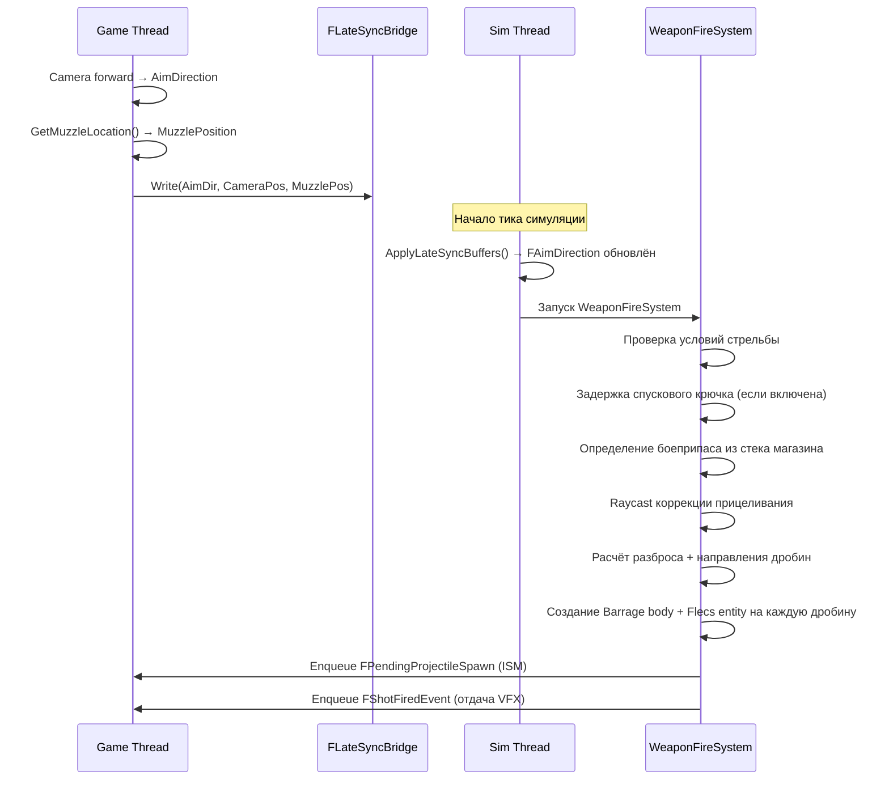
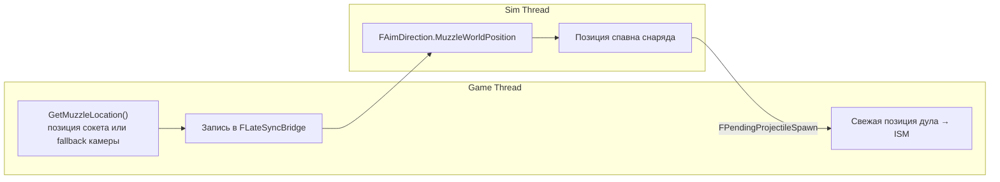

# Система оружия

> Система оружия управляет стрельбой, перезарядкой, разбросом (bloom), боезапасом и циклированием затвора. Вся логика оружия выполняется на sim thread (60 Гц). Коррекция прицеливания, VFX вспышки дула и отдача — косметические системы game thread.

---

## Структура компонентов

### FWeaponStatic (Prefab)

Наследуется из `UFlecsWeaponProfile`. Живёт в Flecs-префабе, разделяется всеми экземплярами данного типа оружия.

| Поле | Тип | Описание |
|------|-----|----------|
| `ProjectileDefinition` | `UFlecsEntityDefinition*` | Определение спавнимого снаряда |
| `FireInterval` | `float` | Интервал между выстрелами в секундах (0.1 = 10 выстр/сек) |
| `BurstCount` | `int32` | Выстрелов в очереди |
| `BurstDelay` | `float` | Задержка между очередями (секунды) |
| `ProjectileSpeedMultiplier` | `float` | Множитель скорости снаряда |
| `DamageMultiplier` | `float` | Множитель урона снаряда |
| `ProjectilesPerShot` | `int32` | Дробин за выстрел (>1 для дробовиков) |
| `bIsAutomatic` | `bool` | Автоматический режим огня |
| `bIsBurst` | `bool` | Режим стрельбы очередями |
| `AmmoPerShot` | `int32` | Расход патронов за выстрел |
| `bHasChamber` | `bool` | Оружие имеет патронник (+1 патрон). Тактическая перезарядка пропускает дозарядку |
| `bUnlimitedAmmo` | `bool` | Отладка: игнорирует систему магазинов |
| `AcceptedCaliberIds` | `uint8[4]` | Принимаемые ID калибров из CaliberRegistry (0xFF = недопустимый) |
| `AcceptedCaliberCount` | `int32` | Количество допустимых калибров |
| `RemoveMagTime` | `float` | Время извлечения магазина (секунды) |
| `InsertMagTime` | `float` | Время вставки магазина (секунды) |
| `ChamberTime` | `float` | Время дозарядки патронника (секунды) |
| `ReloadMoveSpeedMultiplier` | `float` | Множитель скорости передвижения при перезарядке |
| `MuzzleOffset` | `FVector` | Позиция дула относительно оружия |
| `MuzzleSocketName` | `FName` | Сокет скелетного меша для дула |
| `ReloadType` | `uint8` | 0 = Магазин, 1 = Поштучная |
| `OpenTime` | `float` | Время открытия для поштучной перезарядки (0 = пропуск) |
| `InsertRoundTime` | `float` | Время вставки одного патрона |
| `CloseTime` | `float` | Время закрытия после поштучной перезарядки (0 = пропуск) |
| `AcceptedDeviceTypes` | `uint8` | Битовая маска принимаемых устройств быстрой зарядки |
| `bDisableQuickLoadDevices` | `bool` | Принудительно отключить все устройства быстрой зарядки |
| `OpenTimeDevice` | `float` | Время открытия при использовании устройства (0 = стандартное) |
| `CloseTimeDevice` | `float` | Время закрытия при использовании устройства (0 = стандартное) |
| `bRequiresCycling` | `bool` | Оружие требует циклирования после каждого выстрела (затвор/помпа) |
| `CycleTime` | `float` | Время циклирования затвора (секунды) |
| `bEnableTriggerPull` | `bool` | Задержка нажатия спускового крючка (двойное действие) |
| `TriggerPullTime` | `float` | Время нажатия спускового крючка (секунды) |
| `bTriggerPullEveryShot` | `bool` | Каждый выстрел требует нажатия (DA) / только первый (SA) |
| `BaseSpread` | `float` | Базовый разброс в децистепенях (всегда присутствует) |
| `SpreadPerShot` | `float` | Рост разброса за выстрел (децистепени) |
| `MaxBloom` | `float` | Максимальный предел разброса (децистепени) |
| `BloomDecayRate` | `float` | Скорость убывания разброса (децистепени/сек) |
| `BloomRecoveryDelay` | `float` | Задержка перед началом убывания (секунды) |
| `BaseSpreadMultipliers[6]` | `float` | Множители базового разброса по состояниям движения (EWeaponMoveState) |
| `BloomMultipliers[6]` | `float` | Множители разброса по состояниям движения |
| `PelletRingCount` | `int32` | Количество колец дроби (0 = устаревший VRandCone) |
| `PelletRings[4]` | `FPelletRingData` | Данные кольцевого разброса дроби (sim thread, радианы) |

### FWeaponInstance (Per-Entity)

| Поле | Тип | Описание |
|------|-----|----------|
| `InsertedMagazineId` | `int64` | ID сущности вставленного магазина (0 = нет) |
| `FireCooldownRemaining` | `float` | Таймер до следующего выстрела |
| `BurstShotsRemaining` | `int32` | Оставшиеся выстрелы в очереди |
| `BurstCooldownRemaining` | `float` | Таймер задержки между очередями |
| `bHasFiredSincePress` | `bool` | Полуавтомат: уже стрелял при удержании |
| `ReloadPhase` | `EWeaponReloadPhase` | Текущая фаза автомата перезарядки |
| `ReloadPhaseTimer` | `float` | Таймер текущей фазы перезарядки |
| `SelectedMagazineId` | `int64` | Магазин, выбранный для вставки |
| `bPrevMagWasEmpty` | `bool` | Предыдущий магазин был пуст (для решения о дозарядке) |
| `bChambered` | `bool` | Патрон в патроннике (отдельно от магазина) |
| `ChamberedAmmoTypeIdx` | `uint8` | Индекс типа боеприпаса патрона в патроннике |
| `CurrentBloom` | `float` | Текущий разброс в децистепенях |
| `TimeSinceLastShot` | `float` | Секунд с последнего выстрела |
| `TriggerPullTimer` | `float` | Таймер нажатия спускового крючка |
| `bTriggerPulling` | `bool` | Идёт нажатие спускового крючка |
| `ShotsFiredTotal` | `int32` | Всего выстрелов с момента экипировки |
| `bNeedsCycle` | `bool` | Необходимо циклирование перед следующим выстрелом |
| `bCycling` | `bool` | Идёт циклирование (таймер активен) |
| `CycleTimeRemaining` | `float` | Таймер циклирования |
| `RoundsInsertedThisReload` | `int32` | Патронов вставлено в текущей перезарядке |
| `ActiveLoadMethod` | `EActiveLoadMethod` | Метод зарядки (None/LooseRound/StripperClip/Speedloader) |
| `ActiveDeviceEntityId` | `uint64` | ID сущности используемого устройства |
| `BatchSize` | `int32` | Патронов в текущей пачке |
| `BatchInsertTime` | `float` | Время вставки одной пачки |
| `DeviceAmmoTypeIdx` | `uint8` | Индекс типа боеприпаса устройства |
| `bUsedDeviceThisReload` | `bool` | Устройство использовалось в этой перезарядке |
| `bFireRequested` | `bool` | Кнопка стрельбы удерживается (ввод game thread) |
| `bFireTriggerPending` | `bool` | Защёлкнутый триггер (переживает батчинг Start+Stop) |
| `bReloadRequested` | `bool` | Запрошена перезарядка |
| `bReloadCancelRequested` | `bool` | Запрошена отмена перезарядки |

### FAimDirection (Per-Character)

Записывается `FLateSyncBridge` каждый тик симуляции:

| Поле | Тип | Описание |
|------|-----|----------|
| `Direction` | `FVector` | Нормализованное направление прицеливания |
| `CharacterPosition` | `FVector` | Позиция камеры (начало рейкаста) |
| `MuzzleWorldPosition` | `FVector` | Мировая позиция дула из сокета меша |

---

## Пайплайн стрельбы



### Детали WeaponFireSystem

1. **Проверка условий стрельбы:**
   ```
   bFireRequested == true ИЛИ bFireTriggerPending == true
   ReloadPhase == Idle
   InsertedMagazineId != 0
   FireCooldownRemaining <= 0
   BurstCooldownRemaining <= 0
   bNeedsCycle == false
   Полуавтомат: bHasFiredSincePress == false
   ```

2. **Задержка спускового крючка** (при `bEnableTriggerPull == true`):
   - Требует непрерывного удержания (`bFireRequested`) — защёлкнутый триггер недостаточен
   - Первый выстрел всегда требует нажатия; последующие зависят от `bTriggerPullEveryShot`
   - Таймер отсчитывает `TriggerPullTime`; отпускание отменяет нажатие
   - Двойное действие (каждый выстрел) / одинарное (только первый при удержании)

3. **Определение боеприпаса из магазина:**
   - Сначала выстреливается патрон из патронника (`bChambered` + `ChamberedAmmoTypeIdx`)
   - Следующий патрон из магазина немедленно досылается в патронник
   - Тип боеприпаса определяется из массива `FMagazineStatic::AcceptedAmmoTypes`
   - У каждого типа свои `DamageMultiplier` и `SpeedMultiplier`
   - Пустой магазин + пустой патронник запускают автоперезарядку

4. **Raycast коррекции прицеливания:**
   ```cpp
   Barrage->CastRay(
       CharacterPosition, Direction * 100000,
       FastExcludeObjectLayerFilter({PROJECTILE, ENEMYPROJECTILE, DEBRIS})
   );
   ```
   - При попадании: вычисляется направление от дула к точке попадания
   - MinEngagementDist = 300 см: если цель слишком близко, точка сдвигается вдоль луча (защита от параллакса)
   - Скалярное произведение: если `dot(muzzleToHit, aimDir) < 0.85`, попадание отбрасывается (>32 град отклонение)

5. **Расчёт разброса:**
   ```
   EffectiveSpread = BaseSpread * BaseMult(MoveState) + Min(CurrentBloom, MaxBloom) * BloomMult(MoveState)
   SpreadRadians = DegreesToRadians(EffectiveSpread * 0.1)   // децистепени -> радианы
   ```

6. **Создание снаряда (инлайн, без префаба):**
   ```
   CreateBouncingSphere(MuzzlePos, PelletDirection * Speed, CollisionRadius)
   → Flecs entity с инлайн-компонентами (FBarrageBody, FProjectileInstance, FDamageStatic и др.)
   → Обратная привязка: Body->SetFlecsEntity(EntityId)
   → Enqueue FPendingProjectileSpawn (sim → game thread для ISM)
   → Enqueue FShotFiredEvent (game thread, отдача)
   ```

7. **Обновление состояния:**
   ```
   FireCooldownRemaining += FireInterval   // перенос перелёта для стабильной скорострельности
   CurrentBloom += SpreadPerShot (ограничен MaxBloom)
   TimeSinceLastShot = 0
   ShotsFiredTotal++
   bFireTriggerPending = false
   bHasFiredSincePress = true
   ```

---

## Кольцевой разброс дроби (дробовик)

Паттерны дробовых зарядов используют кольцевую систему для визуально консистентного и настраиваемого дизайнером разброса.

### Конфигурация дизайнера (UFlecsWeaponProfile)

Массив `PelletRings` в профиле оружия определяет концентрические кольца дробин:

```cpp
USTRUCT(BlueprintType)
struct FPelletRing
{
    int32 PelletCount;            // дробин на кольце (1-20)
    float RadiusDecidegrees;      // угловой радиус от центра (0 = центр, 20 = 2.0 град)
    float AngularJitterDecidegrees; // джиттер вдоль кольца (ломает геометрическую регулярность)
    float RadialJitterDecidegrees;  // джиттер к/от центра
};
```

### Данные sim thread (FPelletRingData)

`FWeaponStatic::FromProfile()` конвертирует децистепени в радианы в `FPelletRingData`:

```cpp
struct FPelletRingData
{
    int32 PelletCount;
    float RadiusRadians;          // сконвертирован из децистепеней
    float AngularJitterRadians;   // азимутальный джиттер (вдоль кольца)
    float RadialJitterRadians;    // радиальный джиттер (к/от центра)
};
```

### Алгоритм

1. **Дрейф разброса**: Все дробины разделяют единый `VRandCone(SpawnDirection, SpreadRadians)` центр конуса — bloom смещает весь паттерн.
2. **Случайное вращение**: Единый случайный угол `[0, 2pi)` вращает все кольца равномерно за выстрел. Предотвращает предсказуемые фиксированные позиции.
3. **Размещение каждой дробины**: Каждая дробина на кольце размещается на азимуте `RandomRotation + PelletIdx * (2pi / PelletCount)`, на расстоянии `RadiusRadians` от центра.
4. **Джиттер каждой дробины**: Угловой джиттер (вдоль кольца) и радиальный джиттер (к/от центра) применяются независимо к каждой дробине, ломая геометрическую регулярность.

```
Паттерн выстрела (концептуально):
    Кольцо 0: 1 дробина в центре (Radius=0)
    Кольцо 1: 4 дробины на радиусе 2.0 град, равномерно + джиттер
    Кольцо 2: 8 дробин на радиусе 4.0 град, равномерно + джиттер
```

### Устаревший fallback

При `PelletRingCount == 0` (массив PelletRings пуст) система использует независимый `FMath::VRandCone()` для каждой дробины — каждая дробина самостоятельно сэмплирует из конуса разброса. Это поведение по умолчанию для однопулевого оружия.

---

## Система спускового крючка

Имитирует задержку стрельбы в стиле револьвера. Включается для каждого оружия через `bEnableTriggerPull`.

| Поле | Описание |
|------|----------|
| `TriggerPullTime` | Длительность нажатия до выстрела (секунды) |
| `bTriggerPullEveryShot` | `true` = двойное действие (каждый выстрел), `false` = одинарное (только первый при удержании) |

**Поведение:**
- Игрок должен непрерывно удерживать кнопку стрельбы во время нажатия. Отпускание отменяет нажатие.
- Защёлкнутый триггер (`bFireTriggerPending`) НЕ достаточен — необходимо непрерывное удержание.
- После завершения нажатия выстрел происходит немедленно.
- Одинарное действие: первый выстрел с задержкой, последующие при удержании стреляют с обычным `FireInterval`.

---

## Циклирование после выстрела (затвор/помпа)

Оружие с `bRequiresCycling = true` должно завершить цикл после каждого выстрела перед следующим.

| Поле | Описание |
|------|----------|
| `bRequiresCycling` | Включить требование циклирования (FWeaponStatic) |
| `CycleTime` | Длительность цикла в секундах (FWeaponStatic) |
| `bNeedsCycle` | Необходимо циклирование перед следующим выстрелом (FWeaponInstance) |
| `bCycling` | Идёт циклирование (FWeaponInstance) |
| `CycleTimeRemaining` | Таймер обратного отсчёта (FWeaponInstance) |

**Последовательность:** Выстрел -> `bNeedsCycle=true, bCycling=true` -> `CycleTimeRemaining` отсчитывает -> цикл завершён (`bNeedsCycle=false, bCycling=false`) -> можно стрелять.

Если игрок пытается стрелять при `bNeedsCycle && !bCycling`, цикл запускается автоматически.

---

## Фильтрация калибров

Оружие принимает определённые калибры через `AcceptedCaliberIds[4]` (до 4 калибров на оружие). ID калибров берутся из `UFlecsCaliberRegistry` (Project Settings). При магазинной перезарядке система фильтрует магазины, сопоставляя `FMagazineStatic::CaliberId` с принимаемыми калибрами оружия. При поштучной перезарядке россыпные патроны и устройства быстрой зарядки также фильтруются по калибру.

---

## Автомат перезарядки

### EWeaponReloadPhase

```
Idle = 0
RemovingMag = 1
InsertingMag = 2
Chambering = 3
Opening = 4
InsertingRound = 5
Closing = 6
```

### Путь магазинной перезарядки

```
Idle -> RemovingMag -> InsertingMag -> [Chambering] -> Idle
```

1. **RemovingMag** (`RemoveMagTime * MagSpeedMod`): Старый магазин извлекается, возвращается в инвентарь.
2. **InsertingMag** (`InsertMagTime * MagSpeedMod`): Новый магазин (с максимальным количеством патронов из инвентаря) вставляется. `FContainedIn` старого магазина восстанавливается; у нового удаляется.
3. **Chambering** (`ChamberTime`): Только при `bHasChamber && bPrevMagWasEmpty`. Первый патрон из нового магазина досылается в патронник.
4. **Тактическая перезарядка**: Если в патроннике уже был патрон (или в старом магазине были патроны), дозарядка пропускается — сразу в Idle.

**Поведение отмены (магазинная):**
- `RemovingMag`: Отмена разрешена. Магазин остаётся в оружии. Оружие заряжено.
- `InsertingMag`: Отмена разрешена. Старый магазин уже в инвентаре — оружие ПУСТО (опасно).
- `Chambering`: Не отменяемо.

### Путь поштучной перезарядки

```
Idle -> [Opening] -> InsertingRound (цикл) -> [Closing] -> Idle
```

1. **Opening** (`OpenTime` или `OpenTimeDevice`): Открытие барабана/затвора. Пропускается при времени 0.
2. **InsertingRound** (цикл): Каждый патрон занимает `InsertRoundTime` (россыпью) или `BatchInsertTime` (устройством). Повторяется до заполнения, отмены или исчерпания патронов.
3. **Closing** (`CloseTime` или `CloseTimeDevice`): Закрытие барабана/затвора. Пропускается при времени 0.

**Поведение отмены (поштучная):**
- `Opening`: Отмена разрешена. Мгновенный сброс, фаза Close не нужна.
- `InsertingRound`: Отмена **отложена** — таймер текущего патрона/пачки должен истечь, затем переход в Closing.
- `Closing`: Не отменяемо.

**Отмена также срабатывает при:** `bFireRequested` или `bFireTriggerPending` во время InsertingRound (прерывание перезарядки для стрельбы).

---

## Устройства быстрой зарядки (обоймы, спидлоадеры)

Устройства быстрой зарядки позволяют пакетно вставлять несколько патронов при поштучной перезарядке.

### Ассеты данных

**UFlecsQuickLoadProfile** (на EntityDefinition предмета):

| Поле | Тип | Описание |
|------|-----|----------|
| `DeviceType` | `EQuickLoadDeviceTypeUI` | StripperClip (обойма) или Speedloader (спидлоадер) |
| `RoundsHeld` | `int32` | Патронов за использование (1-30) |
| `Caliber` | `FName` | Должен совпадать с CaliberRegistry |
| `AmmoTypeDefinition` | `UFlecsAmmoTypeDefinition*` | Тип боеприпаса, которым заряжено устройство |
| `InsertTime` | `float` | Время пакетной вставки (секунды) |
| `bRequiresEmptyMagazine` | `bool` | Магазин должен быть полностью пуст (спидлоадеры) |

### ECS-компоненты

**FQuickLoadStatic** (префаб, sim-thread копия профиля):

| Поле | Тип | Описание |
|------|-----|----------|
| `DeviceType` | `EQuickLoadDeviceType` | StripperClip (0) или Speedloader (1) |
| `RoundsHeld` | `int32` | Патронов за использование |
| `CaliberId` | `uint8` | Разрешённый ID калибра |
| `AmmoTypeDefinition` | `const UFlecsAmmoTypeDefinition*` | Указатель на тип боеприпаса |
| `InsertTime` | `float` | Время пакетной вставки (секунды) |
| `bRequiresEmptyMagazine` | `bool` | Требуется пустой магазин |

**FTagQuickLoadDevice**: Тег для фильтрации запросов.

**EActiveLoadMethod** (в FWeaponInstance):

```
None = 0, LooseRound = 1, StripperClip = 2, Speedloader = 3
```

### Приёмка устройств оружием (FWeaponStatic)

```cpp
uint8 AcceptedDeviceTypes;      // битовая маска: QUICKLOAD_BIT_STRIPPERCLIP (1) | QUICKLOAD_BIT_SPEEDLOADER (2)
bool bDisableQuickLoadDevices;  // принудительное отключение
float OpenTimeDevice;           // время открытия для устройства (0 = стандартное)
float CloseTimeDevice;          // время закрытия для устройства (0 = стандартное)
```

Настраивается в `UFlecsWeaponProfile` через `bAcceptStripperClips` и `bAcceptSpeedloaders`.

### Алгоритм поиска устройства (ScanForQuickLoadDevice)

При начале перезарядки и после каждой завершённой пачки система сканирует инвентарь персонажа:

1. Фильтрация по: `FContainedIn` в инвентаре, наличие `FQuickLoadStatic`, совпадение калибра, тип устройства принят оружием, тип боеприпаса принят магазином.
2. Спидлоадеры дополнительно проверяют `bRequiresEmptyMagazine`.
3. **Приоритет**: Спидлоадер > Обойма (спидлоадеры предпочтительнее при наличии обоих).
4. Внутри одного типа: наибольший `RoundsHeld` побеждает.
5. `BatchSize = Min(RoundsHeld, AvailableSlots)`.

### Поток перезарядки с устройствами

```
Запрос перезарядки
  -> ScanForQuickLoadDevice()
  -> Устройство найдено? Установить ActiveLoadMethod, BatchSize, BatchInsertTime
  -> Не найдено? Откат к LooseRound

Фаза Opening (используется OpenTimeDevice если устройство активно)
  -> Фаза InsertingRound

Таймер InsertingRound истёк:
  Путь устройства: push BatchSize патронов в магазин, потребить 1 устройство из инвентаря
  Путь россыпью: найти 1 совместимый патрон, push в магазин, потребить 1

После каждой вставки:
  Полный? -> Closing
  Отмена? -> Closing (отложена — таймер должен истечь)
  Нет патронов? -> Closing
  Только что использовано устройство? -> Повторный поиск
    Следующее устройство найдено? -> продолжить с новым
    Устройств нет? -> откат к россыпным, продолжить

Фаза Closing (используется CloseTimeDevice если любое устройство использовалось)
  -> Idle
```

**Ключевые особенности:**
- Пакетная вставка устройством не отменяема. Запрос на отмену откладывается до истечения таймера текущей пачки, затем система переходит в Closing.
- После пачки устройства система повторно ищет следующее устройство. Если не найдено — плавный откат к россыпным патронам.
- Время фазы Closing зависит от того, использовалось ли ЛЮБОЕ устройство в течение перезарядки (`bUsedDeviceThisReload`), а не только последний метод вставки.

---

## Система разброса и Bloom

Все значения разброса в **децистепенях** (1 единица = 0.1 град). Конвертируются в радианы при выстреле.

### Формула

```
EffectiveSpread = BaseSpread * BaseMult(MoveState) + Min(CurrentBloom, MaxBloom) * BloomMult(MoveState)
```

### Множители по состояниям движения

`EWeaponMoveState` (приоритет: Slide > Airborne > Sprint > Crouch > Walk > Idle):

| Состояние | Индекс | Типичный Base | Типичный Bloom |
|-----------|--------|--------------|----------------|
| Idle | 0 | 1.0 | 1.0 |
| Walk | 1 | 1.2 | 1.0 |
| Sprint | 2 | 3.0 | 2.0 |
| Airborne | 3 | 5.0 | 3.0 |
| Crouch | 4 | 0.7 | 0.8 |
| Slide | 5 | 4.0 | 2.5 |

### Жизненный цикл Bloom

1. **Рост**: При выстреле `CurrentBloom += SpreadPerShot` (ограничен `MaxBloom`).
2. **Задержка**: `TimeSinceLastShot` должен превысить `BloomRecoveryDelay` перед началом убывания.
3. **Убывание**: `CurrentBloom` убывает к 0 со скоростью `BloomDecayRate` децистепеней/сек.

---

## WeaponTickSystem

Выполняется каждый тик симуляции, управляет кулдаунами, циклированием и убыванием разброса:

```
FireCooldownRemaining -= DeltaTime
BurstCooldownRemaining -= DeltaTime
TimeSinceLastShot += DeltaTime

if (bCycling):
    CycleTimeRemaining -= DeltaTime
    if (CycleTimeRemaining <= 0):
        bCycling = false
        bNeedsCycle = false

if (TimeSinceLastShot >= BloomRecoveryDelay):
    CurrentBloom убывает к 0 со скоростью BloomDecayRate

if (!bIsAutomatic && !bIsBurst && !bFireRequested):
    bHasFiredSincePress = false   // сброс полуавтомата
```

---

## Поток позиции дула



!!! warning "Fallback позиции дула"
    Если сокет меша оружия недоступен, `GetMuzzleLocation()` использует fallback: `FollowCamera->GetComponentLocation()` + `WeaponStatic->MuzzleOffset`. Он **НЕ** должен использовать `GetActorLocation()` — центр капсулы на ~60 юнитов ниже камеры, что вызывает сильный параллакс на всех дистанциях.

!!! info "Принадлежность MuzzleOffset"
    `MuzzleOffset` принадлежит `FWeaponStatic` (профиль оружия), а НЕ `FAimDirection` или персонажу. Разное оружие имеет разные позиции дула.

---

## ADS (прицеливание)

Чисто косметическая система game thread в `FlecsCharacter_ADS.cpp`:

- Пружинная интерполяция изменения FOV (обычный FOV -> `WeaponProfile.ADSFOV`)
- Переход смещения камеры (от бедра -> к сокету прицела)
- Множитель чувствительности (`ADSSensitivityMultiplier`)
- Все множители ослабления ADS (уменьшение разброса, отдачи, покачивания при прицеливании)

Состояние ADS **не** влияет на баллистику sim thread — только на визуальную обратную связь.

---

## Отдача

Косметическая система game thread в `FlecsCharacter_Recoil.cpp`:

### Kick-отдача

Каждый выстрел применяет случайное отклонение по pitch/yaw к камере:

```
KickPitch = Random(KickPitchMin, KickPitchMax)
KickYaw = Random(KickYawMin, KickYawMax)
```

Затухает каждый кадр с помощью `KickRecoverySpeed` и `KickDamping`.

### Pattern-отдача

Опциональный `UCurveVector`, задающий детерминированный паттерн отдачи (spray pattern):

```
PatternOffset = RecoilPatternCurve->Evaluate(ShotIndex)
    * PatternScale
    + Random(PatternRandomPitch, PatternRandomYaw)
```

### Тряска экрана

Тряска за каждый выстрел с параметрами `ShakeAmplitude`, `ShakeFrequency`, `ShakeDecaySpeed`.

### Пружины движения оружия

Позиционная инерция (оружие покачивается в ответ на движение камеры):

- `InertiaStiffness`, `InertiaDamping`, `MaxInertiaOffset`
- `IdleSwayAmplitude`, `IdleSwayFrequency`
- Покачивание при ходьбе, наклон при стрейфе, удар при приземлении, поза спринта

---

## Blueprint API

```cpp
UFlecsWeaponLibrary::StartFiring(World, WeaponEntityId);
UFlecsWeaponLibrary::StopFiring(World, WeaponEntityId);
UFlecsWeaponLibrary::ReloadWeapon(World, WeaponEntityId);
UFlecsWeaponLibrary::SetAimDirection(World, CharacterEntityId, Direction, Position);

// Запросы
int32 Ammo = UFlecsWeaponLibrary::GetWeaponAmmo(World, WeaponEntityId);
bool Reloading = UFlecsWeaponLibrary::IsWeaponReloading(World, WeaponEntityId);
UFlecsWeaponLibrary::GetWeaponAmmoInfo(World, WeaponEntityId, OutCurrent, OutMag, OutReserve);
```
