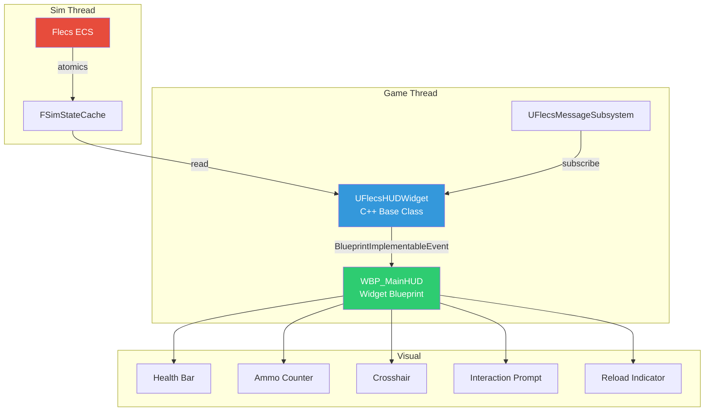
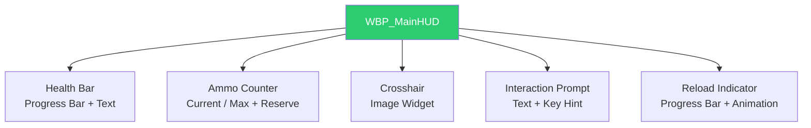
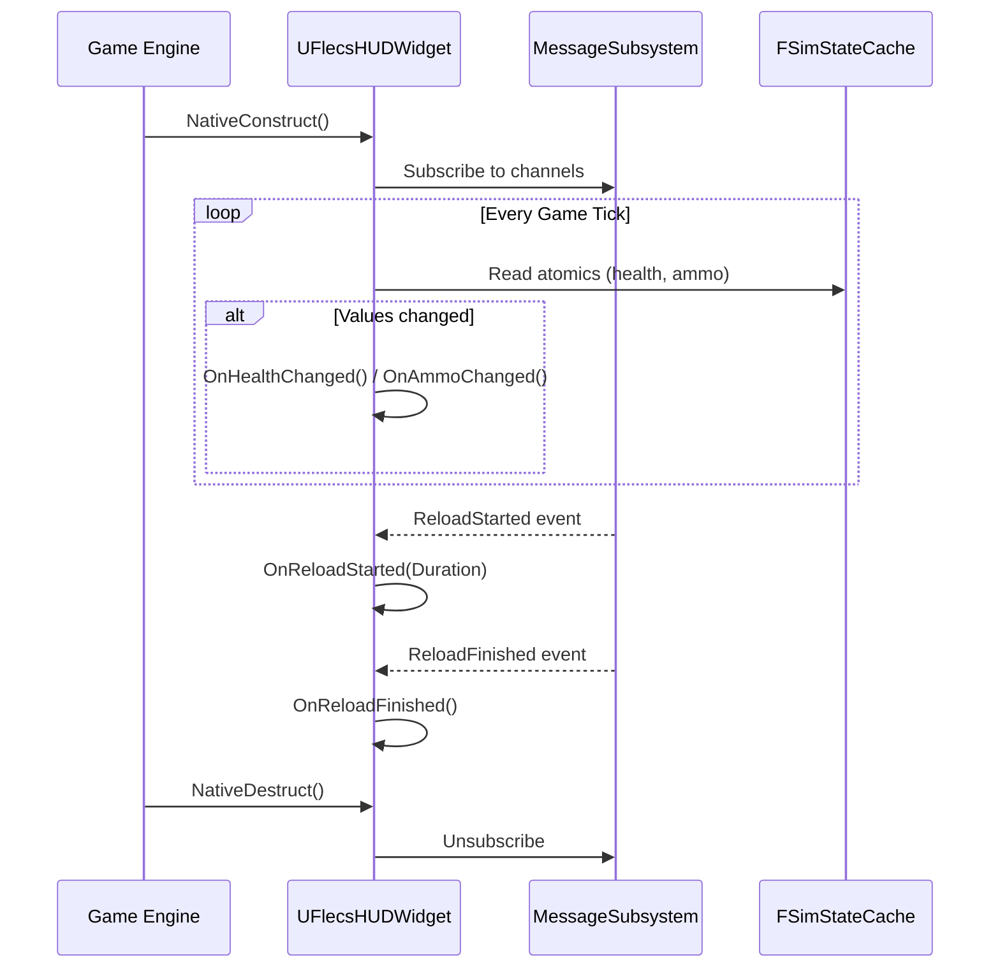

# HUD System

The HUD displays persistent gameplay information (health, ammo, interaction prompts) via a hybrid C++/Blueprint approach. The C++ base class (`UFlecsHUDWidget`) reads simulation state and fires `BlueprintImplementableEvent`s that the widget blueprint (`WBP_MainHUD`) handles for visual presentation.

## Architecture



---

## UFlecsHUDWidget

`UFlecsHUDWidget` is an abstract `UUserWidget` base class (NOT a `UFlecsUIPanel` — it does not use CommonUI activation since it is always visible). It subscribes to message channels and reads `FSimStateCache` to push data to Blueprint.

### Class Declaration

```cpp
UCLASS(Abstract)
class UFlecsHUDWidget : public UUserWidget
{
    GENERATED_BODY()

protected:
    virtual void NativeConstruct() override;
    virtual void NativeDestruct() override;
    virtual void NativeTick(const FGeometry& MyGeometry, float InDeltaTime) override;

    // -- BlueprintImplementableEvents --

    UFUNCTION(BlueprintImplementableEvent, Category = "HUD|Health")
    void OnHealthChanged(float CurrentHP, float MaxHP);

    UFUNCTION(BlueprintImplementableEvent, Category = "HUD|Weapon")
    void OnAmmoChanged(int32 CurrentAmmo, int32 MaxAmmo, int32 ReserveAmmo);

    UFUNCTION(BlueprintImplementableEvent, Category = "HUD|Weapon")
    void OnReloadStarted(float ReloadDuration);

    UFUNCTION(BlueprintImplementableEvent, Category = "HUD|Weapon")
    void OnReloadFinished();

    UFUNCTION(BlueprintImplementableEvent, Category = "HUD|Interaction")
    void OnInteractionPromptChanged(const FText& PromptText, bool bVisible);

    // ... additional events
};
```

### Data Sources

The HUD reads from two sources each tick:

| Source | Data | Access Pattern |
|--------|------|----------------|
| `FSimStateCache` | Health, ammo, resource values | Atomic reads (polled each tick) |
| `UFlecsMessageSubsystem` | Events (reload start/finish, death, etc.) | Pub/sub callbacks |

---

## FSimStateCache Reads

`FSimStateCache` provides lock-free atomic reads of simulation state. The HUD polls these values each tick and fires Blueprint events when values change.

```cpp
void UFlecsHUDWidget::NativeTick(const FGeometry& MyGeometry, float InDeltaTime)
{
    Super::NativeTick(MyGeometry, InDeltaTime);

    // Read health from sim state cache
    const float CurrentHP = SimStateCache->PlayerHealth.load(std::memory_order_relaxed);
    const float MaxHP = SimStateCache->PlayerMaxHealth.load(std::memory_order_relaxed);

    // Only fire event on change (avoid unnecessary Blueprint calls)
    if (CurrentHP != CachedHP || MaxHP != CachedMaxHP)
    {
        CachedHP = CurrentHP;
        CachedMaxHP = MaxHP;
        OnHealthChanged(CurrentHP, MaxHP);
    }

    // Similar pattern for ammo, resources, etc.
}
```

!!! tip "Change Detection"
    The HUD caches the last-known values and only calls `BlueprintImplementableEvent`s when values actually change. This prevents unnecessary Blueprint graph execution every tick.

### Available State Values

| Cache Field | Type | Updated By |
|-------------|------|-----------|
| `PlayerHealth` | `float` | Health systems |
| `PlayerMaxHealth` | `float` | Health systems |
| `CurrentAmmo` | `int32` | Weapon tick system |
| `MaxAmmo` | `int32` | Weapon tick system |
| `ReserveAmmo` | `int32` | Weapon tick system |

---

## UFlecsMessageSubsystem Channels

The HUD subscribes to message channels for event-driven updates that don't map well to polling (discrete events like "reload started").

### Subscription

```cpp
void UFlecsHUDWidget::NativeConstruct()
{
    Super::NativeConstruct();

    if (UFlecsMessageSubsystem* MsgSub = GetWorld()->GetSubsystem<UFlecsMessageSubsystem>())
    {
        MsgSub->Subscribe("ReloadStarted", this, &UFlecsHUDWidget::HandleReloadStarted);
        MsgSub->Subscribe("ReloadFinished", this, &UFlecsHUDWidget::HandleReloadFinished);
        MsgSub->Subscribe("InteractionTarget", this, &UFlecsHUDWidget::HandleInteractionChanged);
    }
}
```

### Channel Mapping

| Channel | Fires When | HUD Response |
|---------|-----------|--------------|
| `ReloadStarted` | Weapon begins reload | `OnReloadStarted(Duration)` |
| `ReloadFinished` | Weapon reload complete | `OnReloadFinished()` |
| `InteractionTarget` | Interaction raycast hits/loses target | `OnInteractionPromptChanged(Text, bVisible)` |

---

## BlueprintImplementableEvents

These events are the C++ to Blueprint bridge. The C++ base class determines **when** to fire; the widget blueprint determines **what** to display.

### Health Events

| Event | Parameters | When Fired |
|-------|-----------|------------|
| `OnHealthChanged` | `CurrentHP`, `MaxHP` | Every tick where health value changed |

### Weapon Events

| Event | Parameters | When Fired |
|-------|-----------|------------|
| `OnAmmoChanged` | `CurrentAmmo`, `MaxAmmo`, `ReserveAmmo` | Every tick where ammo values changed |
| `OnReloadStarted` | `ReloadDuration` | Weapon enters reload state |
| `OnReloadFinished` | (none) | Weapon reload completes |

### Interaction Events

| Event | Parameters | When Fired |
|-------|-----------|------------|
| `OnInteractionPromptChanged` | `PromptText`, `bVisible` | Interaction target acquired or lost |

!!! info "Interaction Prompt Source"
    The prompt text is NOT stored in ECS. It is read from the entity's definition chain: `FEntityDefinitionRef -> UFlecsEntityDefinition -> UFlecsInteractionProfile -> InteractionPrompt`. This read happens on the game thread when the interaction target changes.

---

## WBP_MainHUD Widget Blueprint

`WBP_MainHUD` is the widget blueprint that inherits from `UFlecsHUDWidget`. It lives in `Content/Widgets/WBP_MainHUD.uasset` and handles all visual presentation.

### Visual Elements



### Blueprint Event Handling

In the widget blueprint, each `BlueprintImplementableEvent` is connected to visual updates:

- **OnHealthChanged** -> Updates health bar fill percentage, changes color at low HP
- **OnAmmoChanged** -> Updates ammo text display, flashes at low ammo
- **OnReloadStarted** -> Shows reload progress bar, starts fill animation over `ReloadDuration`
- **OnReloadFinished** -> Hides reload progress bar
- **OnInteractionPromptChanged** -> Shows/hides interaction prompt text with key binding hint

---

## HUD Lifecycle



---

## Key Design Decisions

| Decision | Rationale |
|----------|-----------|
| UUserWidget, not UFlecsUIPanel | HUD is always visible, never "activated" — no CommonUI stack needed |
| C++ base + BP visual | Logic (polling, change detection) in C++; visuals (animations, layout) in BP |
| Polling + Pub/Sub hybrid | Continuous values (health) poll FSimStateCache; discrete events (reload) use messages |
| BlueprintImplementableEvent | BP designers control visuals without touching C++ |

!!! note "Not a CommonUI Panel"
    Unlike inventory and loot, the HUD does **not** extend `UFlecsUIPanel` / `UCommonActivatableWidget`. It is a plain `UUserWidget` that is added to the viewport once and remains visible for the entire play session. It does not participate in the CommonUI activation stack or input routing.
