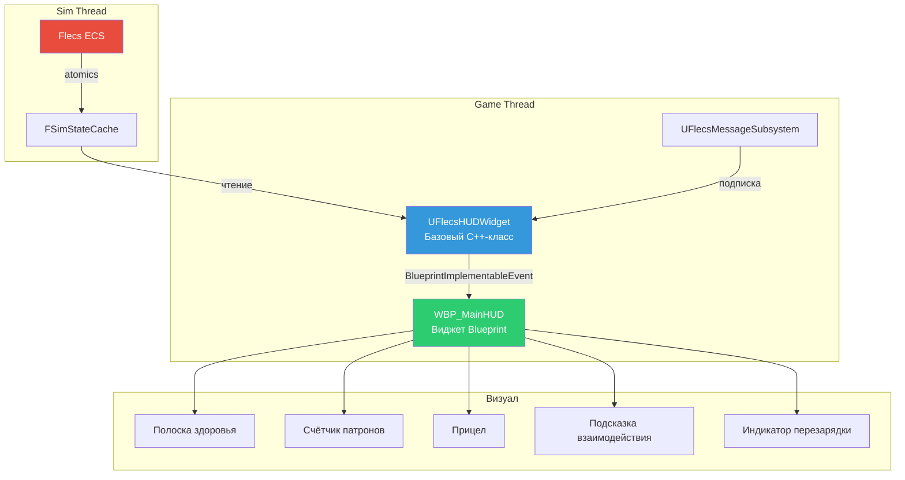
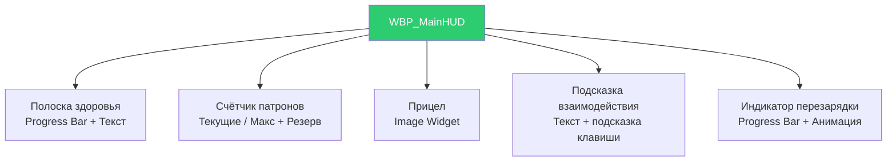
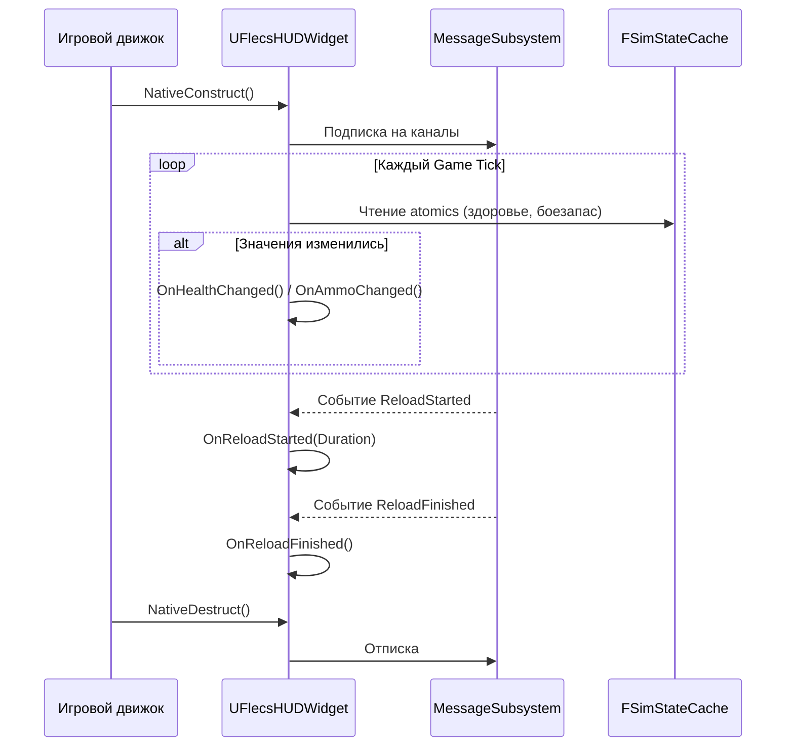

# Система HUD

HUD отображает постоянную игровую информацию (здоровье, боезапас, подсказки взаимодействия) через гибридный C++/Blueprint-подход. Базовый C++-класс (`UFlecsHUDWidget`) читает состояние симуляции и запускает `BlueprintImplementableEvent`, которые виджет-блюпринт (`WBP_MainHUD`) обрабатывает для визуального представления.

## Архитектура



---

## UFlecsHUDWidget

`UFlecsHUDWidget` -- абстрактный базовый класс `UUserWidget` (НЕ `UFlecsUIPanel` -- не использует активацию CommonUI, так как всегда видим). Подписывается на каналы сообщений и читает `FSimStateCache` для передачи данных в Blueprint.

### Объявление класса

```cpp
UCLASS(Abstract)
class UFlecsHUDWidget : public UUserWidget
{
    GENERATED_BODY()

protected:
    virtual void NativeConstruct() override;
    virtual void NativeDestruct() override;
    virtual void NativeTick(const FGeometry& MyGeometry, float InDeltaTime) override;

    // -- BlueprintImplementableEvents --

    UFUNCTION(BlueprintImplementableEvent, Category = "HUD|Health")
    void OnHealthChanged(float CurrentHP, float MaxHP);

    UFUNCTION(BlueprintImplementableEvent, Category = "HUD|Weapon")
    void OnAmmoChanged(int32 CurrentAmmo, int32 MaxAmmo, int32 ReserveAmmo);

    UFUNCTION(BlueprintImplementableEvent, Category = "HUD|Weapon")
    void OnReloadStarted(float ReloadDuration);

    UFUNCTION(BlueprintImplementableEvent, Category = "HUD|Weapon")
    void OnReloadFinished();

    UFUNCTION(BlueprintImplementableEvent, Category = "HUD|Interaction")
    void OnInteractionPromptChanged(const FText& PromptText, bool bVisible);

    // ... дополнительные события
};
```

### Источники данных

HUD каждый тик читает из двух источников:

| Источник | Данные | Паттерн доступа |
|----------|--------|----------------|
| `FSimStateCache` | Здоровье, боезапас, ресурсы | Атомарные чтения (опрос каждый тик) |
| `UFlecsMessageSubsystem` | События (начало/конец перезарядки, смерть и т.д.) | Pub/sub callback-и |

---

## Чтения FSimStateCache

`FSimStateCache` обеспечивает lock-free атомарные чтения состояния симуляции. HUD опрашивает эти значения каждый тик и запускает Blueprint-события при изменении.

```cpp
void UFlecsHUDWidget::NativeTick(const FGeometry& MyGeometry, float InDeltaTime)
{
    Super::NativeTick(MyGeometry, InDeltaTime);

    // Чтение здоровья из кеша состояния симуляции
    const float CurrentHP = SimStateCache->PlayerHealth.load(std::memory_order_relaxed);
    const float MaxHP = SimStateCache->PlayerMaxHealth.load(std::memory_order_relaxed);

    // Запускать событие только при изменении (избегать лишних вызовов Blueprint)
    if (CurrentHP != CachedHP || MaxHP != CachedMaxHP)
    {
        CachedHP = CurrentHP;
        CachedMaxHP = MaxHP;
        OnHealthChanged(CurrentHP, MaxHP);
    }

    // Аналогичный паттерн для боезапаса, ресурсов и т.д.
}
```

!!! tip "Обнаружение изменений"
    HUD кеширует последние известные значения и вызывает `BlueprintImplementableEvent` только при фактическом изменении значений. Это предотвращает ненужное выполнение Blueprint-графов каждый тик.

### Доступные значения состояния

| Поле кеша | Тип | Обновляется |
|-----------|-----|------------|
| `PlayerHealth` | `float` | Системами здоровья |
| `PlayerMaxHealth` | `float` | Системами здоровья |
| `CurrentAmmo` | `int32` | Системой тика оружия |
| `MaxAmmo` | `int32` | Системой тика оружия |
| `ReserveAmmo` | `int32` | Системой тика оружия |

---

## Каналы UFlecsMessageSubsystem

HUD подписывается на каналы сообщений для событийных обновлений, которые плохо ложатся на опрос (дискретные события вроде "начата перезарядка").

### Подписка

```cpp
void UFlecsHUDWidget::NativeConstruct()
{
    Super::NativeConstruct();

    if (UFlecsMessageSubsystem* MsgSub = GetWorld()->GetSubsystem<UFlecsMessageSubsystem>())
    {
        MsgSub->Subscribe("ReloadStarted", this, &UFlecsHUDWidget::HandleReloadStarted);
        MsgSub->Subscribe("ReloadFinished", this, &UFlecsHUDWidget::HandleReloadFinished);
        MsgSub->Subscribe("InteractionTarget", this, &UFlecsHUDWidget::HandleInteractionChanged);
    }
}
```

### Маппинг каналов

| Канал | Когда срабатывает | Реакция HUD |
|-------|------------------|-------------|
| `ReloadStarted` | Оружие начинает перезарядку | `OnReloadStarted(Duration)` |
| `ReloadFinished` | Перезарядка завершена | `OnReloadFinished()` |
| `InteractionTarget` | Рейкаст взаимодействия находит/теряет цель | `OnInteractionPromptChanged(Text, bVisible)` |

---

## BlueprintImplementableEvents

Эти события -- мост C++ -> Blueprint. Базовый C++-класс определяет **когда** запускать; виджет-блюпринт определяет **что** показать.

### События здоровья

| Событие | Параметры | Когда срабатывает |
|---------|----------|------------------|
| `OnHealthChanged` | `CurrentHP`, `MaxHP` | Каждый тик, где значение здоровья изменилось |

### События оружия

| Событие | Параметры | Когда срабатывает |
|---------|----------|------------------|
| `OnAmmoChanged` | `CurrentAmmo`, `MaxAmmo`, `ReserveAmmo` | Каждый тик, где значения боезапаса изменились |
| `OnReloadStarted` | `ReloadDuration` | Оружие входит в состояние перезарядки |
| `OnReloadFinished` | (нет) | Перезарядка оружия завершена |

### События взаимодействия

| Событие | Параметры | Когда срабатывает |
|---------|----------|------------------|
| `OnInteractionPromptChanged` | `PromptText`, `bVisible` | Цель взаимодействия найдена или потеряна |

!!! info "Источник текста подсказки"
    Текст подсказки НЕ хранится в ECS. Он читается через цепочку определения сущности: `FEntityDefinitionRef -> UFlecsEntityDefinition -> UFlecsInteractionProfile -> InteractionPrompt`. Чтение происходит на game thread при смене цели взаимодействия.

---

## Виджет-блюпринт WBP_MainHUD

`WBP_MainHUD` -- виджет-блюпринт, наследующий от `UFlecsHUDWidget`. Расположен в `Content/Widgets/WBP_MainHUD.uasset` и обрабатывает всё визуальное представление.

### Визуальные элементы



### Обработка Blueprint-событий

В виджет-блюпринте каждый `BlueprintImplementableEvent` подключён к визуальным обновлениям:

- **OnHealthChanged** -> Обновляет заполнение полоски здоровья, меняет цвет при низком HP
- **OnAmmoChanged** -> Обновляет текст боезапаса, мигает при малом количестве
- **OnReloadStarted** -> Показывает прогресс-бар перезарядки, запускает анимацию заполнения за `ReloadDuration`
- **OnReloadFinished** -> Скрывает прогресс-бар перезарядки
- **OnInteractionPromptChanged** -> Показывает/скрывает текст подсказки с указанием клавиши

---

## Жизненный цикл HUD



---

## Ключевые проектные решения

| Решение | Обоснование |
|---------|------------|
| UUserWidget, не UFlecsUIPanel | HUD всегда видим, никогда не "активируется" -- стек CommonUI не нужен |
| C++-база + BP-визуал | Логика (опрос, обнаружение изменений) в C++; визуал (анимации, вёрстка) в BP |
| Гибрид опроса + Pub/Sub | Непрерывные значения (здоровье) опрашивают FSimStateCache; дискретные события (перезарядка) используют сообщения |
| BlueprintImplementableEvent | BP-дизайнеры управляют визуалом без изменения C++ |

!!! note "Не панель CommonUI"
    В отличие от инвентаря и лута, HUD **не** расширяет `UFlecsUIPanel` / `UCommonActivatableWidget`. Это обычный `UUserWidget`, добавляемый во viewport один раз и остающийся видимым всю игровую сессию. Он не участвует в стеке активации CommonUI и маршрутизации ввода.
