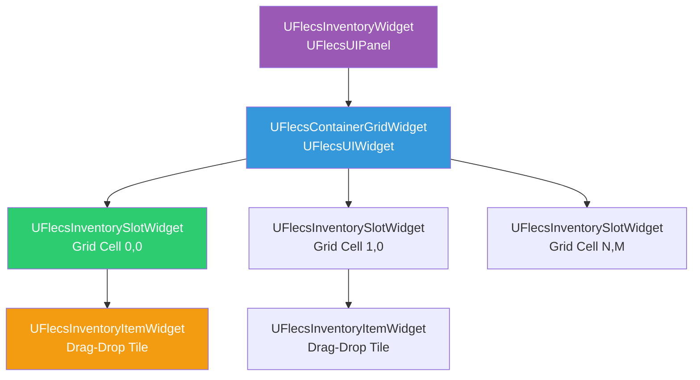
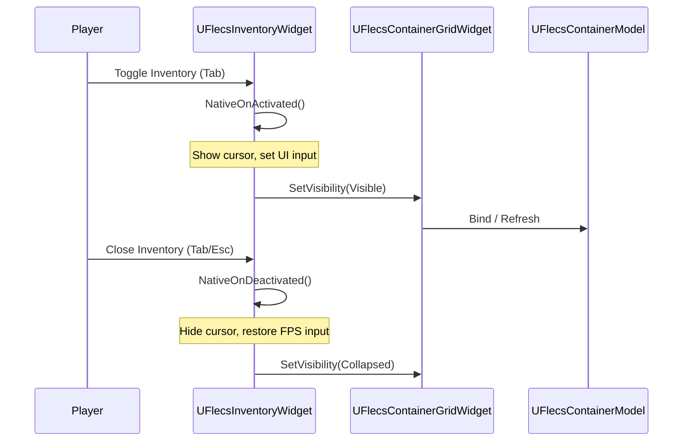
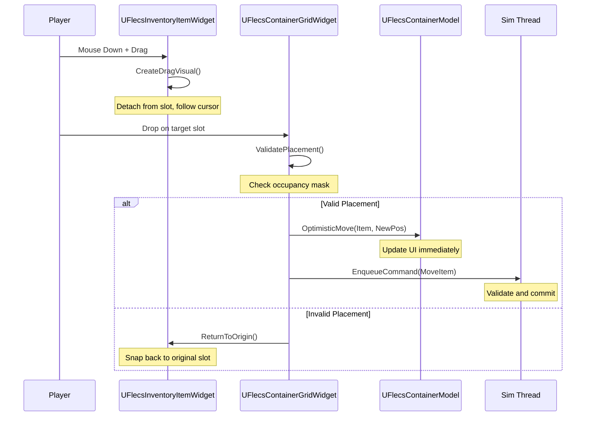
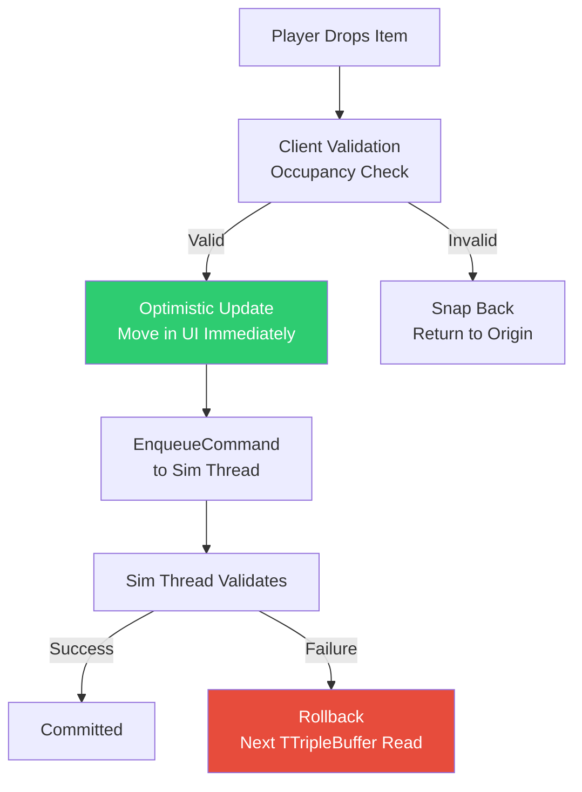
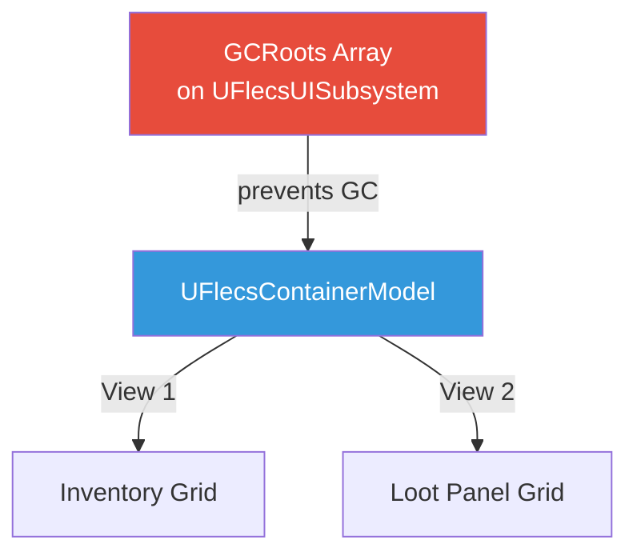
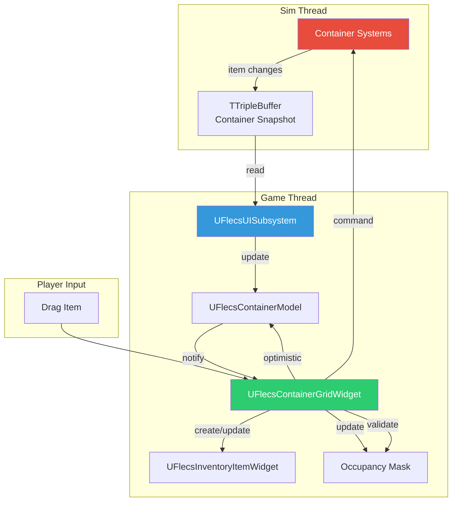

# Inventory UI

The inventory system provides a grid-based container UI with drag-and-drop item management. It is built entirely in C++ using the FlecsUI plugin's Model/View pattern, with optimistic updates for responsive interaction.

## Widget Hierarchy



---

## UFlecsInventoryWidget (Panel)

`UFlecsInventoryWidget` extends `UFlecsUIPanel` and serves as the top-level activatable panel for the player's inventory. It wraps a single `UFlecsContainerGridWidget` bound to the player's container model.

### Lifecycle



### Input State

When activated, the panel switches input to cursor mode so the player can click and drag items. On deactivation, FPS controls are restored.

!!! warning "Manual PC State Required"
    Due to CommonUI quirks, both `NativeOnActivated()` and `NativeOnDeactivated()` must manually set the player controller's input mode and cursor visibility. See [FlecsUI Plugin](../plugins/flecs-ui.md#commonui-input-quirks).

---

## UFlecsContainerGridWidget

The core grid widget that displays an N x M grid of inventory slots. Each slot represents one cell in the container's spatial grid.

### Construction

The grid is built programmatically in `Initialize()` based on the container's dimensions:

```cpp
void UFlecsContainerGridWidget::Initialize()
{
    Super::Initialize();

    // Grid dimensions from container static data
    const int32 Width = ContainerStatic.GridWidth;
    const int32 Height = ContainerStatic.GridHeight;

    for (int32 Y = 0; Y < Height; ++Y)
    {
        for (int32 X = 0; X < Width; ++X)
        {
            UFlecsInventorySlotWidget* Slot = CreateWidget<UFlecsInventorySlotWidget>(
                GetOwningPlayer()
            );
            check(Slot);
            Slot->SetGridPosition(X, Y);
            GridPanel->AddChild(Slot);
            Slots.Add(Slot);
        }
    }
}
```

!!! danger "Build in Initialize(), NOT NativeConstruct()"
    The grid must be constructed in `Initialize()`. By `NativeConstruct()`, the panel may already be activated and expecting children to exist.

### Container Binding

```cpp
void UFlecsContainerGridWidget::BindModel(UFlecsContainerModel* Model)
{
    check(Model);
    ContainerModel = Model;
    // Register as IFlecsContainerView
    Model->AddView(this);
    RefreshAllSlots();
}
```

### IFlecsContainerView Implementation

The grid implements `IFlecsContainerView` to react to model changes:

| Callback | Action |
|----------|--------|
| `OnContainerUpdated()` | Full refresh of all slots |
| `OnItemAdded(Index)` | Create/update item widget at position |
| `OnItemRemoved(Index)` | Remove item widget, clear occupancy |

---

## UFlecsInventorySlotWidget

A single cell in the container grid. Slots can be empty or occupied by part of an item (items can span multiple cells based on `GridSize`).

### States

| State | Visual |
|-------|--------|
| Empty | Default background |
| Occupied | Item tile visible (anchored to top-left cell) |
| Hovered (drag) | Highlight indicating valid/invalid drop |
| Occupied (mask) | Darker tint showing item occupancy |

---

## UFlecsInventoryItemWidget

The draggable item tile. Represents a single item entry in the container and can span multiple grid cells based on the item's `GridSize` (from `FItemStaticData`).

### Properties

| Property | Source | Description |
|----------|--------|-------------|
| Icon | `UFlecsItemDefinition` | Item icon texture |
| Count | `FItemInstance.Count` | Stack count (if > 1) |
| GridSize | `FItemStaticData.GridSize` | Width x Height in grid cells |
| GridPosition | `FContainedIn.GridPosition` | Top-left cell position |

### Drag-Drop



---

## Optimistic Drag-Drop Pattern

Drag-drop uses **optimistic updates** for responsive feedback. The UI updates immediately on drop, then the simulation thread validates and either commits or rolls back.



### Why Optimistic?

The simulation thread runs at 60 Hz, introducing up to ~16ms latency. Without optimistic updates, the player would see a visible delay between dropping an item and it appearing in the new position. Optimistic updates make the UI feel instant.

!!! info "Rollback is Automatic"
    If the simulation thread rejects the move (e.g., concurrent modification by another system), the next `TTripleBuffer` read will contain the authoritative state, and the UI automatically corrects to match.

---

## Occupancy Mask

Each `UFlecsContainerGridWidget` maintains a 2D occupancy mask that tracks which grid cells are occupied by items. This enables O(1) placement validation.

### Structure

The mask is a flat array of booleans, indexed by `Y * GridWidth + X`:

```cpp
// Occupancy mask: true = occupied, false = empty
TArray<bool> OccupancyMask;

// Initialize with Memzero
void ClearOccupancy()
{
    FMemory::Memzero(OccupancyMask.GetData(), OccupancyMask.Num() * sizeof(bool));
}
```

!!! tip "Memzero for Bulk Clear"
    The occupancy mask uses `FMemory::Memzero` for fast bulk clearing rather than iterating over each cell. This is important during full container refreshes.

### Placement Validation

```cpp
bool UFlecsContainerGridWidget::CanPlaceAt(FIntPoint Position, FIntPoint ItemSize) const
{
    // Bounds check
    if (Position.X + ItemSize.X > GridWidth) return false;
    if (Position.Y + ItemSize.Y > GridHeight) return false;

    // Occupancy check
    for (int32 Y = Position.Y; Y < Position.Y + ItemSize.Y; ++Y)
    {
        for (int32 X = Position.X; X < Position.X + ItemSize.X; ++X)
        {
            if (OccupancyMask[Y * GridWidth + X])
                return false;  // Cell occupied
        }
    }
    return true;
}
```

### Visual Feedback

During drag, the grid highlights cells under the dragged item:

| Mask State | Visual |
|-----------|--------|
| All cells free | Green highlight (valid drop) |
| Any cell occupied | Red highlight (invalid drop) |
| Out of bounds | Red highlight (invalid drop) |

---

## Model Lifecycle

### Ref-Counted Models

`UFlecsContainerModel` instances are ref-counted through the view binding system. When the last view unbinds, the model can be released.



!!! danger "GC Root Required"
    Models are `UObject`-derived and must be rooted to prevent garbage collection. The `UFlecsUISubsystem` maintains a `UPROPERTY() TArray<TObjectPtr<UObject>> GCRoots` that holds all active models.

### Creation Flow

```cpp
// In UFlecsUISubsystem
UFlecsContainerModel* Model = NewObject<UFlecsContainerModel>();
GCRoots.Add(Model);  // Prevent GC

// Bind to widget
GridWidget->BindModel(Model);

// On container close
GridWidget->UnbindModel();
GCRoots.Remove(Model);  // Allow GC
```

---

## Data Flow Summary



## ECS Components Involved

| Component | Type | Description |
|-----------|------|-------------|
| `FContainerStatic` | Prefab | GridWidth, GridHeight, MaxItems, MaxWeight |
| `FContainerInstance` | Instance | CurrentWeight, CurrentCount, OwnerEntityId |
| `FItemStaticData` | Prefab | TypeId, MaxStack, Weight, GridSize |
| `FItemInstance` | Instance | Count |
| `FContainedIn` | Instance | ContainerEntityId, GridPosition, SlotIndex |
| `FTagContainer` | Tag | Marks entity as a container |
| `FTagItem` | Tag | Marks entity as an item |
