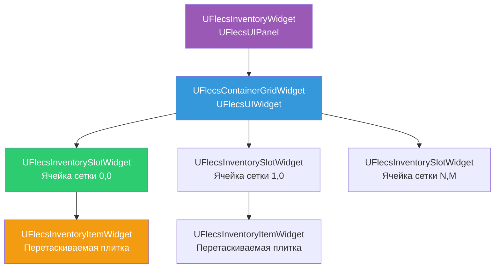
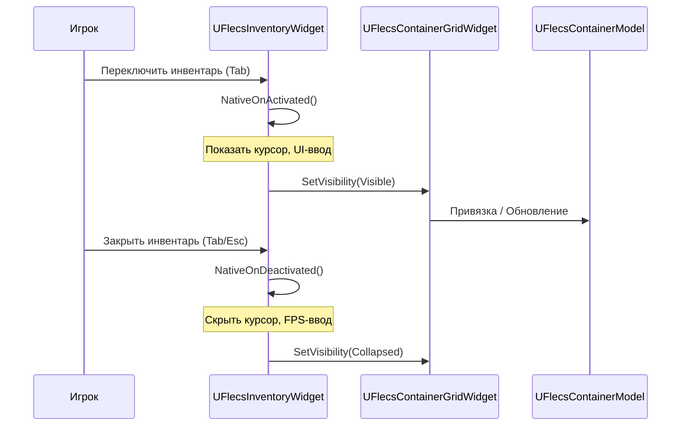
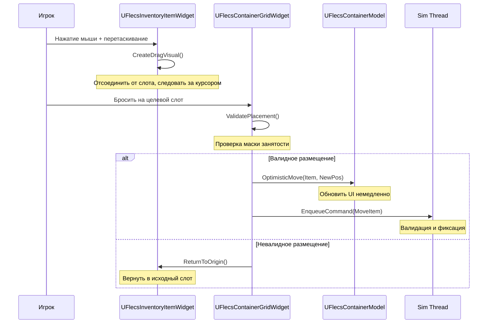
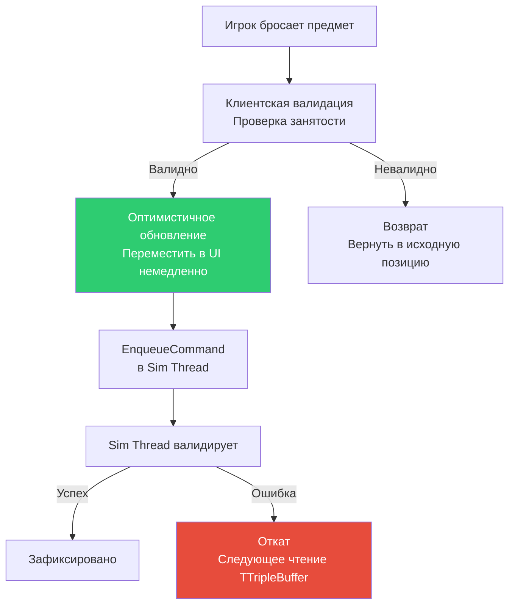
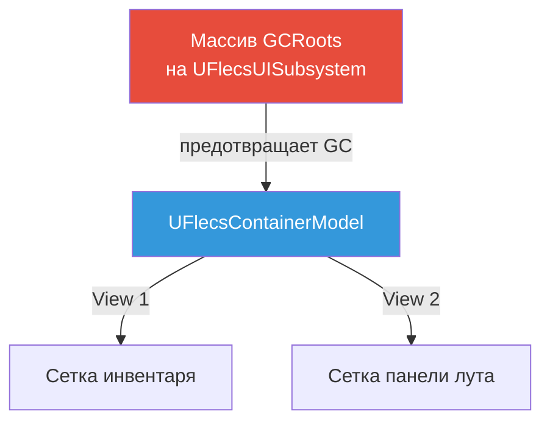
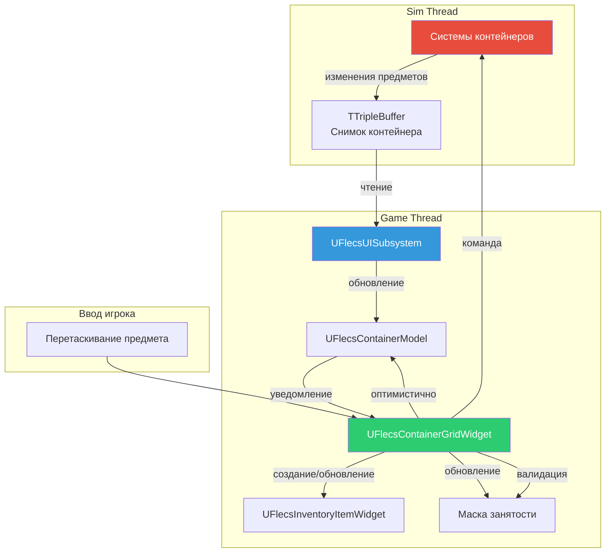

# UI инвентаря

Система инвентаря предоставляет сеточный UI контейнера с drag-and-drop управлением предметами. Полностью построена на C++ с использованием паттерна Model/View плагина FlecsUI и оптимистичными обновлениями для отзывчивого взаимодействия.

## Иерархия виджетов



---

## UFlecsInventoryWidget (панель)

`UFlecsInventoryWidget` расширяет `UFlecsUIPanel` и служит активируемой панелью верхнего уровня для инвентаря игрока. Оборачивает один `UFlecsContainerGridWidget`, привязанный к модели контейнера игрока.

### Жизненный цикл



### Состояние ввода

При активации панель переключает ввод в режим курсора, чтобы игрок мог кликать и перетаскивать предметы. При деактивации FPS-управление восстанавливается.

!!! warning "Требуется ручное состояние PC"
    Из-за особенностей CommonUI и `NativeOnActivated()`, и `NativeOnDeactivated()` должны вручную устанавливать режим ввода и видимость курсора контроллера игрока. См. [плагин FlecsUI](../plugins/flecs-ui.md#commonui-input-quirks).

---

## UFlecsContainerGridWidget

Основной виджет сетки, отображающий N x M сетку слотов инвентаря. Каждый слот представляет одну ячейку пространственной сетки контейнера.

### Построение

Сетка строится программно в `Initialize()` на основе размеров контейнера:

```cpp
void UFlecsContainerGridWidget::Initialize()
{
    Super::Initialize();

    // Размеры сетки из статических данных контейнера
    const int32 Width = ContainerStatic.GridWidth;
    const int32 Height = ContainerStatic.GridHeight;

    for (int32 Y = 0; Y < Height; ++Y)
    {
        for (int32 X = 0; X < Width; ++X)
        {
            UFlecsInventorySlotWidget* Slot = CreateWidget<UFlecsInventorySlotWidget>(
                GetOwningPlayer()
            );
            check(Slot);
            Slot->SetGridPosition(X, Y);
            GridPanel->AddChild(Slot);
            Slots.Add(Slot);
        }
    }
}
```

!!! danger "Строить в Initialize(), НЕ в NativeConstruct()"
    Сетка должна быть построена в `Initialize()`. К `NativeConstruct()` панель уже может быть активирована и ожидать существования дочерних элементов.

### Привязка контейнера

```cpp
void UFlecsContainerGridWidget::BindModel(UFlecsContainerModel* Model)
{
    check(Model);
    ContainerModel = Model;
    // Зарегистрироваться как IFlecsContainerView
    Model->AddView(this);
    RefreshAllSlots();
}
```

### Реализация IFlecsContainerView

Сетка реализует `IFlecsContainerView` для реакции на изменения модели:

| Callback | Действие |
|----------|---------|
| `OnContainerUpdated()` | Полное обновление всех слотов |
| `OnItemAdded(Index)` | Создать/обновить виджет предмета в позиции |
| `OnItemRemoved(Index)` | Удалить виджет предмета, очистить занятость |

---

## UFlecsInventorySlotWidget

Одна ячейка в сетке контейнера. Слоты могут быть пустыми или занятыми частью предмета (предметы могут занимать несколько ячеек на основе `GridSize`).

### Состояния

| Состояние | Визуал |
|-----------|--------|
| Пустой | Фон по умолчанию |
| Занят | Плитка предмета видна (привязана к левой верхней ячейке) |
| Наведён (перетаскивание) | Подсветка, показывающая валидность/невалидность броска |
| Занят (маска) | Более тёмный оттенок, показывающий занятость предметом |

---

## UFlecsInventoryItemWidget

Перетаскиваемая плитка предмета. Представляет одну запись предмета в контейнере и может занимать несколько ячеек на основе `GridSize` предмета (из `FItemStaticData`).

### Свойства

| Свойство | Источник | Описание |
|----------|---------|----------|
| Иконка | `UFlecsItemDefinition` | Текстура иконки предмета |
| Количество | `FItemInstance.Count` | Количество в стаке (если > 1) |
| Размер в сетке | `FItemStaticData.GridSize` | Ширина x Высота в ячейках |
| Позиция в сетке | `FContainedIn.GridPosition` | Позиция левой верхней ячейки |

### Drag-Drop



---

## Паттерн оптимистичного Drag-Drop

Drag-drop использует **оптимистичные обновления** для отзывчивой обратной связи. UI обновляется немедленно при бросании, затем поток симуляции валидирует и либо фиксирует, либо откатывает.



### Почему оптимистичный?

Поток симуляции работает на 60 Гц, вводя до ~16мс задержку. Без оптимистичных обновлений игрок видел бы заметную задержку между бросанием предмета и его появлением на новой позиции. Оптимистичные обновления делают UI мгновенным.

!!! info "Откат автоматический"
    Если поток симуляции отклоняет перемещение (например, конкурентная модификация другой системой), следующее чтение `TTripleBuffer` будет содержать авторитетное состояние, и UI автоматически исправится.

---

## Маска занятости

Каждый `UFlecsContainerGridWidget` поддерживает 2D маску занятости, отслеживающую, какие ячейки заняты предметами. Это позволяет валидировать размещение за O(1).

### Структура

Маска -- плоский массив булевых значений, индексируемый `Y * GridWidth + X`:

```cpp
// Маска занятости: true = занята, false = пуста
TArray<bool> OccupancyMask;

// Инициализация через Memzero
void ClearOccupancy()
{
    FMemory::Memzero(OccupancyMask.GetData(), OccupancyMask.Num() * sizeof(bool));
}
```

!!! tip "Memzero для массовой очистки"
    Маска занятости использует `FMemory::Memzero` для быстрой массовой очистки вместо итерации по каждой ячейке. Это важно при полном обновлении контейнера.

### Валидация размещения

```cpp
bool UFlecsContainerGridWidget::CanPlaceAt(FIntPoint Position, FIntPoint ItemSize) const
{
    // Проверка границ
    if (Position.X + ItemSize.X > GridWidth) return false;
    if (Position.Y + ItemSize.Y > GridHeight) return false;

    // Проверка занятости
    for (int32 Y = Position.Y; Y < Position.Y + ItemSize.Y; ++Y)
    {
        for (int32 X = Position.X; X < Position.X + ItemSize.X; ++X)
        {
            if (OccupancyMask[Y * GridWidth + X])
                return false;  // Ячейка занята
        }
    }
    return true;
}
```

### Визуальная обратная связь

Во время перетаскивания сетка подсвечивает ячейки под перетаскиваемым предметом:

| Состояние маски | Визуал |
|----------------|--------|
| Все ячейки свободны | Зелёная подсветка (валидный бросок) |
| Любая ячейка занята | Красная подсветка (невалидный бросок) |
| За границами | Красная подсветка (невалидный бросок) |

---

## Жизненный цикл моделей

### Модели с подсчётом ссылок

Экземпляры `UFlecsContainerModel` имеют подсчёт ссылок через систему привязки view. Когда последний view отвязывается, модель может быть освобождена.



!!! danger "Требуется GC Root"
    Модели наследуются от `UObject` и должны быть зарутены для предотвращения сборки мусора. `UFlecsUISubsystem` поддерживает `UPROPERTY() TArray<TObjectPtr<UObject>> GCRoots`, хранящий все активные модели.

### Поток создания

```cpp
// В UFlecsUISubsystem
UFlecsContainerModel* Model = NewObject<UFlecsContainerModel>();
GCRoots.Add(Model);  // Предотвратить GC

// Привязать к виджету
GridWidget->BindModel(Model);

// При закрытии контейнера
GridWidget->UnbindModel();
GCRoots.Remove(Model);  // Разрешить GC
```

---

## Сводка потока данных



## Задействованные ECS-компоненты

| Компонент | Тип | Описание |
|-----------|-----|----------|
| `FContainerStatic` | Prefab | GridWidth, GridHeight, MaxItems, MaxWeight |
| `FContainerInstance` | Экземпляр | CurrentWeight, CurrentCount, OwnerEntityId |
| `FItemStaticData` | Prefab | TypeId, MaxStack, Weight, GridSize |
| `FItemInstance` | Экземпляр | Count |
| `FContainedIn` | Экземпляр | ContainerEntityId, GridPosition, SlotIndex |
| `FTagContainer` | Тег | Помечает сущность как контейнер |
| `FTagItem` | Тег | Помечает сущность как предмет |
