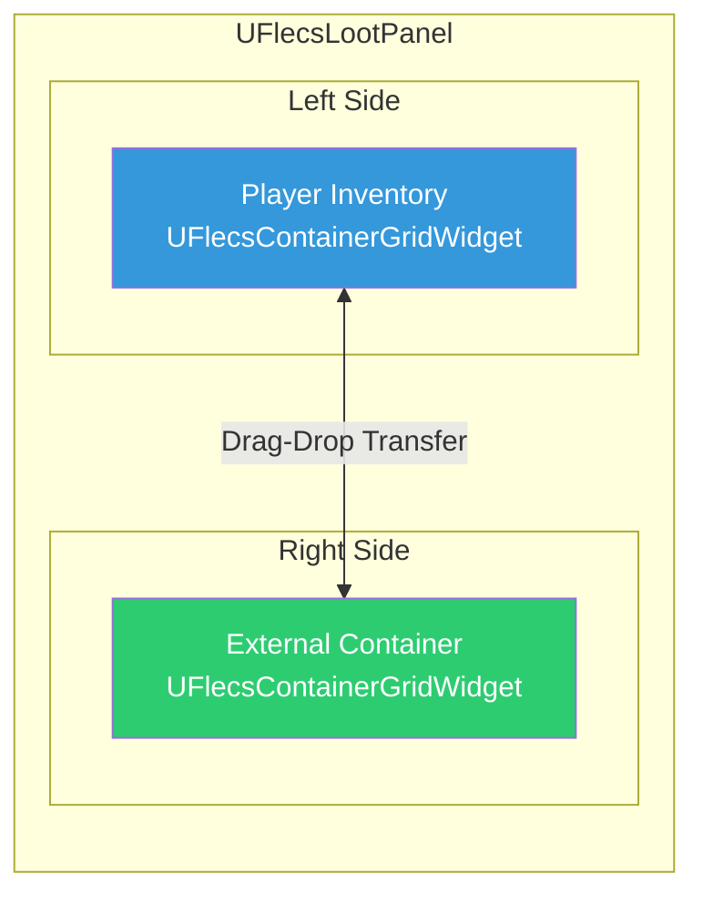
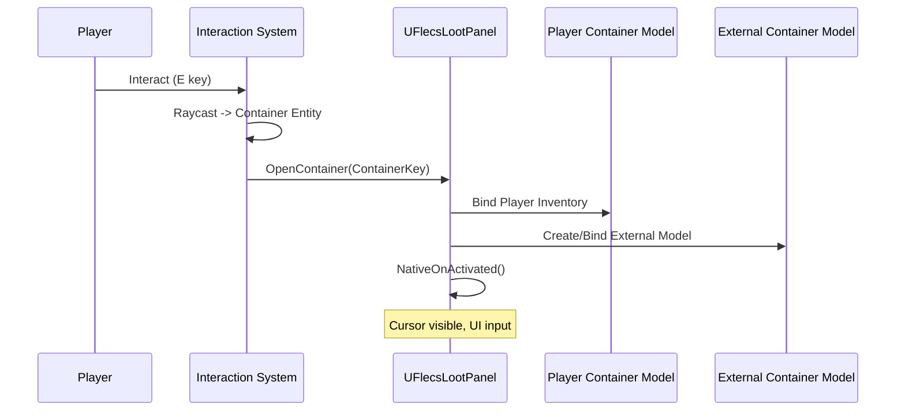
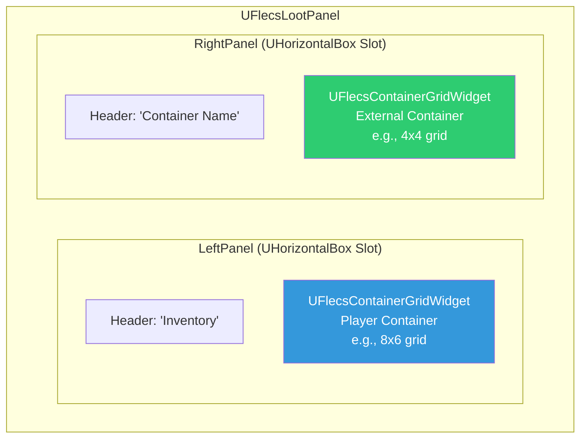
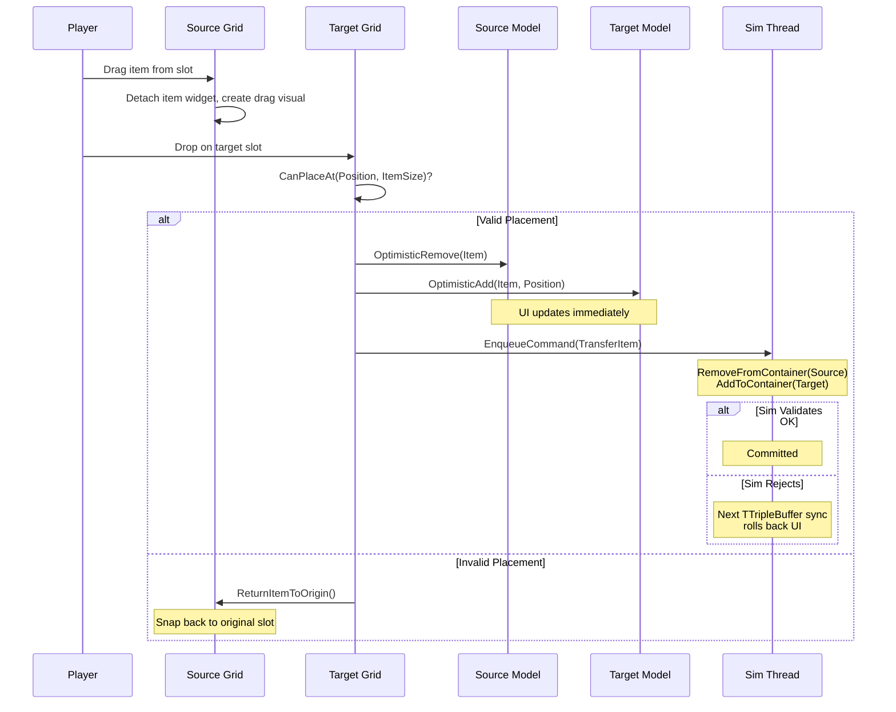
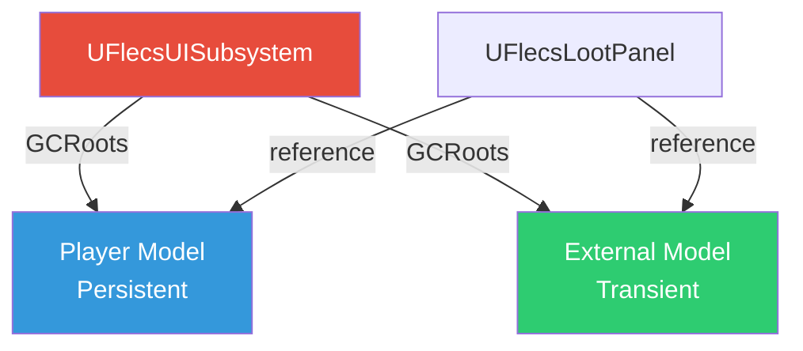
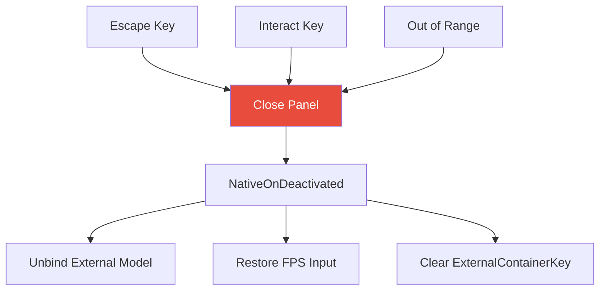
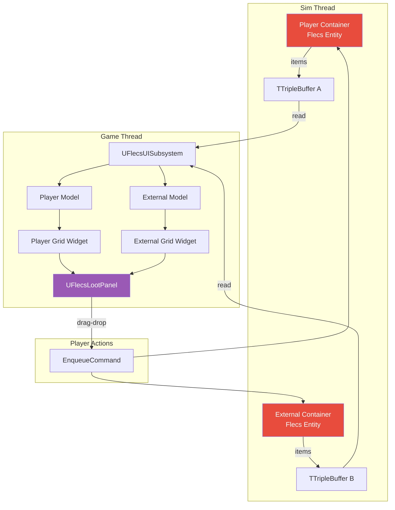

# Loot Panel

The loot panel displays a side-by-side view of the player's inventory and an external container (chest, crate, loot drop). It opens when the player interacts with a container entity and allows drag-and-drop item transfer between the two.

## Overview



---

## UFlecsLootPanel

`UFlecsLootPanel` extends `UFlecsUIPanel` (`UCommonActivatableWidget`) and manages two `UFlecsContainerGridWidget` instances side-by-side.

### Opening the Panel

The panel is opened through the interaction system when the player interacts with a `FTagContainer` entity:



### Key Properties

| Property | Type | Description |
|----------|------|-------------|
| `PlayerGridWidget` | `UFlecsContainerGridWidget*` | Left grid — player's inventory |
| `ExternalGridWidget` | `UFlecsContainerGridWidget*` | Right grid — external container |
| `PlayerContainerModel` | `UFlecsContainerModel*` | Model for player's items |
| `ExternalContainerModel` | `UFlecsContainerModel*` | Model for container's items |
| `ExternalContainerKey` | `FSkeletonKey` | BarrageKey of the opened container entity |

---

## Lifecycle

### Construction

Both grid widgets are built in `Initialize()`:

```cpp
void UFlecsLootPanel::Initialize()
{
    Super::Initialize();

    PlayerGridWidget = CreateWidget<UFlecsContainerGridWidget>(GetOwningPlayer());
    check(PlayerGridWidget);
    LeftPanel->AddChild(PlayerGridWidget);

    ExternalGridWidget = CreateWidget<UFlecsContainerGridWidget>(GetOwningPlayer());
    check(ExternalGridWidget);
    RightPanel->AddChild(ExternalGridWidget);
}
```

!!! danger "Build in Initialize(), NOT NativeConstruct()"
    Both grids must be created in `Initialize()`. By the time `NativeConstruct()` fires, CommonUI may have already triggered activation callbacks that reference these widgets.

### Opening a Container

```cpp
void UFlecsLootPanel::OpenContainer(FSkeletonKey ContainerKey)
{
    check(ContainerKey.IsValid());
    ExternalContainerKey = ContainerKey;

    // Bind player inventory (always available)
    PlayerGridWidget->BindModel(PlayerContainerModel);

    // Create model for external container
    ExternalContainerModel = UISubsystem->CreateContainerModel(ContainerKey);
    ExternalGridWidget->BindModel(ExternalContainerModel);

    // Activate the panel (CommonUI stack)
    ActivateWidget();
}
```

### Activation / Deactivation

```cpp
void UFlecsLootPanel::NativeOnActivated()
{
    Super::NativeOnActivated();

    // MUST set input state manually (CommonUI quirk)
    if (APlayerController* PC = GetOwningPlayer())
    {
        PC->SetShowMouseCursor(true);
        PC->SetInputMode(FInputModeUIOnly());
    }
}

void UFlecsLootPanel::NativeOnDeactivated()
{
    Super::NativeOnDeactivated();

    // MUST restore FPS state manually (CommonUI quirk)
    if (APlayerController* PC = GetOwningPlayer())
    {
        PC->SetShowMouseCursor(false);
        PC->SetInputMode(FInputModeGameOnly());
    }

    // Unbind external container
    ExternalGridWidget->UnbindModel();
    ExternalContainerKey = FSkeletonKey{};
}
```

!!! warning "Manual PC State in Both Callbacks"
    Due to CommonUI quirks (no ActionDomainTable reset, stale ActiveInputConfig), both `NativeOnActivated()` and `NativeOnDeactivated()` must manually configure the player controller. See [FlecsUI Plugin](../plugins/flecs-ui.md#commonui-input-quirks).

---

## Dual Grid Layout



The two grids can have **different dimensions**. The player's inventory might be 8x6 while a small chest is 4x4. Each grid independently manages its own slot widgets and occupancy mask.

---

## Item Transfer (Drag-Drop Between Grids)

The core interaction: dragging an item from one grid and dropping it onto the other.

### Transfer Flow



### Optimistic Updates

!!! info "Optimistic Pattern"
    Item transfers use the same optimistic update pattern as within-grid moves. The UI updates immediately on drop, and the simulation thread validates asynchronously. If the sim rejects the transfer (e.g., container became full from another source), the next `TTripleBuffer` sync automatically corrects the UI.

### Cross-Grid Validation

When dropping an item on the target grid:

1. **Bounds check** — Does the item fit within the target grid dimensions?
2. **Occupancy check** — Are all required cells in the target grid free?
3. **Weight check** — Does the target container have capacity for the item's weight?
4. **Count check** — Is the target container under its max item count?

The client performs checks 1 and 2 instantly (using the occupancy mask). Checks 3 and 4 are validated server-side (simulation thread) and may cause a rollback if they fail.

---

## Model Management

### Two Models, One Panel

The loot panel manages two independent `UFlecsContainerModel` instances:

| Model | Lifetime | Source |
|-------|----------|--------|
| Player container model | Persistent (as long as player exists) | Created at game start |
| External container model | Transient (panel open duration) | Created on `OpenContainer()`, released on close |

### GC Considerations



!!! danger "External Model GC Root"
    The external container model must be added to `GCRoots` on creation and removed when the panel closes. Forgetting to root it causes garbage collection of a live model, leading to crashes when the grid tries to access item data.

---

## Closing the Panel

The panel can be closed by:

1. **Pressing Escape** — CommonUI deactivation
2. **Pressing the interact key again** — Toggle behavior
3. **Walking out of range** — Interaction system detects target lost



---

## ECS Components Involved

| Component | Location | Role |
|-----------|----------|------|
| `FContainerStatic` | Prefab | Grid dimensions, max items, max weight |
| `FContainerInstance` | Instance | Current weight, count, owner entity ID |
| `FItemStaticData` | Prefab | Grid size, weight, max stack |
| `FItemInstance` | Instance | Current stack count |
| `FContainedIn` | Instance | Which container, grid position, slot index |
| `FTagContainer` | Tag | Marks entity as openable container |
| `FTagInteractable` | Tag | Marks entity for interaction raycast |
| `FInteractionStatic` | Prefab | Max range, single-use flag |

---

## Data Flow Summary


