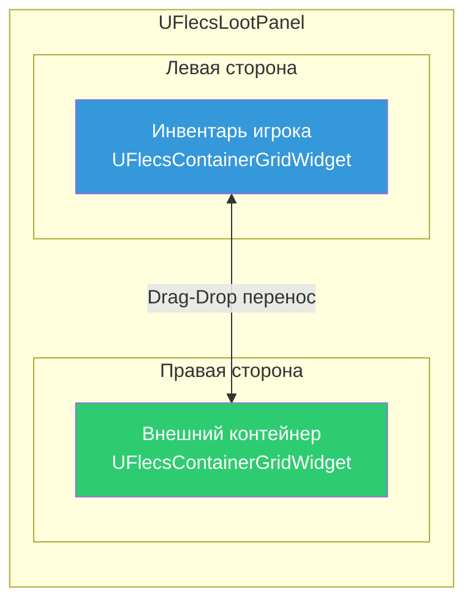
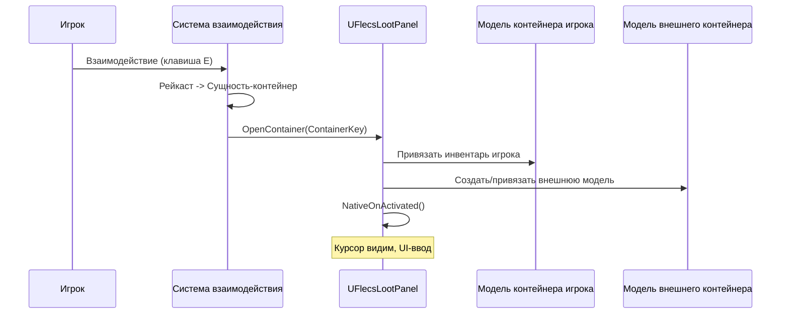
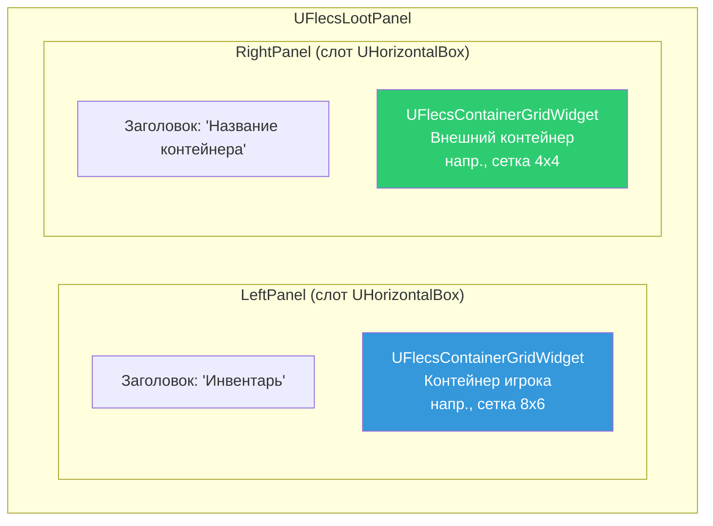
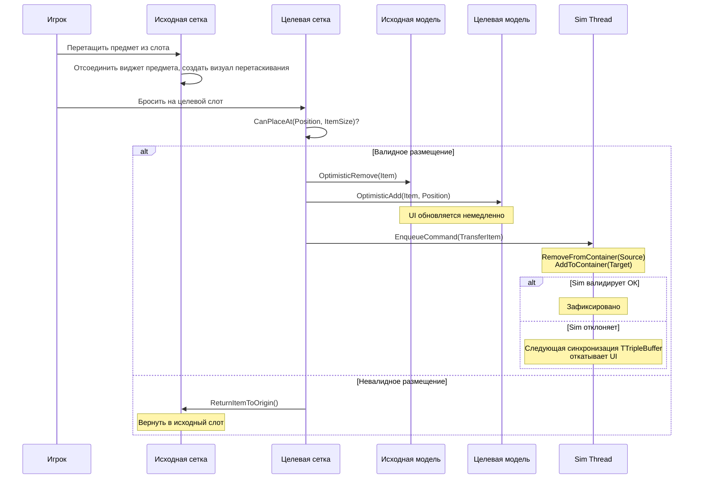
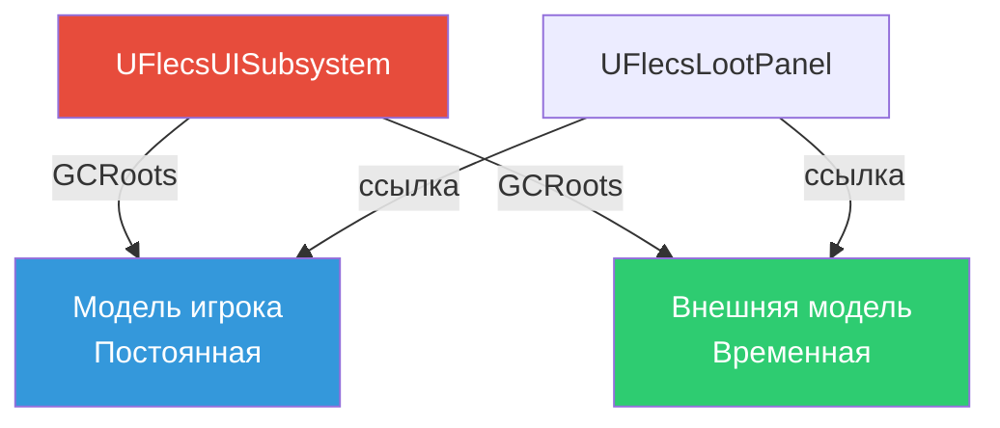
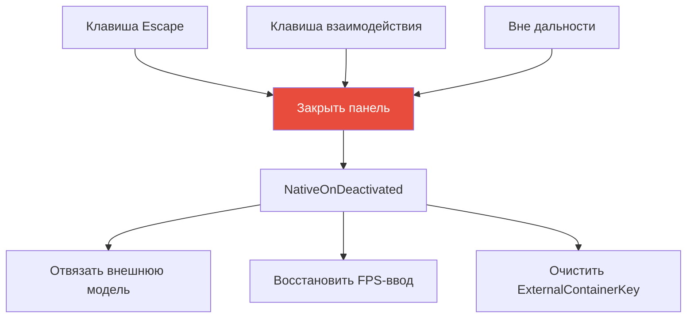
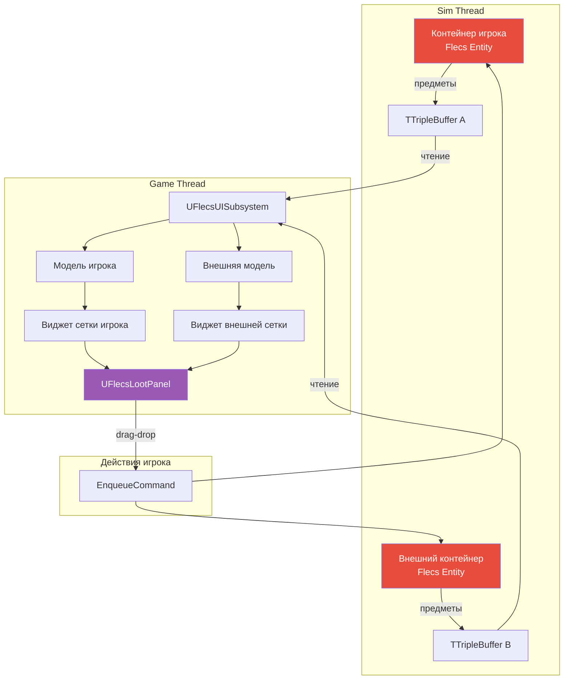

# Панель лута

Панель лута отображает вид "бок-о-бок" инвентаря игрока и внешнего контейнера (сундук, ящик, лут-дроп). Открывается при взаимодействии игрока с сущностью-контейнером и позволяет drag-and-drop перенос предметов между ними.

## Обзор



---

## UFlecsLootPanel

`UFlecsLootPanel` расширяет `UFlecsUIPanel` (`UCommonActivatableWidget`) и управляет двумя экземплярами `UFlecsContainerGridWidget`, размещёнными бок-о-бок.

### Открытие панели

Панель открывается через систему взаимодействия, когда игрок взаимодействует с сущностью `FTagContainer`:



### Ключевые свойства

| Свойство | Тип | Описание |
|----------|-----|----------|
| `PlayerGridWidget` | `UFlecsContainerGridWidget*` | Левая сетка -- инвентарь игрока |
| `ExternalGridWidget` | `UFlecsContainerGridWidget*` | Правая сетка -- внешний контейнер |
| `PlayerContainerModel` | `UFlecsContainerModel*` | Модель предметов игрока |
| `ExternalContainerModel` | `UFlecsContainerModel*` | Модель предметов контейнера |
| `ExternalContainerKey` | `FSkeletonKey` | BarrageKey открытой сущности-контейнера |

---

## Жизненный цикл

### Построение

Оба виджета сетки строятся в `Initialize()`:

```cpp
void UFlecsLootPanel::Initialize()
{
    Super::Initialize();

    PlayerGridWidget = CreateWidget<UFlecsContainerGridWidget>(GetOwningPlayer());
    check(PlayerGridWidget);
    LeftPanel->AddChild(PlayerGridWidget);

    ExternalGridWidget = CreateWidget<UFlecsContainerGridWidget>(GetOwningPlayer());
    check(ExternalGridWidget);
    RightPanel->AddChild(ExternalGridWidget);
}
```

!!! danger "Строить в Initialize(), НЕ в NativeConstruct()"
    Обе сетки должны быть созданы в `Initialize()`. К моменту вызова `NativeConstruct()` CommonUI мог уже запустить callback-и активации, ссылающиеся на эти виджеты.

### Открытие контейнера

```cpp
void UFlecsLootPanel::OpenContainer(FSkeletonKey ContainerKey)
{
    check(ContainerKey.IsValid());
    ExternalContainerKey = ContainerKey;

    // Привязать инвентарь игрока (всегда доступен)
    PlayerGridWidget->BindModel(PlayerContainerModel);

    // Создать модель для внешнего контейнера
    ExternalContainerModel = UISubsystem->CreateContainerModel(ContainerKey);
    ExternalGridWidget->BindModel(ExternalContainerModel);

    // Активировать панель (стек CommonUI)
    ActivateWidget();
}
```

### Активация / Деактивация

```cpp
void UFlecsLootPanel::NativeOnActivated()
{
    Super::NativeOnActivated();

    // ОБЯЗАТЕЛЬНО установить состояние ввода вручную (особенность CommonUI)
    if (APlayerController* PC = GetOwningPlayer())
    {
        PC->SetShowMouseCursor(true);
        PC->SetInputMode(FInputModeUIOnly());
    }
}

void UFlecsLootPanel::NativeOnDeactivated()
{
    Super::NativeOnDeactivated();

    // ОБЯЗАТЕЛЬНО восстановить FPS-состояние вручную (особенность CommonUI)
    if (APlayerController* PC = GetOwningPlayer())
    {
        PC->SetShowMouseCursor(false);
        PC->SetInputMode(FInputModeGameOnly());
    }

    // Отвязать внешний контейнер
    ExternalGridWidget->UnbindModel();
    ExternalContainerKey = FSkeletonKey{};
}
```

!!! warning "Ручное состояние PC в обоих callback-ах"
    Из-за особенностей CommonUI (нет сброса ActionDomainTable, устаревший ActiveInputConfig) и `NativeOnActivated()`, и `NativeOnDeactivated()` должны вручную настраивать контроллер игрока. См. [плагин FlecsUI](../plugins/flecs-ui.md#commonui-input-quirks).

---

## Двойная сетка



Две сетки могут иметь **разные размеры**. Инвентарь игрока может быть 8x6, а маленький сундук -- 4x4. Каждая сетка независимо управляет своими виджетами слотов и маской занятости.

---

## Перенос предметов (Drag-Drop между сетками)

Основное взаимодействие: перетаскивание предмета из одной сетки и бросание на другую.

### Поток переноса



### Оптимистичные обновления

!!! info "Оптимистичный паттерн"
    Переносы предметов используют тот же паттерн оптимистичного обновления, что и перемещения внутри сетки. UI обновляется немедленно при бросании, а поток симуляции валидирует асинхронно. Если sim отклоняет перенос (например, контейнер заполнился из другого источника), следующая синхронизация `TTripleBuffer` автоматически исправляет UI.

### Кросс-сеточная валидация

При бросании предмета на целевую сетку:

1. **Проверка границ** -- помещается ли предмет в размеры целевой сетки?
2. **Проверка занятости** -- все ли необходимые ячейки в целевой сетке свободны?
3. **Проверка веса** -- есть ли у целевого контейнера ёмкость для веса предмета?
4. **Проверка количества** -- не превышен ли лимит предметов в целевом контейнере?

Клиент выполняет проверки 1 и 2 мгновенно (используя маску занятости). Проверки 3 и 4 валидируются на стороне сервера (поток симуляции) и могут вызвать откат при ошибке.

---

## Управление моделями

### Две модели, одна панель

Панель лута управляет двумя независимыми экземплярами `UFlecsContainerModel`:

| Модель | Время жизни | Источник |
|--------|------------|---------|
| Модель контейнера игрока | Постоянная (пока существует игрок) | Создаётся при старте игры |
| Модель внешнего контейнера | Временная (длительность открытия панели) | Создаётся при `OpenContainer()`, освобождается при закрытии |

### Соображения о GC



!!! danger "GC Root внешней модели"
    Внешняя модель контейнера должна быть добавлена в `GCRoots` при создании и удалена при закрытии панели. Если забыть зарутить её, произойдёт сборка мусора живой модели, что приведёт к крашу при попытке сетки обратиться к данным предметов.

---

## Закрытие панели

Панель может быть закрыта:

1. **Нажатием Escape** -- деактивация CommonUI
2. **Повторным нажатием клавиши взаимодействия** -- переключающее поведение
3. **Выходом за пределы дальности** -- система взаимодействия обнаруживает потерю цели



---

## Задействованные ECS-компоненты

| Компонент | Расположение | Роль |
|-----------|-------------|------|
| `FContainerStatic` | Prefab | Размеры сетки, макс. предметов, макс. вес |
| `FContainerInstance` | Экземпляр | Текущий вес, количество, ID сущности-владельца |
| `FItemStaticData` | Prefab | Размер в сетке, вес, макс. стак |
| `FItemInstance` | Экземпляр | Текущий размер стака |
| `FContainedIn` | Экземпляр | В каком контейнере, позиция в сетке, индекс слота |
| `FTagContainer` | Тег | Помечает сущность как открываемый контейнер |
| `FTagInteractable` | Тег | Помечает сущность для рейкаста взаимодействия |
| `FInteractionStatic` | Prefab | Макс. дальность, флаг одноразовости |

---

## Сводка потока данных


