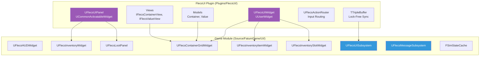
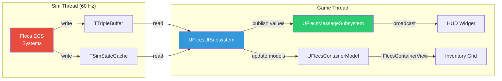
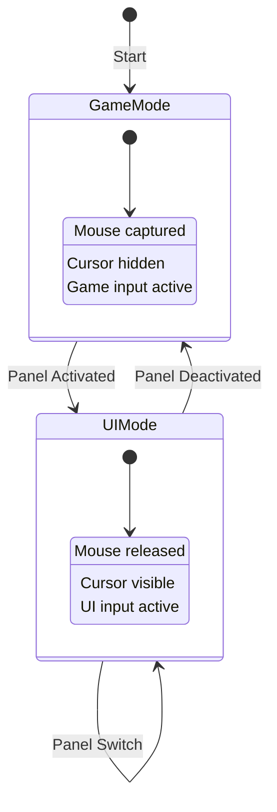
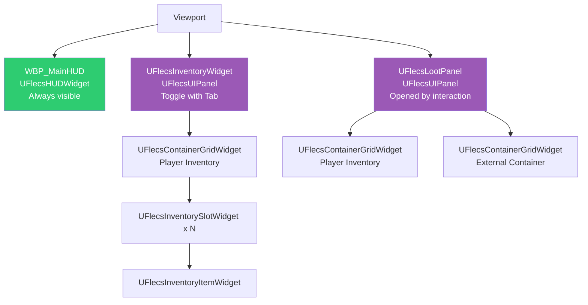

# UI Architecture Overview

FatumGame's UI is built on two layers: the **FlecsUI plugin** (base classes and infrastructure) and the **game module UI** (concrete widgets and subsystems). Data flows from the simulation thread through lock-free buffers to widgets on the game thread.

## Two-Layer Architecture



| Layer | Location | Provides |
|-------|----------|----------|
| **FlecsUI Plugin** | `Plugins/FlecsUI/` | Base classes, Model/View interfaces, input routing, triple buffer |
| **Game UI Module** | `Source/FatumGame/UI/` | Concrete widgets (HUD, inventory, loot), subsystems, state caches |

---

## Data Flow

Data moves from the simulation thread to widgets through a chain of lock-free mechanisms:



### Sync Mechanisms

| Mechanism | Direction | Data Type | Usage |
|-----------|-----------|-----------|-------|
| `TTripleBuffer<T>` | Sim to Game | Container contents, bulk data | Inventory data, entity state |
| `FSimStateCache` | Sim to Game | Scalar values (atomics) | Health, ammo, resource values |
| `UFlecsMessageSubsystem` | Game to Game | Events/messages | Health changed, reload started, etc. |

!!! danger "TTripleBuffer: Use WriteAndSwap(), NOT Write()"
    `Write()` does not set the dirty flag. The game thread never sees the update. Always use `WriteAndSwap()`.

---

## UFlecsUISubsystem

`UFlecsUISubsystem` is a **UWorldSubsystem** in the game module that bridges the FlecsUI plugin with game-specific data. It:

1. Reads from `TTripleBuffer` and `FSimStateCache` each game tick
2. Updates `UFlecsContainerModel` instances with fresh container data
3. Creates and manages model lifecycle (including GC roots)

```cpp
UCLASS()
class UFlecsUISubsystem : public UWorldSubsystem
{
    GENERATED_BODY()

    // Prevents GC from collecting models stored in non-UPROPERTY structs
    UPROPERTY()
    TArray<TObjectPtr<UObject>> GCRoots;

    // Model factory and update
    UFlecsContainerModel* CreateContainerModel(FSkeletonKey ContainerKey);
    void TickUI(float DeltaTime);
};
```

!!! warning "GC Roots for Models"
    Models are `UObject`-derived but may be referenced from plain structs. Without `UPROPERTY()` GC roots, the garbage collector will destroy them. See the [FlecsUI plugin docs](../plugins/flecs-ui.md#garbage-collection-gc-roots) for details.

---

## UFlecsMessageSubsystem (Pub/Sub)

`UFlecsMessageSubsystem` is a lightweight publish/subscribe system for game-thread UI events. Widgets subscribe to named channels and receive callbacks when data changes.

```mermaid
graph LR
    PUB[Publisher<br/>Systems / Subsystems] -->|Publish| CH[Channel<br/>e.g., "Health"]
    CH -->|Notify| S1[Subscriber 1<br/>HUD Widget]
    CH -->|Notify| S2[Subscriber 2<br/>Health Bar]

    style CH fill:#f39c12,color:#fff
```

### Channels

| Channel | Data | Publishers |
|---------|------|-----------|
| Health | Current HP, Max HP | `FSimStateCache` reads |
| Ammo | Current ammo, Max ammo, Reserve | Weapon state reads |
| Reload | Start/finish, progress | Weapon system events |
| Interaction | Prompt text, target entity | Interaction system |

### Usage

```cpp
// Subscribe (in widget)
MessageSubsystem->Subscribe("Health", this, &UMyWidget::OnHealthMessage);

// Publish (in subsystem tick)
MessageSubsystem->Publish("Health", FHealthMessage{ CurrentHP, MaxHP });
```

---

## FSimStateCache

`FSimStateCache` provides atomic-based reads of frequently-accessed simulation state. Unlike `TTripleBuffer` (which is for bulk data), `FSimStateCache` is optimized for individual scalar values that change every tick.

```cpp
struct FSimStateCache
{
    // Atomics written by sim thread, read by game thread
    std::atomic<float> PlayerHealth;
    std::atomic<float> PlayerMaxHealth;
    std::atomic<int32> CurrentAmmo;
    std::atomic<int32> MaxAmmo;
    std::atomic<int32> ReserveAmmo;
    // ... etc.
};
```

!!! info "When to Use Which"
    - **FSimStateCache**: Single values that change every tick (health, ammo). Read cost: one atomic load.
    - **TTripleBuffer**: Structured data that changes less frequently (container contents, lists). Read cost: buffer swap + memcpy.
    - **UFlecsMessageSubsystem**: Event-driven notifications on the game thread. No polling.

---

## Input Routing

### UFlecsActionRouter

The action router manages the transition between game input (FPS controls) and UI input (cursor, clicks) when panels are activated/deactivated.



### Integration Stack

```
Enhanced Input (UE)
    └── UFlecsActionRouter (custom)
        └── CommonGameViewportClient
            └── GetDesiredInputConfig()
                └── Per-panel input requirements
```

!!! warning "CommonUI Input Quirks"
    Two quirks require manual PC state management in **both** `NativeOnActivated` and `NativeOnDeactivated`:

    1. Without `ActionDomainTable`, CommonUI does not reset input config on deactivation
    2. `UFlecsActionRouter`'s `ActiveInputConfig` persists and skips apply when configs match

    See [FlecsUI Plugin - CommonUI Input Quirks](../plugins/flecs-ui.md#commonui-input-quirks) for the full explanation and code pattern.

---

## Widget Hierarchy



| Widget | Base Class | Activation |
|--------|-----------|------------|
| `WBP_MainHUD` | `UFlecsHUDWidget` (UUserWidget) | Always visible |
| `UFlecsInventoryWidget` | `UFlecsUIPanel` (Activatable) | Player toggles (Tab) |
| `UFlecsLootPanel` | `UFlecsUIPanel` (Activatable) | Container interaction |

---

## File Map

```
Source/FatumGame/UI/
    Public/
        FlecsUISubsystem.h
        FlecsMessageSubsystem.h
        FlecsHUDWidget.h
        FlecsInventoryWidget.h
        FlecsInventoryItemWidget.h
        FlecsInventorySlotWidget.h
        FlecsContainerGridWidget.h
        FlecsLootPanel.h
    Private/
        FlecsUISubsystem.cpp
        FlecsMessageSubsystem.cpp
        FlecsHUDWidget.cpp
        FlecsInventoryWidget.cpp
        FlecsInventoryItemWidget.cpp
        FlecsInventorySlotWidget.cpp
        FlecsContainerGridWidget.cpp
        FlecsLootPanel.cpp
```
