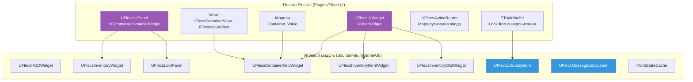
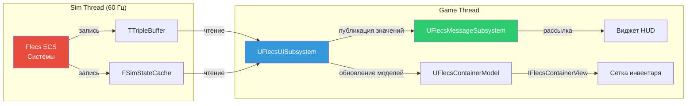
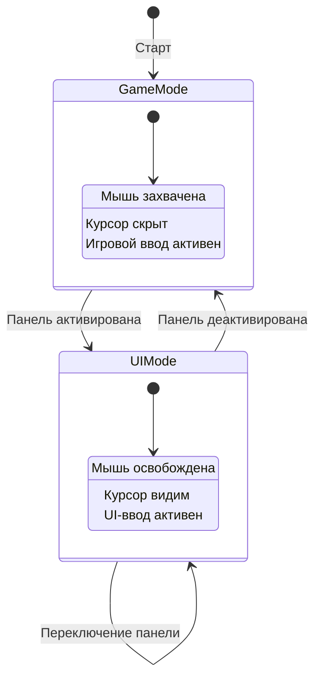
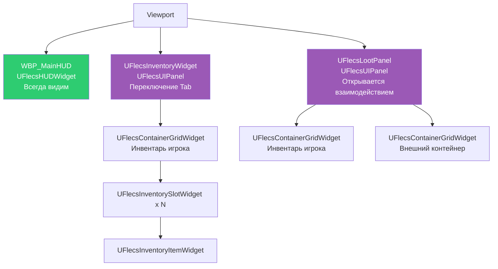

# Обзор архитектуры UI

UI FatumGame построен на двух слоях: **плагин FlecsUI** (базовые классы и инфраструктура) и **игровой модуль UI** (конкретные виджеты и подсистемы). Данные передаются из потока симуляции через lock-free буферы к виджетам на game thread.

## Двухслойная архитектура



| Слой | Расположение | Предоставляет |
|------|-------------|--------------|
| **Плагин FlecsUI** | `Plugins/FlecsUI/` | Базовые классы, интерфейсы Model/View, маршрутизация ввода, тройной буфер |
| **Игровой UI-модуль** | `Source/FatumGame/UI/` | Конкретные виджеты (HUD, инвентарь, лут), подсистемы, кеши состояния |

---

## Поток данных

Данные передаются из потока симуляции к виджетам через цепочку lock-free механизмов:



### Механизмы синхронизации

| Механизм | Направление | Тип данных | Использование |
|----------|------------|-----------|--------------|
| `TTripleBuffer<T>` | Sim -> Game | Содержимое контейнеров, массивные данные | Данные инвентаря, состояние сущностей |
| `FSimStateCache` | Sim -> Game | Скалярные значения (atomics) | Здоровье, боезапас, ресурсы |
| `UFlecsMessageSubsystem` | Game -> Game | События/сообщения | Изменение здоровья, начало перезарядки и т.д. |

!!! danger "TTripleBuffer: используйте WriteAndSwap(), НЕ Write()"
    `Write()` не устанавливает флаг dirty. Game thread никогда не увидит обновление. Всегда используйте `WriteAndSwap()`.

---

## UFlecsUISubsystem

`UFlecsUISubsystem` -- **UWorldSubsystem** в игровом модуле, связывающий плагин FlecsUI с игровыми данными. Он:

1. Каждый game tick читает из `TTripleBuffer` и `FSimStateCache`
2. Обновляет экземпляры `UFlecsContainerModel` свежими данными контейнеров
3. Создаёт и управляет жизненным циклом моделей (включая GC roots)

```cpp
UCLASS()
class UFlecsUISubsystem : public UWorldSubsystem
{
    GENERATED_BODY()

    // Предотвращает GC от сбора моделей в не-UPROPERTY структурах
    UPROPERTY()
    TArray<TObjectPtr<UObject>> GCRoots;

    // Фабрика и обновление моделей
    UFlecsContainerModel* CreateContainerModel(FSkeletonKey ContainerKey);
    void TickUI(float DeltaTime);
};
```

!!! warning "GC Roots для моделей"
    Модели наследуются от `UObject`, но могут ссылаться из обычных структур. Без `UPROPERTY()` GC roots сборщик мусора уничтожит их. Подробнее см. [документацию плагина FlecsUI](../plugins/flecs-ui.md#garbage-collection-gc-roots).

---

## UFlecsMessageSubsystem (Pub/Sub)

`UFlecsMessageSubsystem` -- легковесная система publish/subscribe для UI-событий на game thread. Виджеты подписываются на именованные каналы и получают callback-и при изменении данных.

```mermaid
graph LR
    PUB[Издатель<br/>Системы / Подсистемы] -->|Publish| CH[Канал<br/>напр., "Health"]
    CH -->|Уведомление| S1[Подписчик 1<br/>HUD-виджет]
    CH -->|Уведомление| S2[Подписчик 2<br/>Полоска здоровья]

    style CH fill:#f39c12,color:#fff
```

### Каналы

| Канал | Данные | Издатели |
|-------|--------|---------|
| Health | Текущее HP, Максимальное HP | Чтение `FSimStateCache` |
| Ammo | Текущие патроны, Макс. патроны, Резерв | Чтение состояния оружия |
| Reload | Начало/окончание, прогресс | События системы оружия |
| Interaction | Текст подсказки, целевая сущность | Система взаимодействия |

### Использование

```cpp
// Подписка (в виджете)
MessageSubsystem->Subscribe("Health", this, &UMyWidget::OnHealthMessage);

// Публикация (в тике подсистемы)
MessageSubsystem->Publish("Health", FHealthMessage{ CurrentHP, MaxHP });
```

---

## FSimStateCache

`FSimStateCache` обеспечивает атомарные чтения часто запрашиваемого состояния симуляции. В отличие от `TTripleBuffer` (для массивных данных), `FSimStateCache` оптимизирован для отдельных скалярных значений, меняющихся каждый тик.

```cpp
struct FSimStateCache
{
    // Atomics: записываются sim thread, читаются game thread
    std::atomic<float> PlayerHealth;
    std::atomic<float> PlayerMaxHealth;
    std::atomic<int32> CurrentAmmo;
    std::atomic<int32> MaxAmmo;
    std::atomic<int32> ReserveAmmo;
    // ... и т.д.
};
```

!!! info "Когда что использовать"
    - **FSimStateCache**: Одиночные значения, меняющиеся каждый тик (здоровье, боезапас). Стоимость чтения: одна атомарная загрузка.
    - **TTripleBuffer**: Структурированные данные, меняющиеся реже (содержимое контейнеров, списки). Стоимость чтения: обмен буферов + memcpy.
    - **UFlecsMessageSubsystem**: Событийные уведомления на game thread. Без опроса.

---

## Маршрутизация ввода

### UFlecsActionRouter

Маршрутизатор действий управляет переходом между игровым вводом (FPS-управление) и UI-вводом (курсор, клики) при активации/деактивации панелей.



### Стек интеграции

```
Enhanced Input (UE)
    └── UFlecsActionRouter (пользовательский)
        └── CommonGameViewportClient
            └── GetDesiredInputConfig()
                └── Требования к вводу для каждой панели
```

!!! warning "Особенности ввода CommonUI"
    Две особенности требуют ручного управления состоянием PC в **обоих** `NativeOnActivated` и `NativeOnDeactivated`:

    1. Без `ActionDomainTable` CommonUI не сбрасывает конфигурацию ввода при деактивации
    2. `ActiveInputConfig` в `UFlecsActionRouter` сохраняется и пропускает apply при совпадении конфигураций

    См. [Плагин FlecsUI - особенности ввода CommonUI](../plugins/flecs-ui.md#commonui-input-quirks) для полного объяснения и примера кода.

---

## Иерархия виджетов



| Виджет | Базовый класс | Активация |
|--------|--------------|-----------|
| `WBP_MainHUD` | `UFlecsHUDWidget` (UUserWidget) | Всегда видим |
| `UFlecsInventoryWidget` | `UFlecsUIPanel` (Activatable) | Переключение игроком (Tab) |
| `UFlecsLootPanel` | `UFlecsUIPanel` (Activatable) | Взаимодействие с контейнером |

---

## Карта файлов

```
Source/FatumGame/UI/
    Public/
        FlecsUISubsystem.h
        FlecsMessageSubsystem.h
        FlecsHUDWidget.h
        FlecsInventoryWidget.h
        FlecsInventoryItemWidget.h
        FlecsInventorySlotWidget.h
        FlecsContainerGridWidget.h
        FlecsLootPanel.h
    Private/
        FlecsUISubsystem.cpp
        FlecsMessageSubsystem.cpp
        FlecsHUDWidget.cpp
        FlecsInventoryWidget.cpp
        FlecsInventoryItemWidget.cpp
        FlecsInventorySlotWidget.cpp
        FlecsContainerGridWidget.cpp
        FlecsLootPanel.cpp
```
